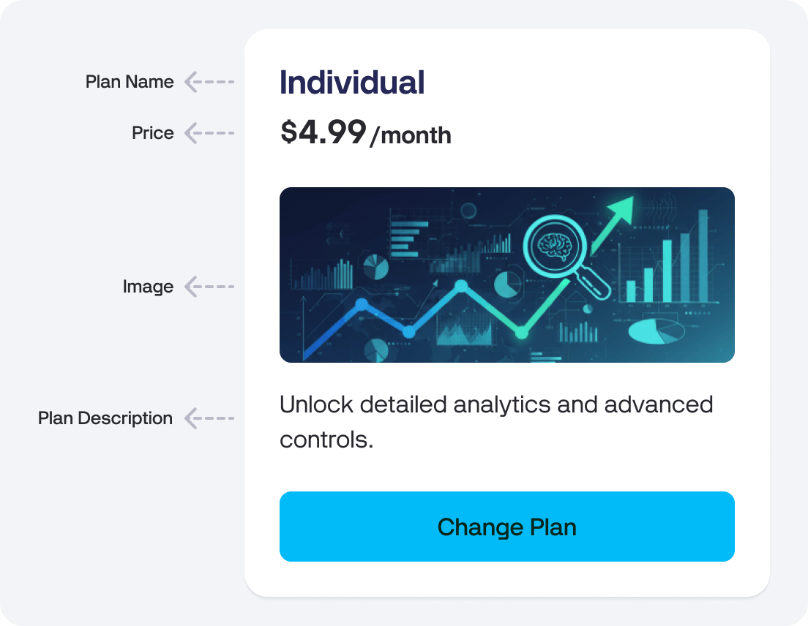
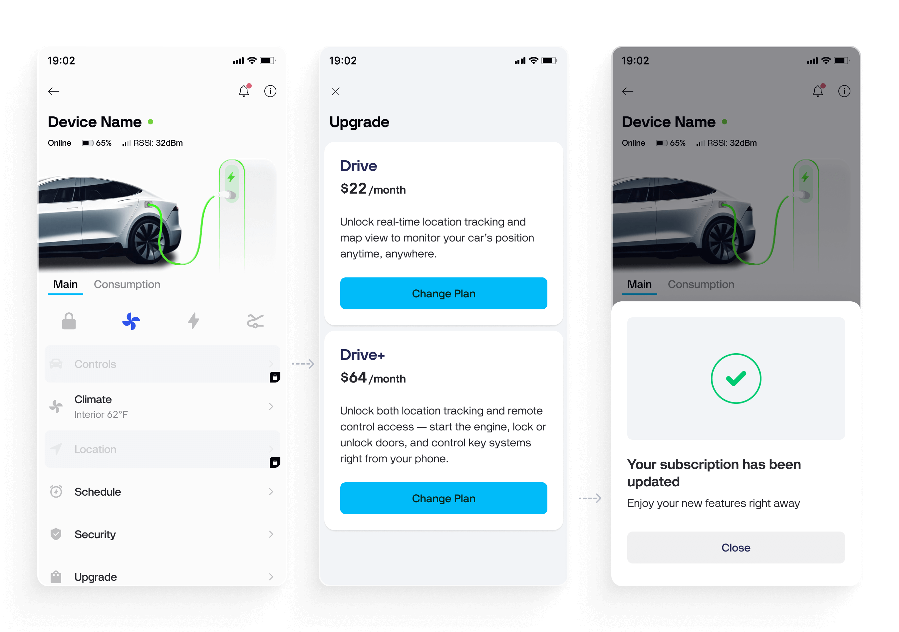

# Billing

#### Overview

The Billing add-on enables you to create and manage custom pricing plans for your end users directly within your app.

**With this feature, you can:**

* Define multiple subscription plans (e.g., _Free_, _Pro_, _Premium_).
* Control access to selected widgets and app features based on the user’s plan.
* Encourage users to upgrade when they try to access restricted features.
* Collect payments and manage user access automatically.


**Note:**

* The Billing add-on is available to [Enterprise plan](https://www.blynk.io/enterprise/blynk-enterprise-overview) subscribers only.
* Contact your Launch Engineer to unlock and configure it for your organization.
* Currently, Billing works with mobile apps only (iOS and Android).


***

#### How to Set Up

**Step 1. Contact Your Launch Engineer**

Reach out to your Launch Engineer to enable the Billing add-on and provide all required content for each pricing plan.


**Note:**

* Only monthly plans are supported at the moment.
* Annual and trial options are planned for future releases


**Pricing Plan Content**

| Field             | Description                                                                         | Example                                                      |
| ----------------- | ----------------------------------------------------------------------------------- | ------------------------------------------------------------ |
| Plan Name         | The display name of your plan shown to users.                                       | Pro Plan                                                     |
| Image (optional)  | Visual banner for your plan. Suggested aspect ratio: 2:1.                           | /images/plans/pro-banner.png                                 |
| Plan Description  | Short summary of what users get after upgrading. Keep it short and benefit-focused. | “Unlock detailed analytics and advanced controls.”           |
| Store Description | Description for App Store and Play Store listings.                                  | “Subscribe to the Pro plan to access advanced IoT controls.” |
| Price             | Monthly subscription price                                                          | $4.99 / month                                                |

**Example of a Plan Card:**

<figure><figcaption></figcaption></figure>

***

**Step 2. Define Which App Features Are Locked**

Once the Billing add-on is active, you can lock specific widgets or features behind a paywall based on the user’s subscription plan.

**To Configure Feature Availability:**

1. Open your **Template** in **Developer Mode** within the mobile app.
2. Select the widget you want to control (e.g., Button, SuperChart, Header Button).
3. In the widget settings, enable **Availability by Plan**.
4. Select which pricing plans will have access to this widget.

Users who don’t have access will see a paywall screen prompting them to upgrade.

**Supported Widgets**

* [Button](https://docs.blynk.io/en/blynk.apps/widgets-controllers/button)
* [Styled Button](https://docs.blynk.io/en/blynk.apps/widgets-controllers/styled-button)
* [Icon Button](https://docs.blynk.io/en/blynk.apps/widgets-controllers/icon-button)
* [Image Button](https://docs.blynk.io/en/blynk.apps/widgets-controllers/image-button)
* [SuperChart](https://docs.blynk.io/en/blynk.apps/widgets-displays/superchart) (graph settings)
* [Header Button](https://docs.blynk.io/en/blynk.apps/device-header-constructor/header-buttons)


More widgets will be supported in upcoming updates.


***

#### How It Looks for the End User

When an end user attempts to access a feature not included in their plan:

1. A paywall screen appears with the locked feature’s name.
2. The screen displays the plans with this feature available.
3. The user can tap Change Plan to switch plans and unlock access immediately.

**Example Flow**

<figure><figcaption></figcaption></figure>

***

#### Promoting Paid Features

Use [in-app messaging](https://docs.blynk.io/en/add-ons/marketing#blynk-in-app-messaging) to inform users about the benefits of upgrading.

You can create a marketing campaign that links directly to your Billing page:

```
https://{server_address}/dashboard/mobile-billing
```

Set this link as the Action URL when configuring your in-app marketing campaign.

This allows you to send promotional notifications to selected user segments and guide them to upgrade seamlessly.

***

#### Linking to Billing Page from Widgets

You can also set Billing as a target page in the following widgets:

* [Button](https://docs.blynk.io/en/blynk.apps/widgets-controllers/button)
* [Styled Button](https://docs.blynk.io/en/blynk.apps/widgets-controllers/styled-button)
* [Header Button](https://docs.blynk.io/en/blynk.apps/device-header-constructor/header-buttons)
* [Formatted Text](https://docs.blynk.io/en/blynk.apps/widgets-interface/formatted-text)

When the user taps the widget, the Billing page with a list of available subscription plans will open automatically.

***

#### Managing and Updating Plans

* To edit, add, or remove a plan, contact your Launch Engineer or Account Manager.
* The Root Org Admin can manually change a user’s subscription directly from the Console.

***

#### API Access

You can get a user’s current plan using both the Platform API and Rule Engine.

This allows you to adapt behavior in your app or device logic depending on the user’s subscription level.
