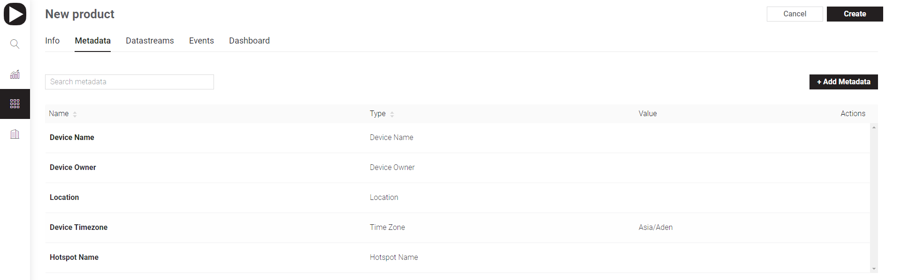

# Metadata

Metadata is a set of characteristics \(or configurations\) applied to every Template and associated with every Device. This information will be used for Device Provisioning and [Device Management](../../../mobile-applications/device-management/).

It's represented by a table in Blynk.Console with Name, Type and Value columns.

Metadata can be of different types. Choose the most relevant type for every characteristic.  
For example, if you would need to associate Serial Number with every product, add the “Number” metadata field. Metadata is also used during device provisioning and configiration process. Staff, installing the equipment will be able to fill it in.

Metadata can be edited by users based on their access level.

Default value can be set to each Metadata, be changed during Add Device procedure and edited any time later.

