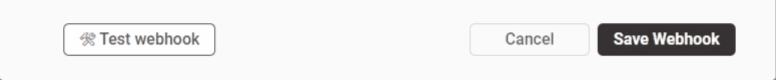
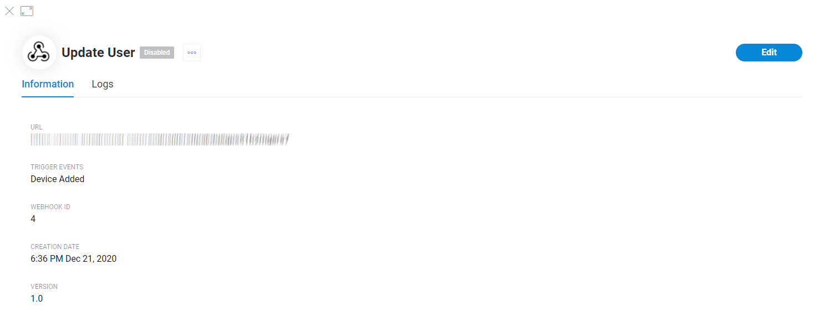

# Webhooks

## Table contents

5 specific columns, table view order can be sorted by any of them.

* **Webhook name**
* **Status** _–_ webhooks can be enabled or disabled for execution
* **Trigger event** – displays the action that causes the webhook to run
* **Last triggered** – displays last execution time in hh:mm:ss M D, Y format \(current year is hidden\)
* **Attempts** – counter of all \(_successful, failed, test, real action_\) attempts to execute the webhook

### Actions

* **Click on row area** – opens Webhook view screen
* **Actions Menu**
  * **Edit** – \(also available from Webhook view screen\)
  * **Test** – triggers test execution with success/error return from the server on the top of the screen \(this execution is not saved to Webhook Log\)
  * **Disable** – turns off the execution of the webhook without deleting it
  * **Delete** – opens delete modal window. Follow the steps described there 

## New Webhook

* **Webhook Name** – Use only letters, digits, -, ' and spaces up to 80 characters. 
* **Webhook Trigger Event** – Blynk.Console event that will trigger webhook execution. Click the field to open events list and select one of the following:
  * New User Added
  * User Deleted
  * User Metadata Updated
  * New Device Added by User 
* **Webhook URL** – input webhook destination https:// link  
* **Request Type** – select supported [HTTP method](https://www.restapitutorial.com/lessons/httpmethods.html):
  * Post – create
  * Get – read
  * Put – update
  * Delete – delete 
* **Content Type** – switch to one of supported webhook request content type: 
  * **Web Form**  Fill the corresponding fields.  Add as much rows as you need – once a row's fields are filled the **Add row** button appears. Hover right to the row to make **Delete** button visible \(at least 2 rows needed for it to appear\).
    * **Form fields constructor**
      * **Key** – type any meaningful key. 100 characters limit
      * **Value** – select from the list \(manual scroll or quick search by typing\)
    * **Query parameters \(optional\)**
      * **Key** – type any meaningful key. 100 characters limit
      * **Value** – select from the list \(manual scroll or quick search by typing\) 
  * **Custom JSON**
    * Code Input field – input your code here. Objects input can be sped up by selecting from Dynamic Data list \(quick search is supported there\)
    * **Dynamic Data**
      * **Search** – objects quick search 
      * **Objects** list – scroll and select the object\(s\) you want to add to your code
  * **Plain text**
    * Text Input field – input any text you want to send. It supports Dynamic Data selections
    * **Dynamic Data**
      * Search – objects quick search
      * User Object list – scroll and select the object\(s\) you want to add to your code
* **Authorization Method \(optional\)** – select corresponding Authentication Type in case your destination requires authorization.
  * **Authentication Type** – switch to one that is required by your destination:
    * **None** is set by default
    * **OAuth 2.0**
      * Client ID 
      * Client Secret – you can click view/hide eye pictogram to be sure it's correct
      * Token URL
    * **Basic Auth**
      * Username
      * Password – you can click view/hide eye pictogram to be sure it's correct
* **HTTP Headers \(optional\)** – you can add them to your request
  * **Key** – type any meaningful key. 100 characters limit
  * **Value** – Use only letters, digits, spaces, /, \_, :, ;, . and - 
* **Test Webhook** – click this button to test the webhook before saving. The result with response code will replace the button. If something is missing in the webhook form – the field will be highlighted.
* **Cancel** – closes webhook form. Please note that all the inputs made will be lost.
* **Create Webhook** – click to save webhook you created

## Webhook view

Once the Webhook is created you can view it's info by clicking it's row or name in Webhooks table.

### Information tab

* **URL** – webhook request destination 
* **Trigger events** – displays the action that causes the webhook to run
* **Webhook ID** – used in Blynk.Console only 
* **Creation date** – hh:mm M D, Y format
* **Version**

### Logs tab

This table stores and displays all trigger results that were caused by real actions \(not test webhook runs\)  
It can be sorted by switching Timeline tabs and each column value.

* **Status** – `OK`_,_ `Waiting`_,_ `Failed` are possible with [`server response code`](https://developer.mozilla.org/en-US/docs/Web/HTTP/Status)\`\`
* **Date** – webhook trigger time in hh:mm:ss M D, Y format 
* **Request to** – webhook request destination URL
* **Trigger ID** – hover on so the hint appears, click Copy pictogram to put it to your clipboard

