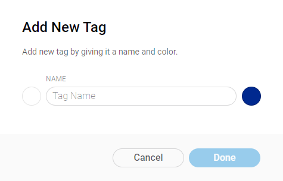

# Tags

## Table contents

There are 5 specific columns:

* **Icons**
* **Id** – every Tag has unique identificator in Web Dashboard and is automatically generated
* **Tag Name** 
* **Color**
* **Owner**

Table view can be **sorted** in ascending/descending order by _Id_, _Tag Name_ and _Owner_

## Search

Tags can be found by _Tag Name_, or _Owner name_ – type at least 1 character to get search results in the table.

## Add Tag

* **Icon** \(on the left of the Name field\) – click to set a pictogram from the menu opened. Can be handy to group and differentiate tags visually. _Color_ settings are applied here.
* **Name** – give tags unique and meaningful names. _\*\*_Use only letters, digits, and spaces. 24 characters limit.
* **Color** – click to set a color by choosing from presets, using color picker or color html code input. Can be handy to group and differentiate tags visually. Also applies to _Icons_.

## Actions

* **Hover on Owner**'s name to view his/her Email – hint will appear, click **Copy** pictogram to put it to your clipboard
* **Actions menu:**
  * **Edit** \(also can be accessed by click on row area\) – opens _Tag Еdit modal window_
  * **Delete** – opens Delete confirmation small modal window

