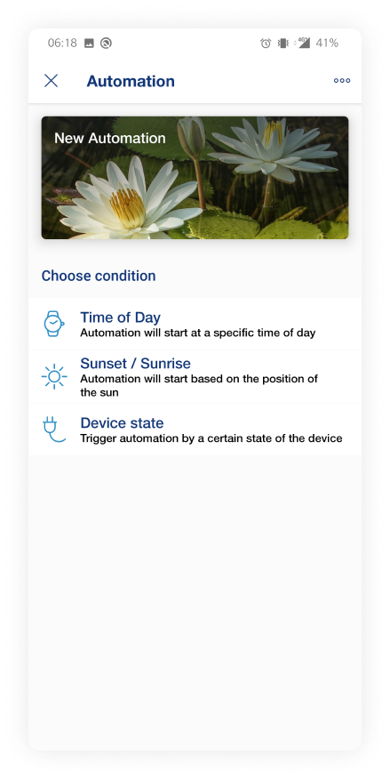
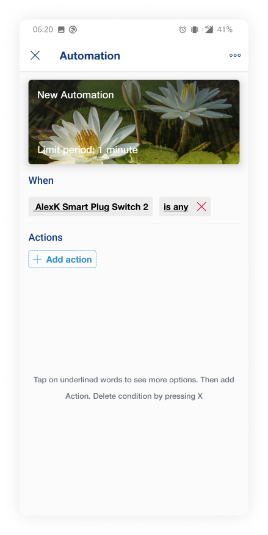
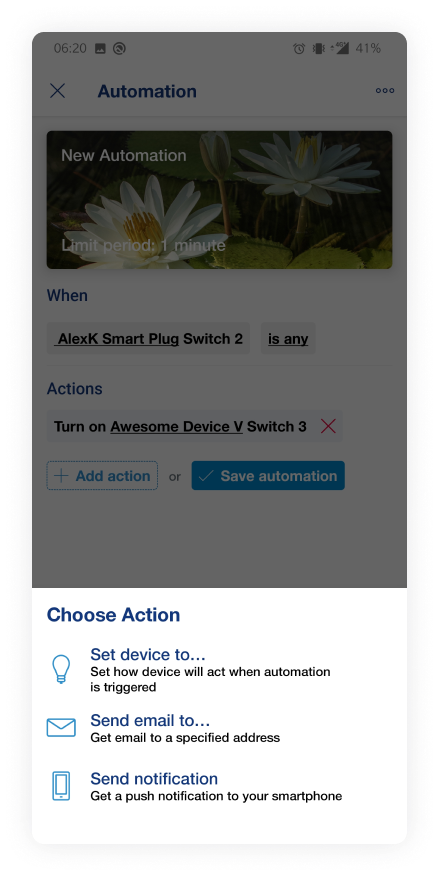
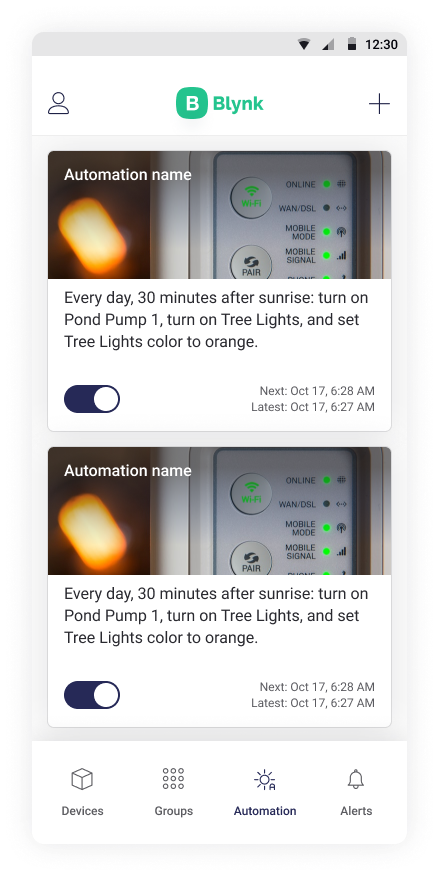

# !Automations

Automations will let you set an automated control of your devices

Press Add automation to create a new one

The first step of creating the automation is choosing its name and cover

Next, you can set a condition that will trigger an automation

After setting the condition you can create actions that will be performed when the condition is triggered

After pressing Add action button you’ll see a modal with types of actions.

You can choose actions that will change the device’s state, send a notification to your smartphone or send an email to the specified address

After adding the first action you can continue adding the next one’s or save this automation

When automations created you will see the list of them. Here you can disable/enable automations and open their settings.

