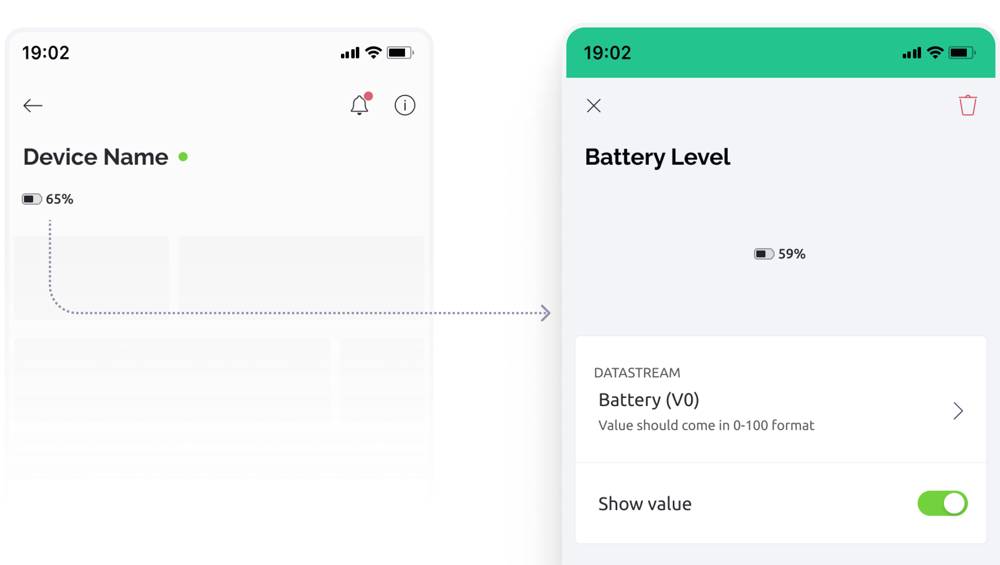

# Battery Level widget

This widget provides a clear visual representation of your battery level, accompanied by a percentage indicator for quick reference.

<figure><figcaption></figcaption></figure>

### Settings

**Datastream** - Select or create a datastream of data type `integer` or `double`. Value should come in 0-100 range.

**Show value** - You can show the battery % value. Turn it off to see just the icon.


### **Properties you can change**

You can hide/show header widgets from device. Use `isHidden` property API:

```
Blynk.setProperty(vPin, "isHidden", "propertyValue");
```

Where:

`vPin` is: virtual pin number the widget is assigned to

`isHidden`: property that controls the widget visibility

`propertyValue`: value of the property you want to change. _true_ and _false_ values are supported.


Example:

```
Blynk.setProperty(V12, "isHidden", true); // This will hide the widget
```


Don't put **`Blynk.setProperty()`** into the **`void loop()`** as it can cause a flood of messages and your hardware will be disconnected. Send such updates only when necessary, or use timers.


### Change widget properties via HTTPs API



The endpoint allows you to update the Datastream Property value via GET request. All widgets (both web and mobile) that are assigned to this datastream will inherit this property. The Datastream Property is persistent and will be stored forever until you change it with another value. In order to clear the property you need to clear the device data in device actions menu.

**Example:**\
`https://blynk.cloud/external/api/update/property?token=GVki9IC70vb3IqvsV0YD3el4y0OpneL1&pin=V1&isHidden=true`



Device [auth token](../../../concepts/device.md#authtoken) from Device info



The datastream [virtual pin](../../../blynk.console/templates/datastreams/virtual-pin.md) (should start with "v")



The property of the widget you want to update: `isHidden`



Get from the bottom right of your Blynk console. [More information](../../../blynk.cloud/device-https-api/troubleshooting.md).



true or false



```
```



```
{"error":{"message":"Invalid token."}}
```


