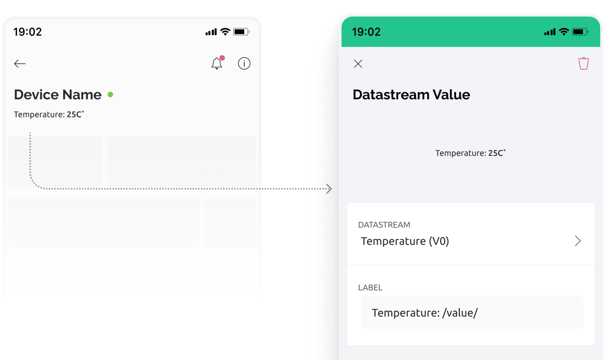

# Datastream Value Widget

Displays the current datastream / virtual pin value. Units assigned to the datastream are also displayed. Labels may also be optionally added before and after the displayed value.

<figure><figcaption></figcaption></figure>

### Settings

**Datastream** - Select or create a datastream of data type integer, double, enumerable or string.

**Label** - Set custom label before the value. E.g Temperature: `/value/`


### **Properties you can change**

You can hide/show header widgets from device. Use `isHidden` property API:

```
Blynk.setProperty(vPin, "isHidden", "propertyValue");
```

Where:

`vPin` is: virtual pin number the widget is assigned to

`isHidden`: property that controls the widget visibility

`propertyValue`: value of the property you want to change. _true_ and _false_ values are supported.


Example:

```
Blynk.setProperty(V12, "isHidden", true); // This will hide the widget
```


Don't put **`Blynk.setProperty()`** into the **`void loop()`** as it can cause a flood of messages and your hardware will be disconnected. Send such updates only when necessary, or use timers.


### Change widget properties via HTTPs API


Updates the Datastream Property and all assigned Widgets!


<mark style="color:blue;">`GET`</mark> `https://{server_address}/external/api/update/property?token={your 32 char token}&pin={your vPin}&{property}={value}`

The endpoint allows you to update the Datastream Property value via GET request. All widgets (both web and mobile) that are assigned to this datastream will inherit this property. The Datastream Property is persistent and will be stored forever until you change it with another value. In order to clear the property you need to clear the device data in device actions menu.

**Example:**\
`https://blynk.cloud/external/api/update/property?token=GVki9IC70vb3IqvsV0YD3el4y0OpneL1&pin=V1&isHidden=true`

#### Path Parameters

| Name                                               | Type   | Description                                                                                                                    |
| -------------------------------------------------- | ------ | ------------------------------------------------------------------------------------------------------------------------------ |
| {server address}<mark style="color:red;">\*</mark> | string | Get from the bottom right of your Blynk console. [More information](../../../blynk.cloud/device-https-api/troubleshooting.md). |

#### Query Parameters

| Name                                    | Type   | Description                                                                                                       |
| --------------------------------------- | ------ | ----------------------------------------------------------------------------------------------------------------- |
| token<mark style="color:red;">\*</mark> | string | Device [auth token](../../../concepts/device.md#authtoken) from Device info                                       |
| pin<mark style="color:red;">\*</mark>   | string | The datastream [virtual pin](../../../blynk.console/templates/datastreams/virtual-pin.md) (should start with "v") |
| {property}                              | string | The property of the widget you want to update: `isHidden`                                                         |
| isHidden                                | string | true or false                                                                                                     |



```
```



```
{"error":{"message":"Invalid token."}}
```


