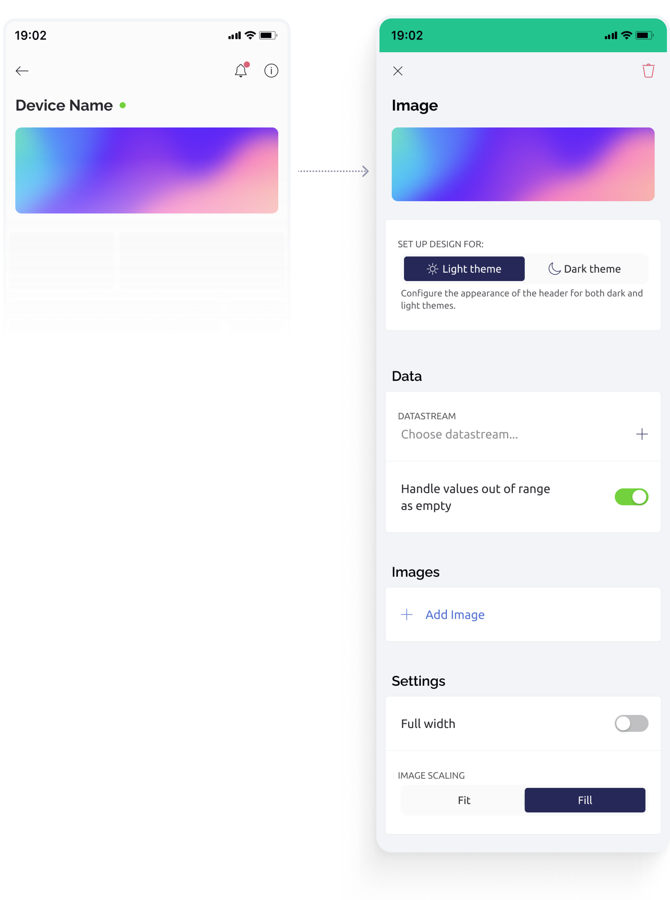

# Image Widget

Improve your header visually with a custom image that can be controlled from hardware.

<figure><figcaption></figcaption></figure>

### Settings

**Theme** - Define how the widget design will appear in dark and light app/OS themes.


**Datastream** - Select or create a datastream of data type integer. By changing the value of this datastream, an image index wil change.&#x20;


**Handle values out of range as empty**&#x20;

When turned ON, widget will don't show an image if the incoming value is out of datastream min/max range.&#x20;

When OFF, the image with index closest to the current value will be shown.


**Images** - Specify a list of images to display, where the Image ID corresponds to the respective values of the datastream.


**Full width** - When ON, image will be expanded to the edges of the screen and under the Tabs.


**Images scaling** - Choose between FIT or FILL options to adjust how the image appears within the container.


### **Properties**

You can change certain properties of the Widget from your hardware. For that, use this command:

```
Blynk.setProperty(vPin, "widgetProperty", "propertyValue"); 
```

Where:

* `vPin` is: virtual pin number the widget is assigned to
* `widgetProperty`: property you want to change
* `propertyValue`: value of the property you want to change


Don't put **`Blynk.setProperty()`** into the **`void loop()`** as it can cause a flood of messages and your hardware will be disconnected. Send such updates only when necessary, or use timers.


### Properties you can change

You can change the properties _`url`_, _`urls`_, _`isHidden`_ of the widget from your hardware. The URL must be encoded, so spaces in labels must be replaced with %20, and color hexadecimal values in the HTTP API URL must include the hash # character urlencoded as %23.

#### **Change Images**

Change the individual image by its index:

```
Blynk.setProperty(V1, "url", 1, "https://image1.jpg");
```

Change a list of URLs for the widget. First image will have index `0`, next `1`, and so on.

```
Blynk.setProperty(V1, "urls", "https://image1.jpg", "https://image2.jpg");"
```


Make sure you not exceed the max string size of 255 chars when sending a long list of URLs&#x20;


#### Show/Hide

Widget can be hidden from header.

```
Blynk.setProperty(V1, "isHidden", true);
```

### Change widget properties via HTTPs API


Updates the Datastream Property and all assigned Widgets!


<mark style="color:blue;">`GET`</mark> `https://{server_address}/external/api/update/property?token={your 32 char token}&pin={your vPin}&{property}={value}`

The endpoint allows you to update the Datastream Property value via GET request. All widgets (both web and mobile) that are assigned to this datastream will inherit this property. The Datastream Property is persistent and will be stored forever until you change it with another value. In order to clear the property you need to clear the device data in device actions menu.

**Examples:**\
`https://blynk.cloud/external/api/update/property?token=GVki9IC70vb3IqvsV0YD3el4y0OpneL1&pin=V1&isHidden=true`

https://blynk.cloud/external/api/update/property?token={token}\&pin={pin}\&url={index}\&url={url}

`https://blynk.cloud/external/api/update/property?token=GVki9IC70vb3IqvsV0YD3el4y0OpneL1&pin=V1&url=2&url=https://image%202.jpg`

https://blynk.cloud/external/api/update/property?token={token}\&pin={pin}\&urls={url1}\&urls={url2}\&urls={url3}

`https://blynk.cloud/external/api/update/property?token=GVki9IC70vb3IqvsV0YD3el4y0OpneL1&pin=V1&urls=https://image%201.jpg&urls=https://image%202.jpg&urls=https://image%203.jpg`

#### Path Parameters

| Name                                               | Type   | Description                                                                                                                    |
| -------------------------------------------------- | ------ | ------------------------------------------------------------------------------------------------------------------------------ |
| {server address}<mark style="color:red;">\*</mark> | string | Get from the bottom right of your Blynk console. [More information](../../../blynk.cloud/device-https-api/troubleshooting.md). |

#### Query Parameters

| Name                                    | Type   | Description                                                                                                       |
| --------------------------------------- | ------ | ----------------------------------------------------------------------------------------------------------------- |
| token<mark style="color:red;">\*</mark> | string | Device [auth token](../../../concepts/device.md#authtoken) from Device info                                       |
| pin<mark style="color:red;">\*</mark>   | string | The datastream [virtual pin](../../../blynk.console/templates/datastreams/virtual-pin.md) (should start with "v") |
| {property}                              | string | The property of the widget you want to update: `isHidden`, `url`, `urls`                                          |
| isHidden                                | string | true or false                                                                                                     |
| url                                     | string | Replace image by its index. Indexes start from 0. URL should be urlencoded                                        |
| urls                                    | string | Replace the whole set of images with the new set of URLs. The URLs should be urlencoded                           |



```
```



```
{"error":{"message":"Invalid token."}}
```



