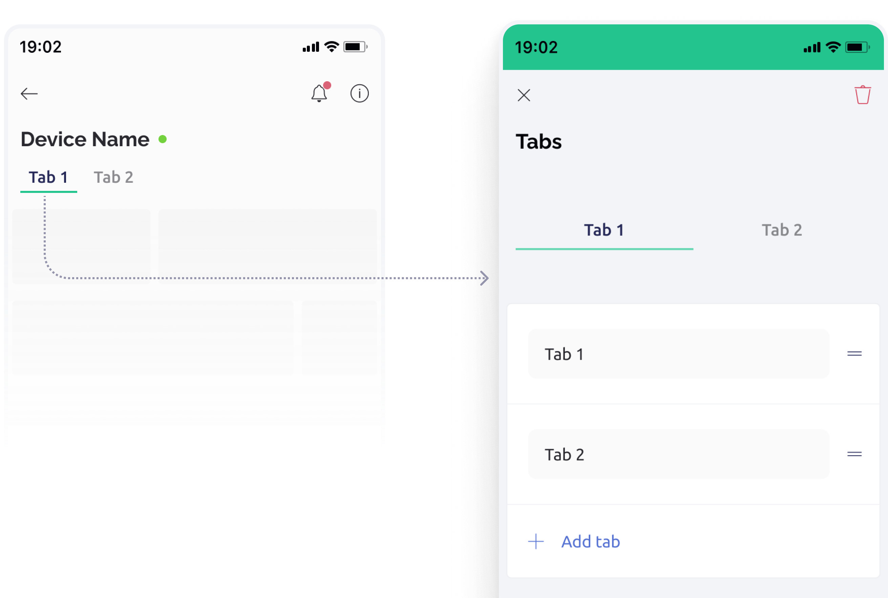

# Tabs widget

Adds one or more tabs to the top of the device mobile dashboard in order to expand and organize the user interface space. You can drag widgets between tabs. Note that [plan limits](../../../blynk.console/limits.md) apply here.

<figure><figcaption></figcaption></figure>

### **Navigating the Tabs Editor:**

To access the Tabs editor, simply tap on the active tab. In the editor, you can rename tabs, alter their order, add new tabs, and swipe left to delete a tab. Note that the last two tabs are permanent and cannot be removed, but you can delete the entire widget by pressing the “Trash” icon located at the top right.

### **Moving Widgets Between Tabs:**

1. Press and hold the widget you wish to move.
2. Drag it over the tab where you want it to be placed and hold until the tab opens.
3. Release the widget in the desired position to seamlessly move it between tabs.


Tabs don't support `setProperty`API

