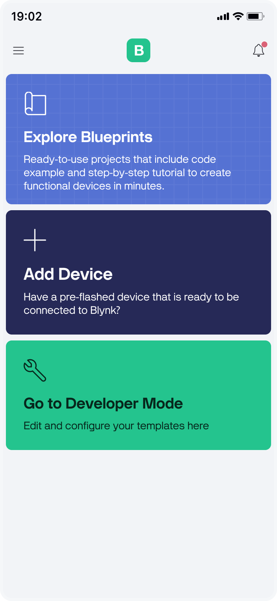
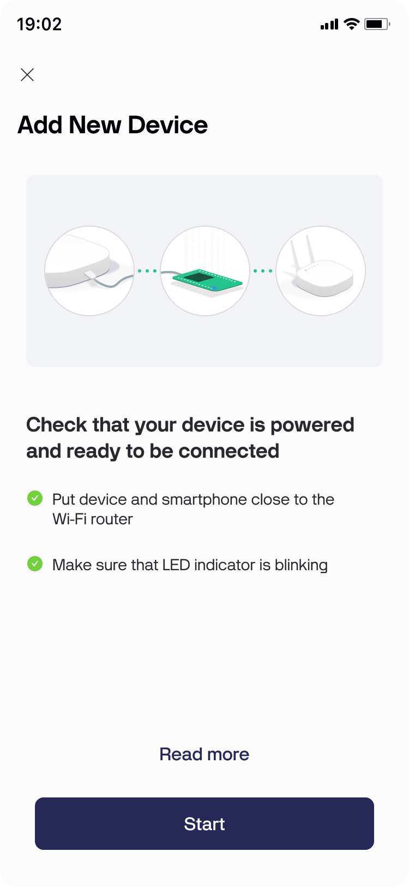
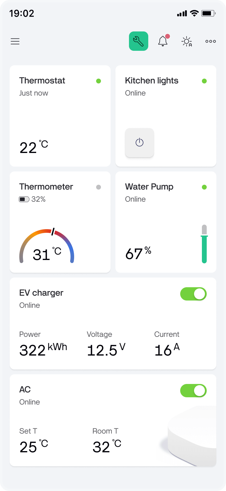
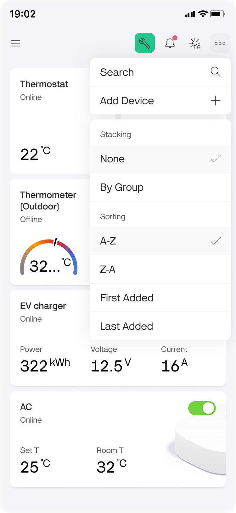

# Devices

In case you haven't added devices yet, your Devices screen will look like this. Tap **Add New Device** to add new devices.

<figure><figcaption>
Devices tab
</figcaption></figure>

Follow the [provisioning steps](../../getting-started/activating-devices/blynk-edgent-wifi-provisioning.md).

<figure><figcaption>
Add new device
</figcaption></figure>

You will see the tiled list of devices after they are added.

<figure><figcaption></figcaption></figure>

You can add new and **stack/sort** existing devices in the **right side menu**

<figure><figcaption>
R<strong>ight side menu</strong>
</figcaption></figure>

Tap **Device tile** to open the device's Dashboard. Here you can view and interact with device's stats and settings.

<figure><figcaption>
Device dashboard
</figcaption></figure>

**Timeline** screen displays all events and notifications related to this device. The screen is availble on tapping the _bell_ icon.

<figure><figcaption>
Timeline screen
</figcaption></figure>

Device info screen contains all the basic information and meta data related to the device and can have additional tabs to host more info with PRO plan or higher. Device actions menu is accessible from the device info screen.

<figure><figcaption>
Actions menu on device info screen
</figcaption></figure>

**Actions Menu** options:

* **Notification settings** – enables the configuration of specific settings for notifications on this particular device, such as sound options, availability and sound for critical notifications, connection status alerts, and the option to disable all notifications entirely.
* **Reconfigure** – use to connect new or factory-reset Device so it keeps all data and settings of a previously set up and used Device. [Starts provisioning flow](../../getting-started/activating-devices/blynk-edgent-wifi-provisioning.md#re-provisioning-new-wifi-credentials).
* **Erase all device data** – _**critical action!**_  Erases all data generated by the device with no restore option. Confirmation required.
* **Delete** – _**critical action!**_  Deletes the device and all it's data. Confirmation required.
