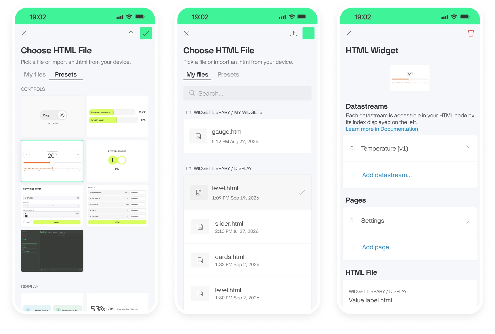

# HTML Widget

The HTML Widget runs your own HTML, CSS, and JavaScript as a widget on the mobile Dashboard, connected to your datastreams. It is the same widget as in [Console](../blynk.console/widgets-console/html-widget/) and it uses the same `BlynkBridge` API described in [HTML Widget Developer Guide](../blynk.console/widgets-console/html-widget/html-widget-developer-guide.md), so a widget built for the web Dashboard runs in the App without changes to its code.

The App loads the widget's `.html` file from **Assets** and injects `BlynkBridge` before your page scripts run. Through it your page can read datastream values, write values back to the Device, receive real-time updates, read Device metadata, fetch historical and map data, pick up the app theme, and open other pages.


**Note:** The App has no code editor. You choose an existing `.html` file or import one from your phone. To write or edit widget code, use the Code Editor in Console.


***

### Adding an HTML Widget

1. Switch to **Developer Mode** and open the Template's mobile device dashboard in the [Mobile Dashboard Editor](https://docs.blynk.io/en/blynk.apps/constructor).
2. Add the **HTML Widget** to the dashboard.
3. Open the widget settings.
4. Choose an HTML file: Blynk preset, uploaded assets, or import file from your phone.
5. Assign datastreams, add pages if your widget navigates.
6. Save widget.

***

### Widget settings

The settings screen has four sections.

| Section         | What it does                                        |
| --------------- | --------------------------------------------------- |
| **Preview**     | Renders the selected file with the current settings |
| **Datastreams** | The datastreams the widget can read and write       |
| **Pages**       | The dashboard pages the widget is allowed to open   |
| **HTML File**   | The `.html` file the widget renders                 |

***

#### Datastreams

Each datastream is accessible in your HTML code by its index, shown on the left of the row. The order of rows defines the index, starting at `0` — your code refers to datastreams by that index, not by name.


**Note:** Reordering or removing a datastream changes the indexes of the ones after it. If your widget reads by index, check it still points at the right stream after editing this list.


***

#### Pages

**Pages** lists the dashboard pages this widget can open, numbered from `0`. Your code opens them by that index with `showPage(index)` — not by page ID.

Tap **Add page** to add a target. See [Pages](https://docs.blynk.io/en/blynk.apps/pages) for how dashboard pages work.

***

#### HTML File

Shows the folder and file name of the selected file, for example **WIDGET LIBRARY / DISPLAY → Value label.html**. From here you can:

* **Choose another** — reopens the **Choose HTML File** screen
* **Clear selection** — unassigns the file and returns the section to its empty state

***

### Choosing an HTML File

The **Choose HTML File** screen is where you pick the file the widget renders.

#### My files

Lists only `.html` files stored in the **Widget Library** folder in [Assets](https://docs.blynk.io/en/blynk.console/templates/assets) or its sub-folders. Files kept elsewhere in Assets are not shown.

#### Presets

Ready-made widgets built and maintained by Blynk. When you select a preset and confirm, a copy is created in **Widget Library → My widgets** — the same behavior as on the web. The original preset is never modified.

#### Importing from your phone

The upload button in the header opens your phone's file picker so you can import an `.html` file from the device. The imported file is added to your Assets.


**Tip:** Sub-folders inside **Widget Library** appear as separate groups here. Organize your widgets into sub-folders in Console and the App's list follows the same structure.


***

### Generating widgets with AI

Blynk publishes `blynk-html-widget`, an [Agent Skill](https://agentskills.io) that teaches an AI coding agent how to build HTML widgets. It carries the BlynkBridge API reference, the platform constraints, and Blynk's visual style, so the agent produces a widget that works instead of guessing at the bridge.

Download the skill and follow the steps in [Generating widgets with AI](../blynk.console/widgets-console/html-widget/html-widget-developer-guide.md#generating-widgets-with-ai). Generate and edit the widget in Console, then select its `.html` file in the App.

***

### Limits

The HTML widget is available on all plans. The number of widgets you can add differs by subscription.

| Limit                         | Details                                                              |
| ----------------------------- | -------------------------------------------------------------------- |
| **HTML code size**            | 100,000 characters per widget                                        |
| **HTML Widgets per Template** | `1,3,10,20` per plan — see [Blynk pricing](https://blynk.io/pricing) |
| **Historical data range**     | Maximum 365 days per request                                         |
