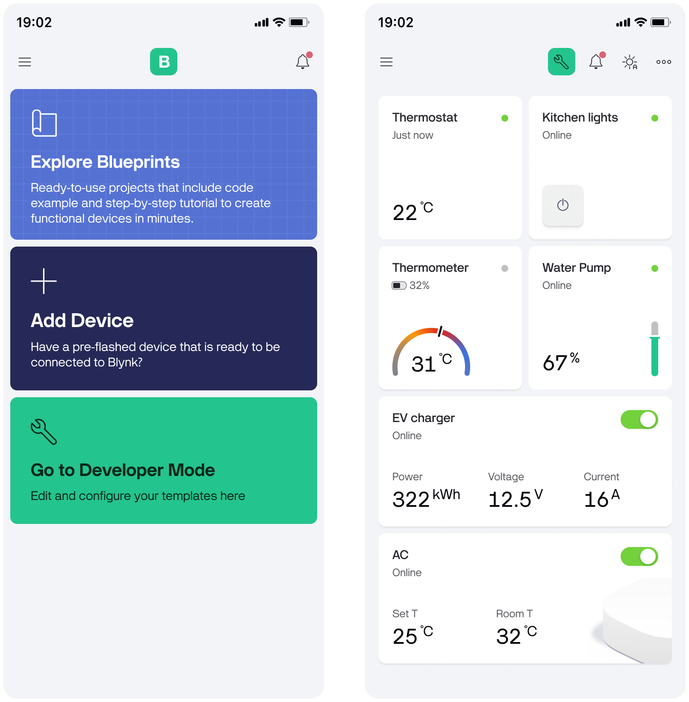
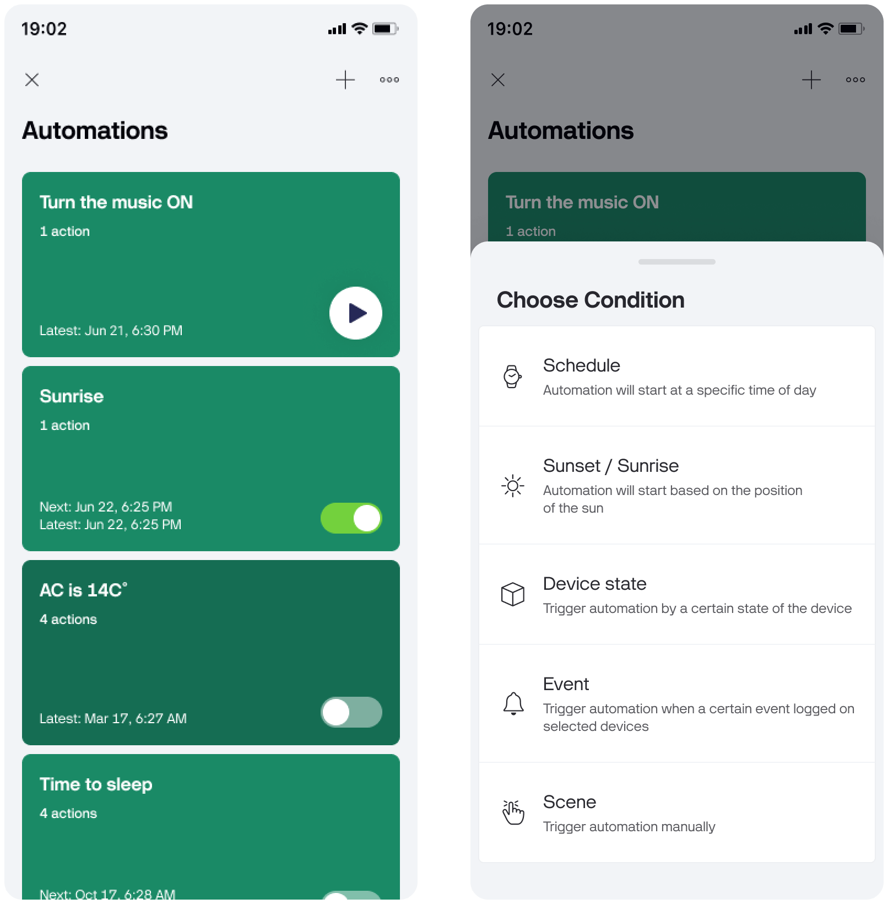
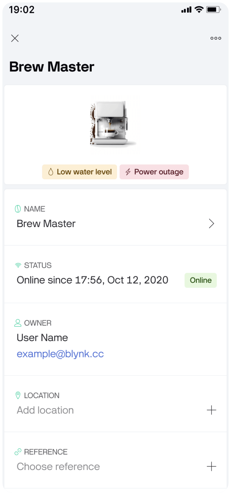
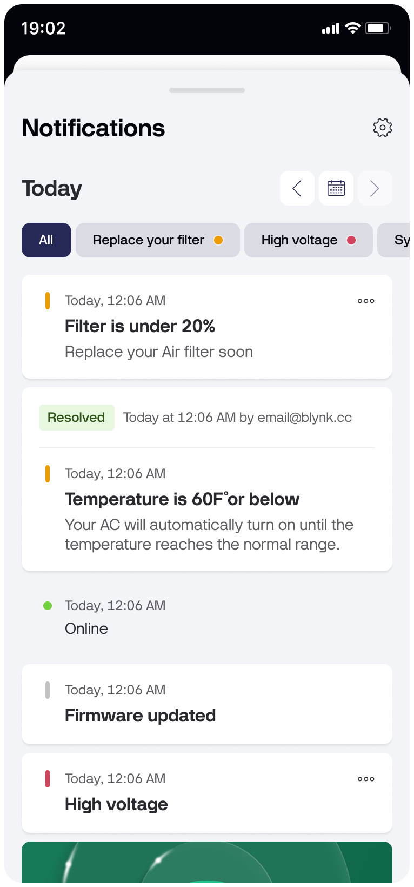
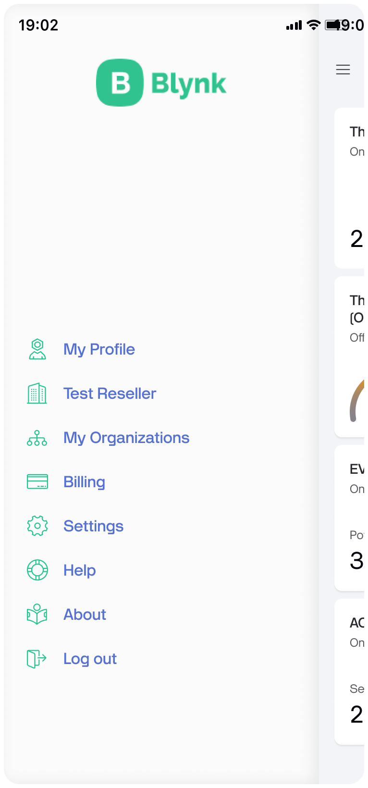

# Overview

Blynk offers native iOS and Android mobile apps which allow to remotely control connected devices and visualize data from them.

App operates in two modes:

#### **Developer Mode**

The primary function of Developer Mode in the mobile app is to [build and edit the Mobile Dashboard User interface (GUI) for the given Device Template](constructor.md).

Mobile Dashboard is built from Widgets - modular UI elements which can be positioned on the canvas. Every Widget serves a special function (a button, a slider, a chart, etc). Every Widget has it's own settings based on its functionality**.**

#### **End-user mode**

This mode is used by both the developers and the end-users.

It's focused on devices, automations and notifications view and management with the help of widgets and additional screens containing specific information about data that is set/sent/received to/from Blynk.Cloud and devices.

## Home screen

Depending on the configuration, home screen can consist of up to 3 sections corresponding to icons in the navigation bar: [Devices](overview.md#devices), [Automations](overview.md#automations) and [Notifications & Events](overview.md#notifications-and-events)

### **Devices**

<figure><figcaption>
Devices section
</figcaption></figure>

This section is open by default when you open the app. All created devices will be listed here and their tiles will look according to their [template ](../blynk.console/templates/)type. To add a device go to the [Right](overview.md#right-menu) menu by tapping the top right button in the navigation bar. There are also options to change how devices are sorted.

If there are no devices yet, there is a button "Add new device" in the middle wich takes you right to the device provisioning routine.

### **Automations**


This section is visible only when a template has at least one datastream enabled for automation.\
To learn how to enable a datastream for automation, please read the [Datastreams](../blynk.console/templates/datastreams/datastreams-common-settings/) article.


<figure><figcaption>
Automations section
</figcaption></figure>

You can [automate](../concepts/automations.md) your connected devices with the following triggers:

* Time of the day
* Sunset and sunrise
* Device trigger
* Manual execution (Scenes)

### **Notifications & Events**

<figure><figcaption>
Notifications &#x26; events section
</figcaption></figure>

The list of notifications from all devices will be here.


In order to be listed here, the template should have the [Event](../blynk.console/templates/events/) configured and the event should be [triggered](../blynk.console/templates/events/custom-events/events--how-to-log-events.md) in the device.


## Device dashboard

<figure><figcaption></figcaption></figure>

When a user taps on the device tile, the device dashboard will open. It consists of widgets to monitor and control the device. The layout of the widgets and their settings can be edited in the [Developer mode](../concepts/developer-mode.md) and apply to all devices using this template.

### **Device Info**

The 'i' icon in the top right corner of the dashboard opens the _Device Info_ page.

In the **Device Info** page the metadata for the device is presented. You can edit a device name, view other information like firmware version, etc.

<figure><figcaption>
Device Info page
</figcaption></figure>

### **Device Actions menu**

<figure><figcaption>
Device Actions menu
</figcaption></figure>

At the top right corner of the Device Info page, there's a 'three dots' icon that opens device actions menu with the following options:

* Notification settings
* Reconfigure (re-provision new WiFi credentials)
* Erase all device data
* Delete device

### Device Notifications

In the **Device Notifications** page which is opened by tapping on the 'bell' icon in the _Device Dashboard_ page, you'll find the list of all events of the device (for example online, offline and custom [Events](../blynk.console/templates/events/)).

<figure><figcaption>
Device Notifications page
</figcaption></figure>

## Main menu

<figure><figcaption></figcaption></figure>

At the top left corner of the main screen, there's a **Burger** icon that opens the main menu when you tap on it. This menu consists of the following entries:

* **My profile** – here you can change your name, password, or delete your account.
* **Organization settings** – manage organization info (change the organization name, description, and timezone), members and contractors here.
* **My Organizations (households)** – view the structure of your organization. Switch to one of your suborganizations to view the app as a member of that suborg.
* **Billing** – view and manage your plan (if you initially subscribed on this platform).
* **Settings** – set up sounds for notifications, light/dark theme, biometric authentication and other global settings for the app.
* **Help** –  quick access to Blynk's documentation.
* **About** – app version, server, logs, reset learning cards and other useful resouerces.
* **Log out**&#x20;

## **Right menu**

<figure><figcaption></figcaption></figure>

At the top right corner in the main screen, there's a 'three dots' icon that opens the right sidebar menu when you tap on it.\
It offers adding a new Device, as well as search and sorting and stacking options for the devices and device groups list.
