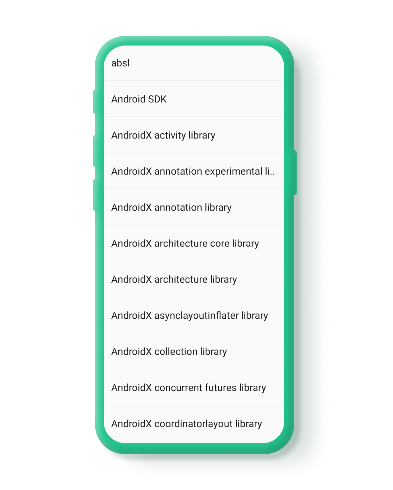

# About

.png>)

### General app info:&#x20;

* Version – Blynk IoT app version
* Account – Email of the account used at the moment
* Server – server web address

### Set up log collection parameters by toggling the switches:

* App usage analytics
* App performance analytics
* App logs

### Actions:

#### Send logs.

Use this option once you've spotted the issue to provide us details of what went wrong.

1. tap it
2. select Email application (Blynk team members addresses and all the logs you've activated will be present there)
3. attach screenshot or video of the issue (if needed)
4. send the email

#### Remove logs

This option allows to reduce the size of log files stored on your device and sent to Blynk team.\
We kindly ask you to use it before reproducing the issue and sending the logs, if it's possible.

#### Third party libraries

List of libraries used with Terms and Conditions details included (view by tap)

