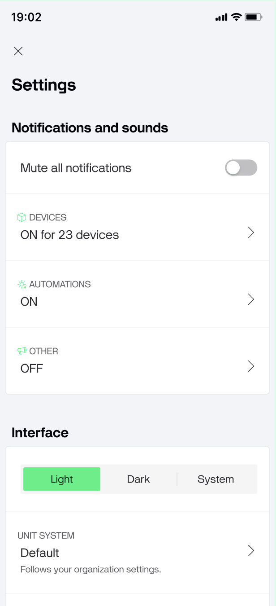

# Settings

Tap Settings in the left sidebar.

Here you can enable or disable the following application settings:

### Notifications and sounds

* Mute all notifications: will mute any incoming notifiations
* Devices: set up device notifications settings and choose sound for generic and critical alerts
* Automations: turn on/off notifications triggered by Automations. You can choose custom sounds
* Other

### Unit system

Each user can override the org default in their **Settings** on mobile app. Users get the same **Metric** and **Imperial** presets, plus a **Default** option that follows whatever the organization is set to.&#x20;

Default is pre-selected for new users and shows what it currently resolves to, so users always know what they're inheriting. If the org admin later changes the org units, users on Default update automatically; users who picked their own preset stay put.

<figure><figcaption></figcaption></figure>

### Interface

* Keep screen always on: if you don't exit the app, smartphone screen will not turn off&#x20;
* Don't show offline notifications:&#x20;
* Skip tile view for single device: if you have only one device, device list will be hidden. When app is opened, device dashboard will appear. If you add more than one device, device list (tiles) will be seen automatically

### Security

Biometric authentication: enable fingerprint/face authentication if smartphone supports it.
