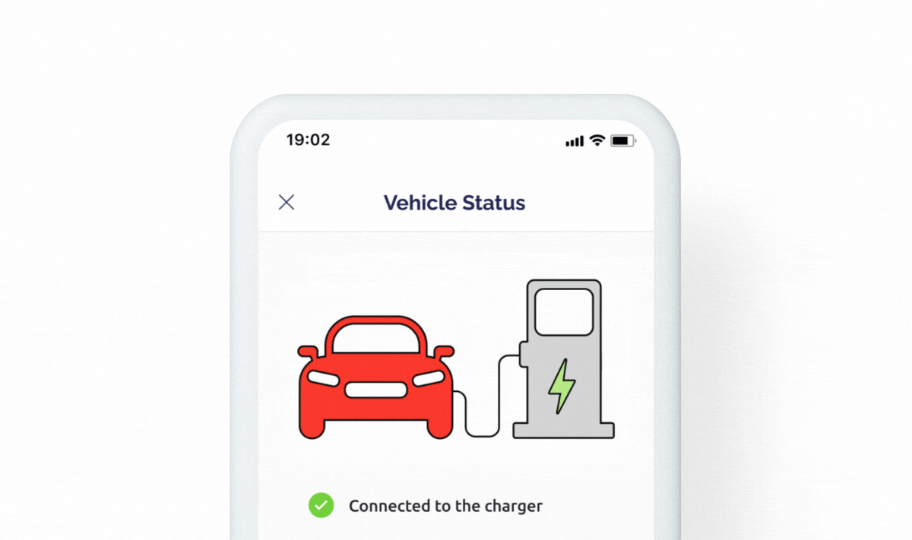

# Lottie Animation


Available to PRO and higher subscribers.


This widget allows you to display an animated Lottie image. Lottie is a JSON based file format for vector graphics animation.  It is intended as a lighter alternative to other [animated graphic](image-animation.md) file formats (GIF, APNG, ...).  It is commonly used in applications and web pages.

<figure><figcaption></figcaption></figure>

### Widget Controls

The widget has the following controls:

1. URL ADDRESS: The URL to .json file.
2. Auto-Play: Play the animation once when the device is initially displayed in the app.&#x20;
3. Play in Loop: Play the animation repeatedly.\


### Datastream

Select or create a datastream of [data type](https://docs.blynk.io/en/blynk.console/templates/datastreams/datastreams-common-settings/data-type) string. The datastream value of “play” will cause the animation to play, and the value of “stop” will cause the animation to stop.&#x20;

### Change Widget Properties

You can change the properties of the widget from your hardware using the command:&#x20;

```cpp
Blynk.setProperty(vPin, "widgetProperty", "propertyValue"); 
```

Where:&#x20;

* `vPin` is: virtual pin number the widget is assigned to
* `widgetProperty`: property you want to change
* `propertyValue`: value of the property you want to change


Don't put **`Blynk.setProperty()`**into the **`void loop()`** as it can cause a flood of messages and your hardware will be disconnected. Send such updates only when necessary, or use timers.



#### Properties you can change

You can change the properties _url_, _autoplay_, and _loop_ of the widget from your hardware, or via an [HTTP API](../../blynk.cloud/update-property.md). Substitute ‘V2’ in the examples below with the datastream virtual pin reference (V0, V1 ...V255) you have configured for this widget. Make sure any string values are [URL encoded](https://en.wikipedia.org/wiki/URL\_encoding).&#x20;

```cpp
Blynk.setProperty(V2, "url", "https://mechatronicsolutionsllc.com/Blynk_animated_image_breathing.json"); 
// Change image URL via hardware
```

```cpp
Blynk.setProperty(V2, "autoplay", "true"); // Start the image animation
Blynk.setProperty(V2, "autoplay", "false"); // Stop the image animation
```

```cpp
Blynk.setProperty(V2, "loop", "true"); // Set the image to replay from the beginning
Blynk.setProperty(V2, "loop", "false"); // Set the image to stop at the end of the animation

```

### Change widget properties via HTTPs API



The endpoint allows you to update the Datastream Property value via GET request. All widgets (both web and mobile) that are assigned to this datastream will inherit this property. The Datastream Property is persistent and will be stored forever until you change it with another value. In order to clear the property you need to clear the device data in device actions menu.

**Example:**\
`https://blynk.cloud/external/api/update/property?token=GVki9IC70vb3IqvsV0YD3el4y0OpneL1&pin=V2&autoplay=true`



Device 

[auth token](../../concepts/device.md#authtoken)

 from Device info



The datastream 

[virtual pin](../../blynk.console/templates/datastreams/virtual-pin.md)

 (should start with "v")



The property of the widget you want to update: 

`autoplay`

, 

`loop`

, 

`url`



true or false



Get from the bottom right of your Blynk console. 

[More information](../../blynk.cloud/troubleshooting.md)

.



true or false



the image URL, should be urlencoded



```
```



```
{"error":{"message":"Invalid token."}}
```




### Sync hardware to the latest datastream value

You can update your hardware to the latest datastream value from Blynk.Cloud after your hardware went offline, and then came online again.

```cpp
BLYNK_CONNECTED() { // Executes every time Blynk is connected to the Blynk.Cloud 
 Blynk.syncVirtual(V2); // Synchronize variable V2 with the latest value stored in Blynk.Cloud
}
```

### Change the datastream value with the hardware

Use the `Blynk.virtualWrite()` command to set the datastream value to “play” to cause the animation to play, and the value “stop” to cause the automation to stop playing.&#x20;

```cpp
const uint32_t TIMER_INTERVAL_V_MS = 15000;
uint32_t timerLastVn = 0;
uint8_t toggle = 0;


void timerVn(uint8_t vPin) {
 if (timerLastVn > millis()) timerLastVn = millis();
 if ((millis() - timerLastVn) > TIMER_INTERVAL_V_MS) { 
 if (toggle == 1) {
 toggle = 0;
 Blynk.virtualWrite(vPin, "play"); // play animation
 } else { // toggle == 0
 toggle = 1;
 Blynk.virtualWrite(vPin, "stop"); // stop animation
 }
 timerLastVn = millis(); 
 } 
} // timerVn()


void setup() {
} // setup()


void loop() {
 timerVn(V2)
} // loop()

```

### Change the datastream value with the HTTP API

Use the Blynk [HTTP API](../../blynk.cloud/https-api-overview.md) to set the datastream value to _play_ to cause the animation to play, and the value _stop_ to cause the automation to stop playing.



**Example:**

\


`https://blynk.cloud/external/api/update/property?token=GVki9IC70vb3IqvsV0YD3el4y0OpneL1&V2=stop`



Get from the bottom right of your Blynk console. 

[More information](../../blynk.cloud/troubleshooting.md)

.



Device 

[auth token](../../concepts/device.md#authtoken)

 from Device info



The datastream 

[virtual pin](../../blynk.console/templates/datastreams/virtual-pin.md)

 (should start with "v")



The desired value of the pin (play or stop)



```
```



```
{"error":{"message":"Invalid token."}}
```




### Control hardware with datastream value

You can configure the hardware to respond to a change in a datastream value by configuring the `BLYNK_WRITE()` command.&#x20;

```cpp
BLYNK_WRITE(V2) // Called when the datastream value for V2 changes
{
 int pinValue = param.asInt(); // assigning incoming value from virtual pin V2 to a variable
 
 if (value=="play") {
 Serial.println("V2 'play' command received'");
 } else if (value=="stop") {
 Serial.println("V2 'stop' command received'");
 } else {
 Serial.print("Unexpected V2 value of: ");
 Serial.print(value);
 Serial.println("");
 }

}
```
