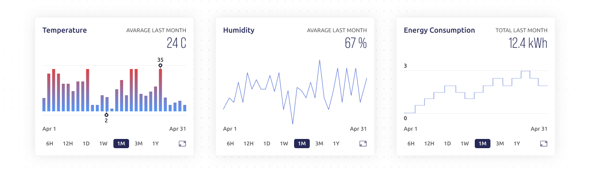
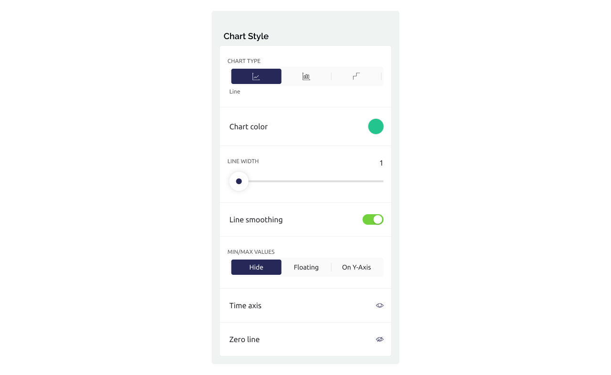
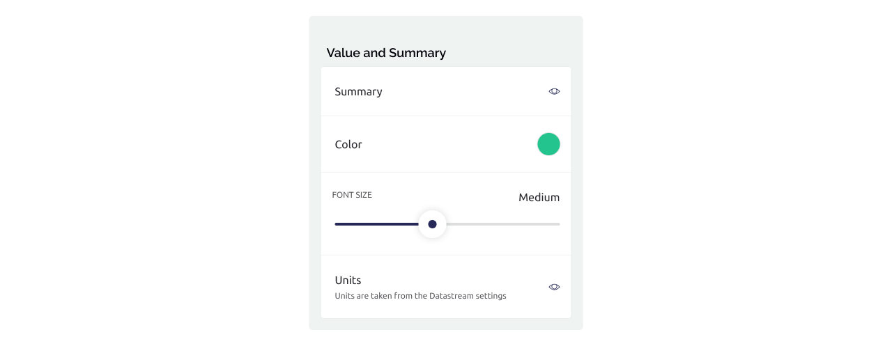

# Simple Chart



Visualize live and historical data in a chart from a **single** datastream. Applications include sensor data and binary event logging. Choose from data aggregation options of average and sum. The Y-axis scaling can be customized.  Scrolling is an option, and you can connect missing data points.

See also the [SuperChart widget](superchart.md) that can handle multiple datastreams, shows the Y axis values, and supports the chart types of line, step, area, bar, state.

Simple Chart features:

* line, stepped line, or bar chart types
* plotting data resolutions: 1 min, 1 hour, or 1 day
* plotting time ranges from 6 hours to 1 year
* auto-scaled or fixed data axis
* highlighted min/max values
* easily reveal individual points via tap-n-hold
* scrollable time axis
* numerous styling settings
* full-screen mode

### **Widget Settings**

#### **Data**


Select a datastream which has numerical (i.e. of Int or Double) data type and comes from the device. Data that the app sends to the device is not registered. Simple Chart widget shows data from a single datastream. If you need to plot multiple datastreams in a single chart, check the Super Chart widget. By default the chart shows the average value (AVG) for each point on the chart, but you can change aggregation to (SUM) total of the incoming data. The time period covered by each point on the chart is defined by the selected Time Range/Resolution (see below).

#### Chart Style



Choose chart type (Line, Bar, or Step line) and its visual properties, like line width, color or gradient, axes style, etc. Note: when the gradient option is used, its color distribution is based on min/max properties of the selected datastream.

#### Time Ranges / Resolution


Select up to 7 time ranges you want to be able to switch between in the widget. Each time range button you select specifies its resolution - that is a period of time covered by each single point on a chart. Whenever there are multiple actual data writings coming from the device within the resolution period, that data is aggregated into one point (calculating average or total depending on the selection made in the Data section (see above).

#### Y-Axis Scaling


There are a number of ways to define the range of values to be shown on a chart. Select option to**:**

* use datastream min/max (available for AVG aggregation, not available for SUM aggregation)
* auto scale the visual range to always fit all the data
* 0-Auto: auto-scale but always start from zero
* define fixed min and max of the visual range
* define delta: chart is auto-scaled, but its range never gets less than the delta set

#### Summary



Turn on Summary to show the average or total of all values presented on the chart in the top right corner. Note: summary style settings also define the style of selected value during tap-n-hold.

#### Other Settings


* Show or hide a button at the bottom right to go to full-screen mode
* Allow chart scrolling along the time axis. On scrolling, the chart and the summary are updated according to the new time range
* Whether the line chart should connect missing points - that is all available points are connected in a line. Turn it off to visualize points without neighbours

### How to send data from device to Simple Chart widget

Usually, just make sure that the data coming from the device is numerical. See more details on sending data [here](https://docs.blynk.io/en/getting-started/how-to-display-any-sensor-data-in-blynk-app).

```
float sensorData = readSensor(); 
Blynk.virtualWrite(V5, sensorData);
```

### Widget Properties

Simple Chart supports standard `isDisabled` and `isHidden` [properties](https://docs.blynk.io/en/blynk.edgent-firmware-api/widget-properties)&#x20;

```
Blynk.setProperty(V0, "isDisabled", "true");
```
