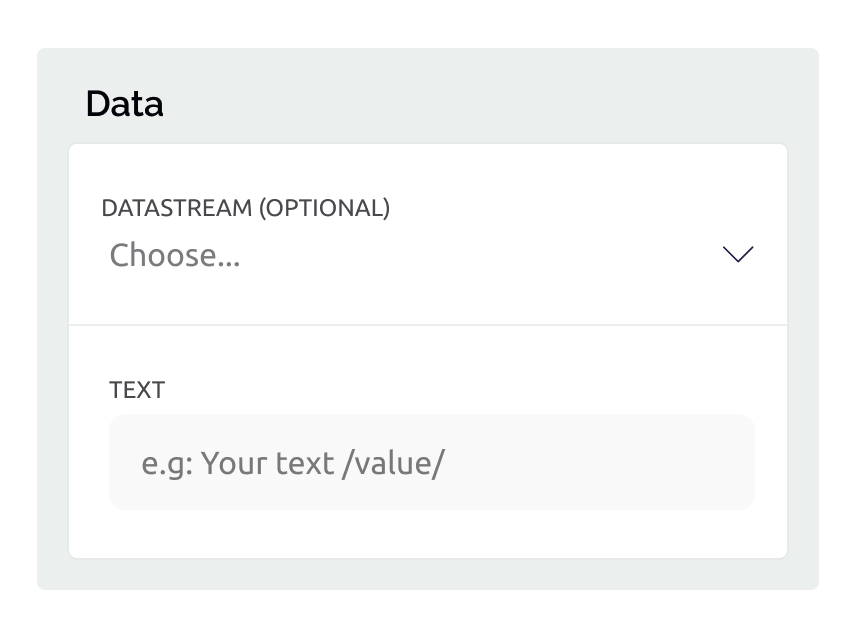
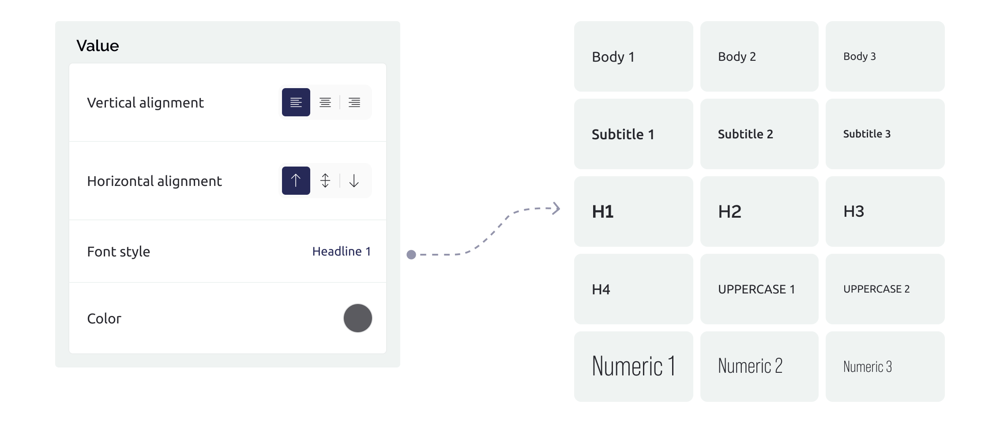

# Formatted Text

Displays static formatted text with your choice of font style, horizontal and vertical alignment, and color.&#x20;

If the widget has a datastream on, it can show its value via placeholder '/value/' put in the text option in settings.

<figure><figcaption></figcaption></figure>

A formatted label for the widget is optional.

### Datastream

Select or create a datastream of [data type](https://docs.blynk.io/en/blynk.console/templates/datastreams/datastreams-common-settings/data-type) integer, double, enumerable, string. The datastream is used to insert a corresponding value inside the text the widget is showing, and for holding and assigning the widget properties of vertical and horizontal alignment, font style and color.&#x20;

### Tap Interaction

Configure the widget's behavior when it is tapped. The available options are:

1. **None**. The widget does not respond to taps.
2. **Page**. Opens a specified app page when pressed (requires [PRO](https://blynk.io/pricing) plan)

### Widget Controls

The widget has no controls.&#x20;

### Widget Settings

* **Text** - the formatted text you want to appear in the widget. Alignment as left, center, right justified can be assigned in Design tab. Use placeholder '/value/' to show the datastream value inside the text.

### Widget Design

* **Title** - the widget label that appears above the formatted text.
* **Value** - format options for the displayed text assigned under ‘Settings’. Font style, horizontal & vertical alignment, and text color.

<figure><figcaption></figcaption></figure>

### How to process widget with the hardware

Not applicable. This widget only displays the text and the datastream value, it does not allow it to be changed from the UI.

### Change Widget Properties

You can change certain properties of the Widget from your hardware. For that, use this command:&#x20;

```cpp
Blynk.setProperty(vPin, "widgetProperty", "propertyValue"); 
```

Where:&#x20;

* `vPin` is: virtual pin number the widget is assigned to
* `widgetProperty`: property you want to change
* `propertyValue`: value of the property you want to change


Don't put **`Blynk.setProperty()`**&#x69;nto the **`void loop()`** as it can cause a flood of messages and your hardware will be disconnected. Send such updates only when necessary, or use timers.


### Properties you can change

You can change the properties _label_, _color_, _isDisabled_, _isHidden_ of the widget from your hardware, or via an [HTTP API](broken-reference). The URL must be encoded, so spaces in labels must be replaced with %20, and color hexadecimal values in the HTTP API URL must include the hash # character urlencoded as %23.

#### **Change Widget Label**

```cpp
Blynk.setProperty(V1, "label", "Select");
```

#### **Set Color**

```cpp
//#D3435C - Blynk RED 
Blynk.setProperty(V1, "color", "#D3435C");
```

#### **Disable/Enable**

Widget will be greyed out on UI and users won't be able to tap on it.

```cpp
Blynk.setProperty(V1, "isDisabled", true);
```

#### **Show/Hide**

Widget will be hidden from dashboard. Design your UI so that it doesn't look weird when there is no widget.

```cpp
Blynk.setProperty(V1, "isHidden", true);
```


### Change widget properties via HTTPs API

## Updates the Datastream Property and all assigned Widgets

<mark style="color:blue;">`GET`</mark> `https://{server_address}/external/api/update/property?token={your 32 char token}&pin={your vPin}&{property}={value}`

The endpoint allows you to update the Datastream Property value via GET request. All widgets (both web and mobile) that are assigned to this datastream will inherit this property. The Datastream Property is persistent and will be stored forever until you change it with another value. In order to clear the property you need to clear the device data in device actions menu.

**Example:**\
`https://blynk.cloud/external/api/update/property?token=GVki9IC70vb3IqvsV0YD3el4y0OpneL1&pin=V2&label=My%20Label`

`https://blynk.cloud/external/api/update/property?token=GVki9IC70vb3IqvsV0YD3el4y0OpneL1&pin=V1&color=%23D3435C`

`https://blynk.cloud/external/api/update/property?token=GVki9IC70vb3IqvsV0YD3el4y0OpneL1&pin=V1&isDisabled=true`

#### Path Parameters

| Name                                               | Type   | Description                                                                                                                 |
| -------------------------------------------------- | ------ | --------------------------------------------------------------------------------------------------------------------------- |
| {server address}<mark style="color:red;">\*</mark> | string | Get from the bottom right of your Blynk console. [More information](../../blynk.cloud/device-https-api/troubleshooting.md). |

#### Query Parameters

| Name                                    | Type   | Description                                                                                                    |
| --------------------------------------- | ------ | -------------------------------------------------------------------------------------------------------------- |
| token<mark style="color:red;">\*</mark> | string | Device [auth token](../../concepts/device.md#authtoken) from Device info                                       |
| pin<mark style="color:red;">\*</mark>   | string | The datastream [virtual pin](../../blynk.console/templates/datastreams/virtual-pin.md) (should start with "v") |
| {property}                              | string | The property of the widget you want to update: `label`, `color`, `isDisabled`, `isHidden`                      |
| label                                   | string | the text used as widget label                                                                                  |
| color                                   | string | button color hexadecimal, must include the hash # character urlencoded as %23                                  |
| isDisabled                              | string | true or false                                                                                                  |
| isHidden                                | string | true or false                                                                                                  |



```
```



```
{"error":{"message":"Invalid token."}}
```



### **Sync to the latest known state**&#x20;

You can update your hardware to the latest datastream value from Blynk.Cloud after your hardware went offline, and then came online again. Use `Blynk.syncVirtual()` to update a single virtual pin, or `Blynk.syncAll()` to update all virtual pins. See [State Syncing](../../blynk.edgent-firmware-api/state-syncing.md) for more details.

```cpp
BLYNK_CONNECTED() { 
  // Called when hardware is connected to Blynk.Cloud  

  // get the latest value for V1
  Blynk.syncVirtual(V1); 

  // Request Blynk server to re-send latest values for all pins
  Blynk.syncAll()
}
```
