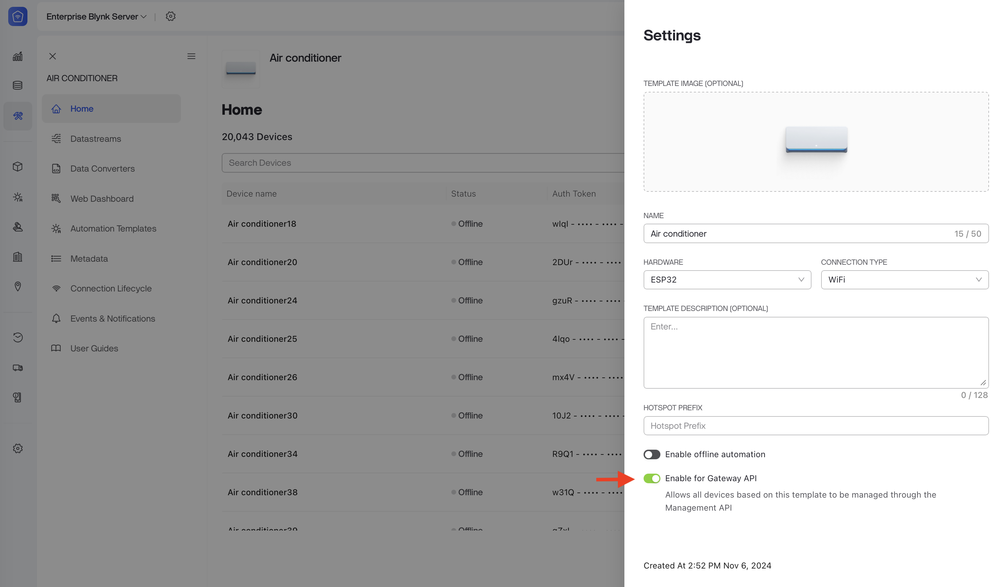

# MQTT Gateway API

The API enables the control of multiple devices and the handling of updates from various devices through a single MQTT connection. This capability makes it particularly beneficial for gateway devices by streamlining communication and management processes.


MQTT Gateway API is available exclusively for enterprise clients.


### Connection

The MQTT Gateway API shares a common MQTT broker with the [Device MQTT API](../blynk.cloud/device-mqtt-api/).

* TCP port: **`1883`**
* Secure SSL/TLS port: **`8883`**
* Secure WebSocket ports: **`443`, `9443`** (path must be **`/mqtt`**)

The broker will accept connections from `MQTT 3.1.1` and `MQTT 5` clients.

### Authentication

To authenticate with the MQTT Gateway API, you have two options:

1. **OAuth Client Credentials**: Use this method to authenticate using client credentials typically provided during the enterprise setup.
2. **Device Auth Token**: Devices with enabled access to the MQTT Gateway API can connect to it using their own authentication token.

#### OAuth Client Credentials

To connect to the MQTT Gateway API using OAuth Client credentials, create the OAuth Client if you haven't yet, and use its Client ID as the MQTT username and Client Secret as the MQTT password when sending `CONNECT` message.

Only devices located within the OAuth Client's creation organization (or its descendant sub-organizations) will be accessible via the API.

To create the OAuth Client, refer to the [OAuth 2.0 documentation](../blynk.console/settings/developers/oauth2.md).

#### Device Auth Token

Alternatively, you can connect to the MQTT Gateway API using the device authentication token. This is particularly useful in a gateway scenario, where the Gateway Device holds its own Authentication Token to connect to the Gateway API.

1.  Select the specific templates that should have access to the MQTT Gateway API. In the template settings, turn on the "Enable for Gateway API" switch and save the template.\

    <figure><figcaption></figcaption></figure>
2. When sending `CONNECT` MQTT message, use `mgmt_device` as the MQTT username and device authentication token as password.

Only devices located in the organization of the device, which was used for authentication, or its descendant sub-organizations will be accessible through the API.

If you're using dynamic provisioning or static tokens, the device must be successfully provisioned or claimed before attempting to connect to the Gateway API.

### Publishing MQTT messages

The MQTT Gateway API extends the [Device MQTT API's](../blynk.cloud/device-mqtt-api/) functionality, allowing you to publish messages to individual devices by prefixing the topic with the target device's authentication token.

The prefix `dev/{deviceToken}/` directs the broker to the intended device within your organization's scope. The `{deviceToken}` in the topic must be the authentication token of the specific device you intend to manage or update, not the token used for your Gateway API connection.

Example: To update the "Temperature" datastream value on a device, you publish the update payload to the topic: `dev/{deviceToken}/ds/Temperature`  (see the [Send data to Blynk](../blynk.cloud/device-mqtt-api/datastreams.md#send-data-to-blynk) article).

### Receiving MQTT downlinks

The Management API uses a similar topic prefixing approach for subscribing to updates (downlinks) from devices. To receive a downlink message (e.g., a datastream update) from a specific device, you must include that device's authentication token in the subscription topic.

Example: To receive updates for the "Temperature" datastream from a target device, subscribe to the topic: `dev/{deviceToken}/downlink/ds/Temperature`  (see the [Get data updates from Blynk](../blynk.cloud/device-mqtt-api/datastreams.md#get-data-updates-from-blynk) article).


**Subscription Wildcard Restrictions**

Subscription to multiple devices simultaneously using MQTT wildcards is restricted on the Gateway API's device token level to ensure security and efficient routing.

* The `dev/{deviceToken}` segment of the topic must be specific to a single device (i.e., contain a valid, literal device authentication token).
* Forbidden Subscriptions (Wildcards in Device Token segment):
  * `dev/+/downlink/ds/Temperature`
  * `dev/#`
  * `#` (Wildcarding the entire topic)
* Allowed Subscriptions (Wildcards _after_ Device Token):
  * `dev/{token}/#` (Allows subscription to all downlinks for the specified device)
  * `dev/{token}/downlink/#` (Allows subscription to all downlink for the specified device)

