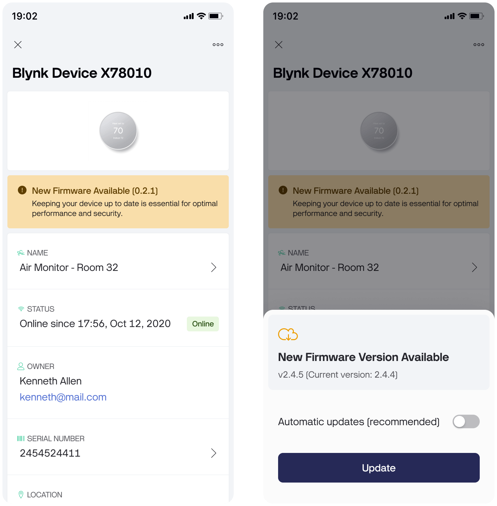
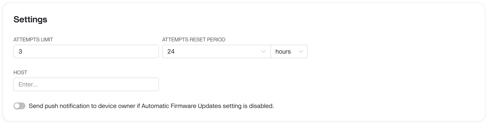

# User-controlled Shipments

By default, all shipments are delivered automatically if the device meets the shipment conditions. However, sometimes users may want to control device firmware updates manually or turn off all updates altogether.

Blynk provides this feature using the "Firmware Update Control" metafield. By [adding this metafield to your device template](../templates/metadata/), you provide the ability for users to control device updates manually.

After adding the metafield to the device template, the user can disable or enable firmware auto-update on the device information page in both the [Blynk.Console](../devices/device-profile/device-info.md) and Blynk.App.

<figure><figcaption></figcaption></figure>

If the user disables auto-udpate, as soon as a new update is available, we will display a button to update the firmware on the device. After the user clicks on the "Update Firmware" button, we will send the new firmware to the device if it is online or wait until the device goes online to send the new firmware. Note that the preferred shipment time is ignored in this case. Blynk will send an update as soon as possible.

<figure><figcaption>
Firmware Update pop-up window on the Blynk.Console
</figcaption></figure>

In addition, if you want to notify users who have disabled auto-update of a new firmware update, you can enable the "Send push notification" option in the shipment settings. The notification will be sent to all eligible users when the shipment is created.

<figure><figcaption>
Shipment Settings
</figcaption></figure>

For White-Label customers, Blynk also provides the ability to create a "Critical Shipment": such a shipment will ignore user-configured auto-update settings.
