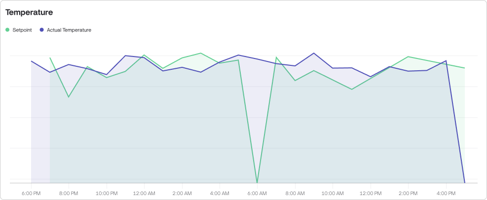

# Dashboards


**Dashboards are available on PRO and Enterprise plans.** You can upgrade anytime in your Account Settings.



**Free and legacy Maker plan users get 30 days of full access to Dashboards.** Try them out and explore new ways to work with your data!&#x20;


### Overview

Dashboards put you in the driver's seat for managing and monitoring all your devices in one place. They allow you to bring together data from different devices and control them from a single dashboard. Even if they belong to different templates, you can work with them simultaneously.

For example, you can display the average temperature value from 10 devices on a single Label widget or turn on multiple devices in a single click.

<figure><figcaption>
Dashboards overview
</figcaption></figure>

Watch the demo to see Blynk Dashboards in action, and find all the necessary documentation below.


Dashboards demo


### Dashboard Data Filtering

To accommodate various use cases, we have implemented a three-layered device filtering system that enables efficient data management for both small-scale and enterprise deployments.

#### Layer 1: Dashboard Data Source

Dashboard Data Source allows you to refine the devices that should be included to the dashboard by selecting specific templates and organizations.

For example, you have three different products: a heater, an air conditioner, and a fan. However, you want to build a dashboard only for heaters. In that case, you can select the corresponding template that contains heaters as the dashboard data source, ensuring that only such devices are included.

<figure><figcaption>
Layer 1: Dashboard Data Source
</figcaption></figure>

By default, the data source for the entire dashboard includes All devices (Templates = All, Organizations = All).  The Dashboard Data Source is editable anytime, but be careful as the changes affects all added widgets and may broke some of your settings.

<figure><figcaption>
Setting up data source for your dashboard
</figcaption></figure>

#### Layer 2: Widget Data Source

By default each widget is assigned to All devices from your Dashboard Data Source.

However, you can narrow down the device selection for any widget.

<figure><figcaption>
Layer 2: Widget Data Source
</figcaption></figure>

**To specify devices for the widget**:

* Open widget settings
* Navigate to Devices on a Data tab.
* Choose devices by selecting a segment bubble, applying filters, or picking them manually from the table.

Each widget may be assigned to a different subset of devices.

<figure><figcaption>
Devices that are assigned to the widget
</figcaption></figure>

#### Segments

"**All**" segment is assigned by default. It means all devices corresponding the dashboard data source are assigned. **The segments in widgets contain only devices corresponding dashboard data source, other devices are filtered out.**

Next to the "All" there are other segments that were created on a Devices page.\
You can select any of these segments.

#### Filters

Also you can select devices by applying filters (e.g. Device name contains “heater”). The filters work the same as on the Devices page.

#### Manual Selection

To assign particular device(s) as a widget data source select it from the table. Once you select the first device, the new segment "Selected devices \[count]" appears.

You may select up to 50 devices.

#### Layer 3. Dynamic Filters

Dynamic filters are available in View mode after a dashboard is created and are accessible to all users with dashboard access. These filters allow users to temporarily focus on specific devices included in the dashboard. They do not affect other users and are reset after the page is reloaded. The Filters button is located in the top-right corner.

There are three dynamic filters: **Organizations**, **Templates**, and **Devices**. The filter options are based on the dashboard's data source.

<figure><figcaption>
Layer 3. Dynamic Filters
</figcaption></figure>

<figure><figcaption>
Apply dynamic filters to the dashboard
</figcaption></figure>

### Creating a Dashboard

**Access Dashboard Page**: Go to the Dashboards page and click the **New Dashboard** button in the sidebar.


To create a dashboard you need to have a **Manage Dashboards** permission. Additionally you need to have **View Templates** permission to be able to work on a template level.


<figure><figcaption>
Creating a Dashboard
</figcaption></figure>

The new dashboard will open in an empty state in Edit mode.

**Define Dashboard Data Source**:\
Firstly, we recommend to narrow down the list of devices included to the dashboard if you don’t need all of them. It will make the dashboard configuration faster and simpler for you. To do that click the **Change**... button inside a Dashboard **Data Source** box and select the desired templates and organizations.

<figure><figcaption>
Select devices to include in the dashboard
</figcaption></figure>

**Build Your Dashboard**: Add widgets from the Widget Box and configure them according to your needs. To add a widget double-click it or drag into the canvas.

<figure><figcaption>
Add widgets from the Widget Box
</figcaption></figure>

**Customize Dashboard Settings**: Rename dashboard by clicking on it and entering the name. Also, you can set a default date range that is relevant to your data and will apply every time you open the dashboard and manage who can see the dashboard.

**Save Your Dashboard**: Once you are satisfied with the dashboard view, click the Save Dashboard button in the top right corner. Congrats, your first dashboard is live.

**Manage Access**: By default, only roles with Manage analytics permission from the organization where the dashboard was created have an access. You can grant view access to other roles through the Manage Access menu either in Edit mode or options menu.

<figure><figcaption>
Options menu
</figcaption></figure>

### Widgets

Each widget has its own settings, similar to those on a [Device Dashboard](templates/dashboard/) but adjusted slightly to work correctly with multiple devices.

The following widgets are currently supported:

#### Device Metrics Widgets

**Control Widgets**:

These widgets can be used to perform management operations on devices, such as turning devices on or off, or changing values.

* Switch
* Slider

**Display Widgets**:

These widgets can be used to display a metric value from multiple devices, or historical data for the selected period of time.

* Label
* Chart: Metrics over time, agg.
* Chart: Metric by devices

<figure><figcaption>
Device Metrics Widgets
</figcaption></figure>

#### **Event Widgets**

The dashboard includes 9 ready-to-use widgets that display data about events. These widgets provide insights into the latest events, most frequent events, critical events, and more. You can analyze trends and event distribution across devices and organizations, helping you stay informed and make data-driven decisions.

<figure><figcaption>
Event Widgets
</figcaption></figure>

### Device metrics widgets

Device metrics widgets are designed to display or interact with datastream values, offering insightful data visualization and control.

#### Datastreams

All device metrics widgets require an assigned datastream to function. To streamline this process and enhance your experience, we’ve developed a **Virtual Pin** approach for datastream selection.

Instead of manually mapping multiple datastreams one by one, you only need to select a single Virtual Pin. All datastreams associated with that Virtual Pin will automatically be assigned to the widget, saving time and reducing complexity.

This approach simplifies widget setup and ensures a seamless connection to the data you need.


Before creating a dashboard, standardize the datastreams across the templates included in it so that the corresponding Virtual Pins contain the same data. For example, V1 represents Brightness across all templates.


E.g. You have launched a new product model. And you want to add the data from it to one of your existing dashboards. If you have datastreams standardized the same way as for the existing products, you just need to add the new product (template) to the dashboard data source and all of your widgets will be updated immediately.

#### Data Types

Current widgets support only Integer and Double data types. Datastreams of any other type will be ignored and excluded from calculations.


For example, if you set the V1 Pin to display the Average value in a Label widget, and V1 uses the Integer type in four templates but String type in two, the calculation will only include the four Integer datastreams. The two String datastreams will be ignored, regardless of the data selection.


#### How to select datastreams

To select datastreams, choose a row from the dropdown. The dropdown displays all datastreams, grouped by Virtual Pin, based on the templates included in the dashboard's data source.

<figure><figcaption>
Select datastreams grouped by Virtual Pin
</figcaption></figure>

Once you select the row, assigned datastreams preview appears on the right, displaying the datastreams associated with the selected Virtual Pin across all templates included in the dashboard. This preview helps you quickly assess the data and confirm that the correct datastreams are connected for each template.

<figure><figcaption>
Assigned datastreams preview
</figcaption></figure>

#### Aggregation types

Blynk supports 4 aggregation types across all widgets: Average, Min, Max, and Sum.

Also the **Label widget** supports additional aggregation type - **Latest value**.&#x20;


**Latest value** aggregation type is available only if **1 device** is selected and updates its latest value once in a 10 sec.


<figure><figcaption>
Aggregation types
</figcaption></figure>

&#x20;&#x20;

#### Decimals

Determines the number of decimal places displayed for numerical values in the widget (e.g., #.## for 25.35).

#### Units

Specifies the measurement unit to display alongside values (e.g., °C, %, kWh) for clarity and context.


Note that this is purely a label and does not involve any unit conversion of the values.


### Switch

The Switch widget sends a command to the devices, typically 1 for ON and 0 for OFF. This widget allows you to turn multiple devices on or off with a single click. Additionally, it can interact with other datastreams and perform various operations that involve two states, such as enabling or disabling features, toggling between modes, or setting specific conditions.


Please note that the switch does not reflect the current state of devices. It serves as a control for setting the desired state.


<figure><figcaption>
Switch
</figcaption></figure>


The value will be sent to all currently online devices. For offline devices, the value will be stored on the server. When any of these offline devices goes online, they may request the latest state via Blynk.sync() if necessary.


**How to configure**:

1. Select a datastream.
2. Set On/Off values.
3. Narrow down device selection (optional).
4. Design. Navigate to Design tab to adjust widget appearance such as color and labels.\

### Slider

The Slider widget sends a value to devices within a defined range. Move the slider handle or use the fine control buttons (+ and -) to set the value precisely. It may be used to adjust temperature setpoint, fan speed, brightness level, etc.


Please note that the slider does not reflect the current value on devices. It serves as a control for setting the desired value.


<figure><figcaption>
Slider
</figcaption></figure>


The value will be sent to all currently online devices. For offline devices, the value will be stored on the server. When any of these offline devices goes online, they may request the latest state via Blynk.sync() if necessary.


**How to configure**:

1. Select a datastream.
2. Set Values Range. Enter Min and Max values and Handle step value.
3. Narrow down device selection (optional).
4. Design. Navigate to Design tab to edit the name, choose a color, or enable fine controls.

### Label

The Label widget provides a clear, aggregated view of important data from single or multiple devices.

<figure><figcaption></figcaption></figure>

By combining data from multiple devices, the Label widget helps you make informed decisions. It is useful in many cases such as:

**Construction**: Display the total energy consumption of a building by aggregating data from all smart meters and sensors.

**Agriculture**: Show the average humidity level across multiple greenhouses to ensure optimal growing conditions.

**Manufacturing**: Present the total output or efficiency rate of production lines by aggregating data from various machines and sensors.

**Smart Homes**: Display the overall air quality index by combining readings from multiple air quality sensors throughout the house.

**How to configure**:

1. Select datastreams.
2. Choose aggregation type. You can choose Average, Min, Max, Sum, or Latest value (only if 1 device selected).
3. Narrow down device selection (optional).
4. Design. Navigate to Design tab to configure options such as Background color, Level, and Content Alignment.


Ensure that **Enable History Data** switch is enabled across all used datastreams. Otherwise the widget will not display the data.

1. Navigate to Developer Tools → Templates.
2. Open a template → Datastreams tab.
3. Click on a datastream.
4. Open Advanced Settings.
5. Turn on the Enable history data.



<figure><figcaption>
Enable History Data
</figcaption></figure>

### Chart: Metrics over time, agg.

This widget provides a visual representation of historical data, making it easier to identify trends, patterns, and anomalies over time.

<figure><figcaption>
Chart: Metrics over time, agg.
</figcaption></figure>

By supporting multiple data series, the widget allows you to compare different data types simultaneously, such as temperature and humidity, or energy consumption and production output. You can also compare energy consumption or any other metric by different aggregation types, e.g. Min Temperature vs Max Temperature.

**How to configure**:

1. Select datastreams. The chart supports up to 5 series.
2. Choose aggregation type. You can choose Average, Min, Max, or Sum for each data series.
3. Narrow down device selection (optional).
4. Design. Navigate to Design tab to select the chart view (line, area, column (bar), or stepline) set colors, axis and series names.

### Chart: Metric by device

This chart displays datastream values from multiple selected devices on a single chart, with each device represented by a distinct line. You can customize the chart by selecting specific devices.

The chart can display data from up to **eight** devices at the same time.

<figure><figcaption>
Chart: Metric by device
</figcaption></figure>

**How to configure**:

1. Select datastream.
2. Narrow down device selection (optional).
3. Design. Navigate to Design tab to set widget title.

### Date range picker

You can find the date range picker under the Dashboard name.

<figure><figcaption>
Date range picker
</figcaption></figure>

This picker allows you to analyze historical data across different periods. It includes predefined ranges such as:

**1d** - displays data for the last 24 hours.

**1w** - displays data for the last 7 days.

**1mo** - displays data for the last 30 days.

**3mo** - Displays data for the last 90 days.

**1y** - Displays data for the last 365 days.


Please note, the date range picker does not affect the **Control widgets** and the widgets showing **Latest value**. Regardless of the selected range, they operate the same.


### Managing Access

By default, only users with the **Manage Dashboards** permission in the organization where the dashboard was created can access it. These users can view and edit all dashboards in that organization.


Please note that creating or editing a dashboard also requires the **View Template** permission.


You can grant **View** access to specific dashboards for additional users through the **Manage Access** option, available in the menu or **Edit mode**.

<figure><figcaption>
Manage access in the menu
</figcaption></figure>

Dashboards can be shared with sub-organizations, allowing you to create a single dashboard and share it across all sub-orgs. However, shared dashboards can only be edited in the organization where they were created.

Access to a dashboard depends on the **organizations included in its data source**:

* **All Sub-Organizations**: The dashboard is shared with all sub-organizations.
* **Specific Organizations**: The dashboard is shared only with those selected organizations.
* **Current Organization Only**: The dashboard is not shared with sub-organizations.

<figure><figcaption>
Manage access
</figcaption></figure>

### Setting a Dashboard as the Homepage

Normally, when you log into Blynk, you’d see the devices page first. Alternatively you can set a dashboard as the homepage for your organization.

By customizing your Homepage, you can ensure the data that matters most to you is always front and center. This makes it easier to keep track of key metrics, trends, and control devices.

**How to Set a Dashboard as the Homepage**:

1. **Open a dashboard**: Go to Dashboards and open the dashboard you want to set as the homepage.
2. **Open menu**: Find the Options menu in the top right corner.
3. **Set as homepage**: Choose the “Set as homepage” option from the menu.

<figure><figcaption>
Set as Homepage
</figcaption></figure>

The home icon appears at the top of the Main Navigation menu once you’ve set the homepage.

The homepage applies per organization, so each of your organizations can have its own homepage.

<figure><figcaption>
Dashboard as a Homepage
</figcaption></figure>

