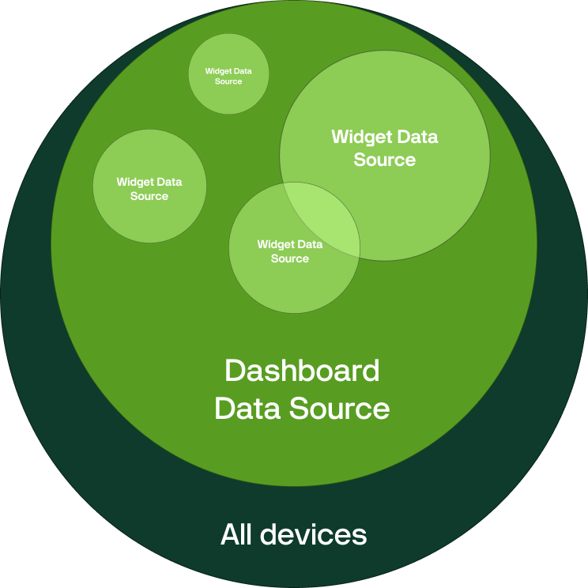
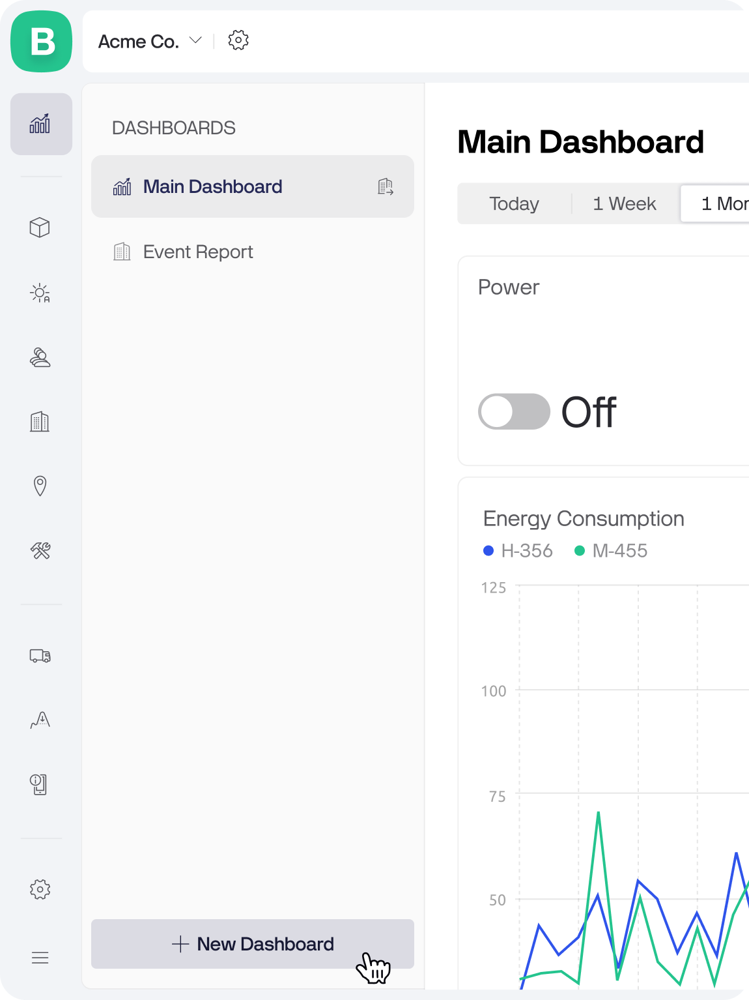
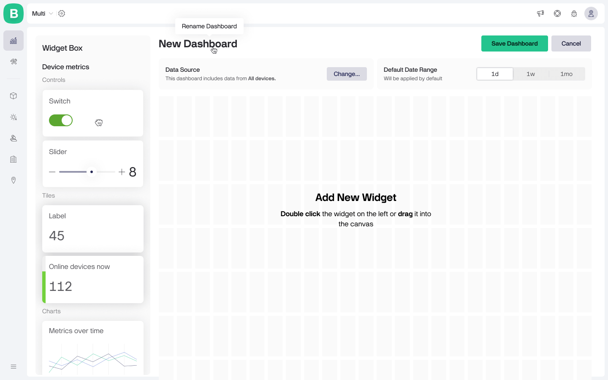
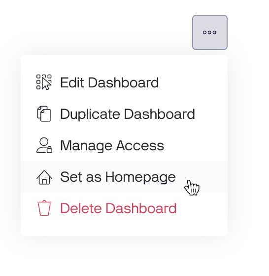

# Dashboards


**Dashboards are available on PRO and Enterprise plans.** You can upgrade anytime in your Account Settings.



**Free and legacy Maker plan users get 30 days of full access to Dashboards.** Try them out and explore new ways to work with your data!&#x20;


### Overview

Dashboards put you in the driver's seat for managing and monitoring all your devices in one place. They allow you to bring together data from different devices and control them from a single dashboard. Even if they belong to different templates, you can work with them simultaneously.

For example, you can display the average temperature value from 10 devices on a single Label widget or turn on multiple devices in a single click.

<figure><figcaption>
Dashboards overview
</figcaption></figure>

Watch the demo to see Blynk Dashboards in action, and find all the necessary documentation below.


Dashboards demo


### Dashboard Data Filtering

To accommodate various use cases, we have implemented a three-layered device filtering system that enables efficient data management for both small-scale and enterprise deployments.

#### Layer 1: Dashboard Data Source

Dashboard Data Source allows you to refine the devices that should be included to the dashboard by selecting specific templates and organizations.

For example, you have three different products: a heater, an air conditioner, and a fan. However, you want to build a dashboard only for heaters. In that case, you can select the corresponding template that contains heaters as the dashboard data source, ensuring that only such devices are included.

<figure><figcaption>
Layer 1: Dashboard Data Source
</figcaption></figure>

By default, the data source for the entire dashboard includes All devices (Templates = All, Organizations = All).  The Dashboard Data Source is editable anytime, but be careful as the changes affects all added widgets and may broke some of your settings.

<figure><figcaption>
Setting up data source for your dashboard
</figcaption></figure>

#### Layer 2: Widget Data Source

By default each widget is assigned to All devices from your Dashboard Data Source.

However, you can narrow down the device selection for any widget.

<figure><figcaption>
Layer 2: Widget Data Source
</figcaption></figure>

**To specify devices for the widget**:

* Open widget settings
* Navigate to Devices on a Data tab.
* Choose devices by selecting a segment bubble, applying filters, or picking them manually from the table.

Each widget may be assigned to a different subset of devices.

<figure><figcaption>
Devices that are assigned to the widget
</figcaption></figure>

#### Segments

"**All**" segment is assigned by default. It means all devices corresponding the dashboard data source are assigned. **The segments in widgets contain only devices corresponding dashboard data source, other devices are filtered out.**

Next to the "All" there are other segments that were created on a Devices page.\
You can select any of these segments.

#### Filters

Also you can select devices by applying filters (e.g. Device name contains “heater”). The filters work the same as on the Devices page.

#### Manual Selection

To assign particular device(s) as a widget data source select it from the table. Once you select the first device, the new segment "Selected devices \[count]" appears.

You may select up to 50 devices.

#### Layer 3. Dynamic Filters

Dynamic filters are available in View mode after a dashboard is created and are accessible to all users with dashboard access. These filters allow users to temporarily focus on specific devices included in the dashboard. They do not affect other users and are reset after the page is reloaded. The Filters button is located in the top-right corner.

There are three dynamic filters: **Organizations**, **Templates**, and **Devices**. The filter options are based on the dashboard's data source.

<figure><figcaption>
Layer 3. Dynamic Filters
</figcaption></figure>

<figure><figcaption>
Apply dynamic filters to the dashboard
</figcaption></figure>

### Creating a Dashboard

**Access Dashboard Page**: Go to the Dashboards page and click the **New Dashboard** button in the sidebar.


To create a dashboard you need to have a **Manage Dashboards** permission. Additionally you need to have **View Templates** permission to be able to work on a template level.


<figure><figcaption>
Creating a Dashboard
</figcaption></figure>

The new dashboard will open in an empty state in Edit mode.

**Define Dashboard Data Source**:\
Firstly, we recommend to narrow down the list of devices included to the dashboard if you don’t need all of them. It will make the dashboard configuration faster and simpler for you. To do that click the **Change**... button inside a Dashboard **Data Source** box and select the desired templates and organizations.

<figure><figcaption>
Select devices to include in the dashboard
</figcaption></figure>

**Build Your Dashboard**: Add widgets from the Widget Box and configure them according to your needs. To add a widget double-click it or drag into the canvas.

<figure><figcaption>
Add widgets from the Widget Box
</figcaption></figure>

**Customize Dashboard Settings**: Rename dashboard by clicking on it and entering the name. Also, you can set a default date range that is relevant to your data and will apply every time you open the dashboard and manage who can see the dashboard.

**Save Your Dashboard**: Once you are satisfied with the dashboard view, click the Save Dashboard button in the top right corner. Congrats, your first dashboard is live.

**Manage Access**: By default, only roles with Manage analytics permission from the organization where the dashboard was created have an access. You can grant view access to other roles through the Manage Access menu either in Edit mode or options menu.

<figure><figcaption>
Options menu
</figcaption></figure>

### Date range picker

You can find the date range picker under the Dashboard name.

<figure><figcaption>
Date range picker
</figcaption></figure>

This picker allows you to analyze historical data across different periods. It includes predefined ranges such as:

**1d** - displays data for the last 24 hours.

**1w** - displays data for the last 7 days.

**1mo** - displays data for the last 30 days.

**3mo** - Displays data for the last 90 days.

**1y** - Displays data for the last 365 days.


Please note, the date range picker does not affect the **Control widgets** and the widgets showing **Latest value**. Regardless of the selected range, they operate the same.


### Managing Access

By default, only users with the **Manage Dashboards** permission in the organization where the dashboard was created can access it. These users can view and edit all dashboards in that organization.


Please note that creating or editing a dashboard also requires the **View Template** permission.


You can grant **View** access to specific dashboards for additional users through the **Manage Access** option, available in the menu or **Edit mode**.

<figure><figcaption>
Manage access in the menu
</figcaption></figure>

Dashboards can be shared with sub-organizations, allowing you to create a single dashboard and share it across all sub-orgs. However, shared dashboards can only be edited in the organization where they were created.

Access to a dashboard depends on the **organizations included in its data source**:

* **All Sub-Organizations**: The dashboard is shared with all sub-organizations.
* **Specific Organizations**: The dashboard is shared only with those selected organizations.
* **Current Organization Only**: The dashboard is not shared with sub-organizations.

<figure><figcaption>
Manage access
</figcaption></figure>

### Setting a Dashboard as the Homepage

Normally, when you log into Blynk, you’d see the devices page first. Alternatively you can set a dashboard as the homepage for your organization.

By customizing your Homepage, you can ensure the data that matters most to you is always front and center. This makes it easier to keep track of key metrics, trends, and control devices.

**How to Set a Dashboard as the Homepage**:

1. **Open a dashboard**: Go to Dashboards and open the dashboard you want to set as the homepage.
2. **Open menu**: Find the Options menu in the top right corner.
3. **Set as homepage**: Choose the “Set as homepage” option from the menu.

<figure><figcaption>
Set as Homepage
</figcaption></figure>

The home icon appears at the top of the Main Navigation menu once you’ve set the homepage.

The homepage applies per organization, so each of your organizations can have its own homepage.

<figure><figcaption>
Dashboard as a Homepage
</figcaption></figure>

