# Dashboard Widgets

Each widget has its own settings, similar to those on a [Device Dashboard](../templates/dashboard/) but adjusted slightly to work correctly with multiple devices.

The following widgets are currently supported:

### Device Metrics Widgets

#### **Control Widgets**:

These widgets can be used to perform management operations on devices, such as turning devices on or off, or changing values.

* [Switch](dashboard-widgets.md#switch)
* [Slider](dashboard-widgets.md#slider)

#### **Display Widgets**:

These widgets can be used to display a metric value from multiple devices, or historical data for the selected period of time.

* [Label](dashboard-widgets.md#label)
* [Chart: Metrics over time, agg.](dashboard-widgets.md#chart-metrics-over-time-agg)
* [Chart: Metric by devices](dashboard-widgets.md#chart-metric-by-device)
* [Device Table](dashboard-widgets.md#device-table)
* [Image Map](dashboard-widgets.md#image-map)
* [Geomap](dashboard-widgets.md#geomap)

<figure><figcaption>
Device Metrics Widgets
</figcaption></figure>

### **Event Widgets**

The dashboard includes 9 ready-to-use widgets that display data about events. These widgets provide insights into the latest events, most frequent events, critical events, and more. You can analyze trends and event distribution across devices and organizations, helping you stay informed and make data-driven decisions.

<figure>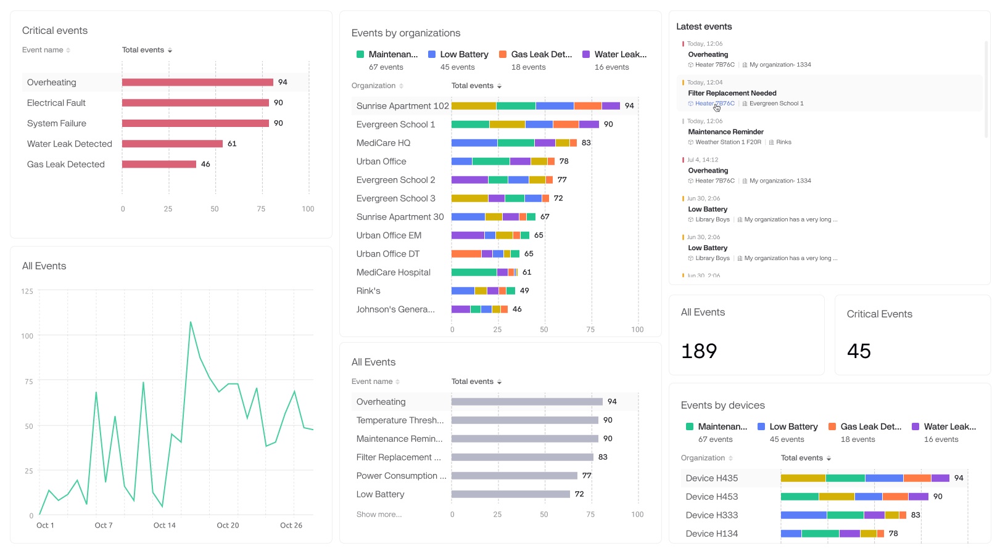<figcaption>
Event Widgets
</figcaption></figure>

### Platform Data Widgets

Fleet Analytics (Platform Data) Widgets are available only for Enterprise plan.

Six ready-to-use widgets keep you informed about your fleet performance by showing key metrics and trends powered by time-series data.

* **Activations** – Displays the number of newly activated devices, defined as those that connected to the Blynk cloud for the first time.
* **Total Devices** – Shows the total number of devices in your organization(s).
* **Total Devices by Templates** – Shows the total number of devices grouped by their templates, helping you analyze device distribution across product types.
* **Active Devices** – Indicates how many devices were online and connected to the Blynk cloud at least once during the selected time period.
* **Active Devices by Templates** – Breaks down active device by their templates, offering deeper insight into which product types are most active.
* **Devices by Connection Statuses Chart** – Visualizes the distribution of connection statuses (Online, Offline) across your devices. If a device was both online and offline during the selected timeframe, it is counted once for each status.

<figure><figcaption>
Platform Data Widgets
</figcaption></figure>

### Device metrics widgets

Device metrics widgets are designed to display or interact with datastream values, offering insightful data visualization and control.

#### Datastreams

All device metrics widgets require an assigned datastream to function. To streamline this process and enhance your experience, we’ve developed a **Virtual Pin** approach for datastream selection.

Instead of manually mapping multiple datastreams one by one, you only need to select a single Virtual Pin. All datastreams associated with that Virtual Pin will automatically be assigned to the widget, saving time and reducing complexity.

This approach simplifies widget setup and ensures a seamless connection to the data you need.


Before creating a dashboard, standardize the datastreams across the templates included in it so that the corresponding Virtual Pins contain the same data. For example, V1 represents Brightness across all templates.


E.g. You have launched a new product model. And you want to add the data from it to one of your existing dashboards. If you have datastreams standardized the same way as for the existing products, you just need to add the new product (template) to the dashboard data source and all of your widgets will be updated immediately.

#### Data Types

Current widgets support only Integer and Double data types. Datastreams of any other type will be ignored and excluded from calculations.


For example, if you set the V1 Pin to display the Average value in a Label widget, and V1 uses the Integer type in four templates but String type in two, the calculation will only include the four Integer datastreams. The two String datastreams will be ignored, regardless of the data selection.


#### How to select datastreams

To select datastreams, choose a row from the dropdown. The dropdown displays all datastreams, grouped by Virtual Pin, based on the templates included in the dashboard's data source.

<figure><figcaption>
Select datastreams grouped by Virtual Pin
</figcaption></figure>

Once you select the row, assigned datastreams preview appears on the right, displaying the datastreams associated with the selected Virtual Pin across all templates included in the dashboard. This preview helps you quickly assess the data and confirm that the correct datastreams are connected for each template.

<figure><figcaption>
Assigned datastreams preview
</figcaption></figure>

#### Aggregation types

Blynk supports 4 aggregation types across all widgets: Average, Min, Max, and Sum.

Also the **Label widget** supports additional aggregation type - **Latest value**.&#x20;


**Latest value** aggregation type is available only if **1 device** is selected and updates its latest value once in a 10 sec.


<figure><figcaption>
Aggregation types
</figcaption></figure>

&#x20;&#x20;

#### Decimals

Determines the number of decimal places displayed for numerical values in the widget (e.g., #.## for 25.35).

#### Units

Specifies the measurement unit to display alongside values (e.g., °C, %, kWh) for clarity and context.


Note that this is purely a label and does not involve any unit conversion of the values.


### Switch

The Switch widget sends a command to the devices, typically 1 for ON and 0 for OFF. This widget allows you to turn multiple devices on or off with a single click. Additionally, it can interact with other datastreams and perform various operations that involve two states, such as enabling or disabling features, toggling between modes, or setting specific conditions.


Please note that the switch does not reflect the current state of devices. It serves as a control for setting the desired state.


<figure>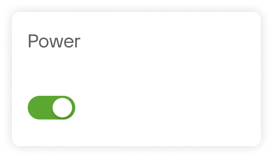<figcaption>
Switch
</figcaption></figure>


The value will be sent to all currently online devices. For offline devices, the value will be stored on the server. When any of these offline devices goes online, they may request the latest state via Blynk.sync() if necessary.


**How to configure**:

1. Select a datastream.
2. Set On/Off values.
3. Narrow down device selection (optional).
4. Design. Navigate to Design tab to adjust widget appearance such as color and labels.\

### Slider

The Slider widget sends a value to devices within a defined range. Move the slider handle or use the fine control buttons (+ and -) to set the value precisely. It may be used to adjust temperature setpoint, fan speed, brightness level, etc.


Please note that the slider does not reflect the current value on devices. It serves as a control for setting the desired value.


<figure><figcaption>
Slider
</figcaption></figure>


The value will be sent to all currently online devices. For offline devices, the value will be stored on the server. When any of these offline devices goes online, they may request the latest state via Blynk.sync() if necessary.


**How to configure**:

1. Select a datastream.
2. Set Values Range. Enter Min and Max values and Handle step value.
3. Narrow down device selection (optional).
4. Design. Navigate to Design tab to edit the name, choose a color, or enable fine controls.

### Label

The Label widget provides a clear, aggregated view of important data from single or multiple devices.

<figure>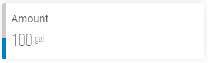<figcaption></figcaption></figure>

By combining data from multiple devices, the Label widget helps you make informed decisions. It is useful in many cases such as:

**Construction**: Display the total energy consumption of a building by aggregating data from all smart meters and sensors.

**Agriculture**: Show the average humidity level across multiple greenhouses to ensure optimal growing conditions.

**Manufacturing**: Present the total output or efficiency rate of production lines by aggregating data from various machines and sensors.

**Smart Homes**: Display the overall air quality index by combining readings from multiple air quality sensors throughout the house.

**How to configure**:

1. Select datastreams.
2. Choose aggregation type. You can choose Average, Min, Max, Sum, or Latest value (only if 1 device selected).
3. Narrow down device selection (optional).
4. Design. Navigate to Design tab to configure options such as Background color, Level, and Content Alignment.


Ensure that **Enable History Data** switch is enabled across all used datastreams. Otherwise the widget will not display the data.

1. Navigate to Developer Tools → Templates.
2. Open a template → Datastreams tab.
3. Click on a datastream.
4. Open Advanced Settings.
5. Turn on the Enable history data.



<figure><figcaption>
Enable History Data
</figcaption></figure>

### Chart: Metrics over time, agg.

This widget provides a visual representation of historical data, making it easier to identify trends, patterns, and anomalies over time.

<figure>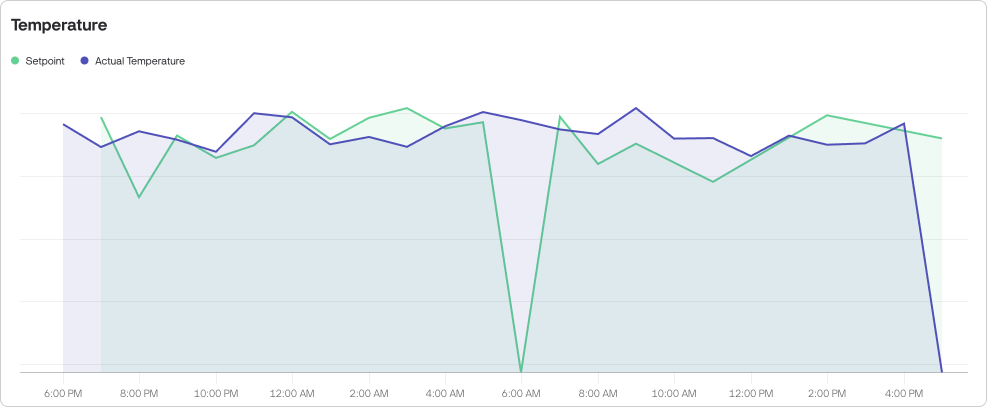<figcaption>
Chart: Metrics over time, agg.
</figcaption></figure>

By supporting multiple data series, the widget allows you to compare different data types simultaneously, such as temperature and humidity, or energy consumption and production output. You can also compare energy consumption or any other metric by different aggregation types, e.g. Min Temperature vs Max Temperature.

**How to configure**:

1. Select datastreams. The chart supports up to 5 series.
2. Choose aggregation type. You can choose Average, Min, Max, or Sum for each data series.
3. Narrow down device selection (optional).
4. Design. Navigate to Design tab to select the chart view (line, area, column (bar), or stepline) set colors, axis and series names.

### Chart: Metric by device

This chart displays datastream values from multiple selected devices on a single chart, with each device represented by a distinct line. You can customize the chart by selecting specific devices.

The chart can display data from up to **eight** devices at the same time.

<figure>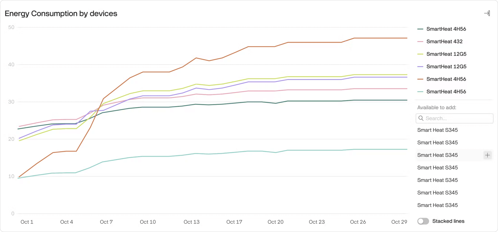<figcaption>
Chart: Metric by device
</figcaption></figure>

**How to configure**:

1. Select datastream.
2. Narrow down device selection (optional).
3. Design. Navigate to Design tab to set widget title.

### Device Table

The Device Table widget displays the latest datastream values from multiple devices along with their connection statuses. This makes it ideal for quickly identifying outliers, and comparing metrics across devices. Whether you're managing 10 or 1,000 devices, the table gives you a clear and actionable overview of their current state—helping you make faster decisions and keep operations running smoothly.

<figure><figcaption>
Device Table Widget
</figcaption></figure>

#### How to Configure

1. Add the Device Table widget to your dashboard.
2. Select the devices you want to display in the table.
3. Configure the columns (up to 20 supported).
4. (Optional) Add conditional formatting.
5. Adjust table settings such as Title, Default Sort, and Devices per Page.

#### Selecting Devices

In this tab, you can choose which devices are shown in the table. You can:

* Select segments
* Apply filters
* Manually pick individual devices

By default, all devices from the Dashboard Data Source are selected.

#### Columns

Once devices are selected, you can configure which datastreams appear as columns in the table (up to 20 columns).

#### Datastream Value Columns

Currently, only datastream value columns are supported, showing each datastream’s latest value. Data is refreshed every 10 seconds.

<figure><figcaption>
Device Table - Columns
</figcaption></figure>


Preview displays dummy datastream values for 10 random devices from your selection. Real values will load after saving the dashboard.


#### Column Settings

* Column Name: By default, the name is taken from one of the selected datastream, but you can rename it.
* Display Options: There are three display options: Values, Bars, and Icons.

<figure><figcaption>
Display Options
</figcaption></figure>

*

    * Values (default) - show datastream values as it is.

    <figure><figcaption>
Values
</figcaption></figure>

    * Bars: Adds a colored bar in the background of the cell. You can set a min/max range, pick a color, and optionally enable dynamic color based on conditional formatting. Threshold lines or ranges are also supported.

    <figure><figcaption>
Bars
</figcaption></figure>

    * Icons: Replaces values with icons. Define a value range and assign specific icons and colors for each value step.

    <figure><figcaption>
Icons
</figcaption></figure>

#### Conditional Formatting

Once you’ve configured columns, you can enhance the table visually by applying conditional formatting rules.

<figure><figcaption>
Conditional Formatting
</figcaption></figure>

This feature lets you highlight differences in device values using color gradients. You can start with one of the preset gradients or fully customize your own by adjusting the color and values. For each point on the gradient, you can define both the background and the content color.

<figure><figcaption>
Formatting Settings
</figcaption></figure>

If you want the same formatting applied across all columns in the table, simply enable the Color all columns option.\

#### Table Settings

In this tab, configure:

* Title: The table title.
* Default Sort Option: Choose a column and sort direction (ascending/descending). Users can re-sort while viewing by clicking on column headers, but settings will reset to the default on refresh.
* Devices per Page: Set the number of devices displayed per page to control the amount of visible data at a time.

<figure><figcaption>
Table Settings
</figcaption></figure>

### Image Map

#### Overview

The **Image Map widget** allows you to place devices on any image and monitor their status in real time. It’s designed for cases where the location or relative position of devices matters—for example, factory floors, offices, greenhouses, or homes.

Unlike GPS-based maps, the Image Map uses images you upload, giving you full control over the layout. You decide what the background looks like, and then position devices manually.

<figure>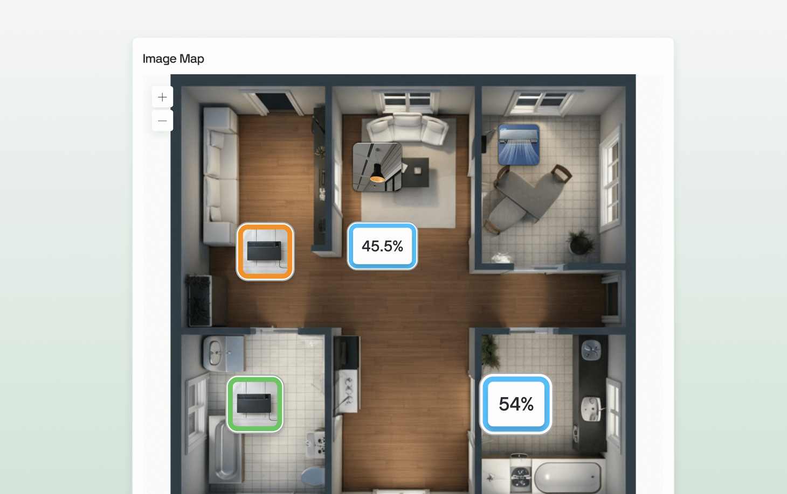<figcaption></figcaption></figure>

#### How to Configure

1. **Add the widget**\
   Open your dashboard, click _Add Widget_, and choose **Image Map** from the Widget Box.

<figure>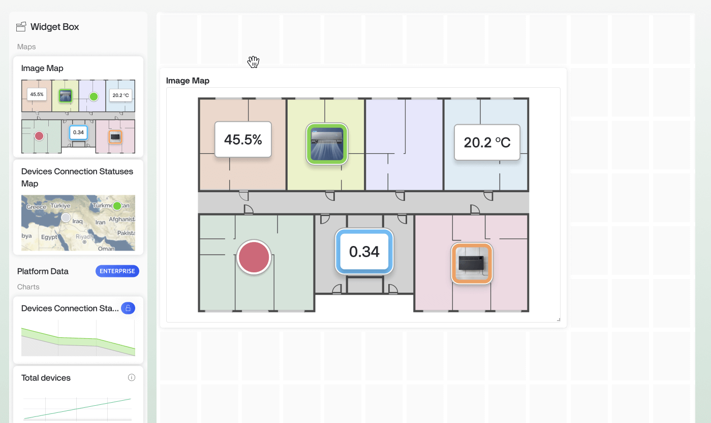<figcaption>
Image Map Widget in the Widget Box
</figcaption></figure>

2. **Upload your image**\
   Upload any image to use as the map background. This could be a floor plan, site diagram, equipment layout, or even a simple sketch. The widget supports .jpg and .png formats only.
3. **Add devices**\
   Hover over the image and click in a place you want to add a device.

<figure>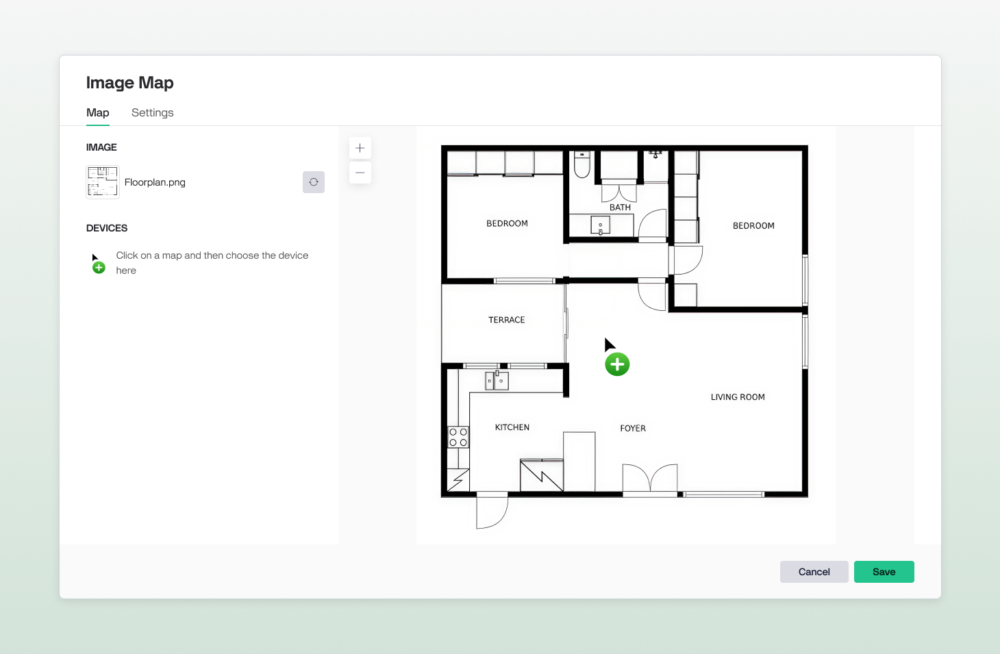<figcaption></figcaption></figure>

One you’ve clicked, the spot is created. Then pick a device you want to display there.

<figure>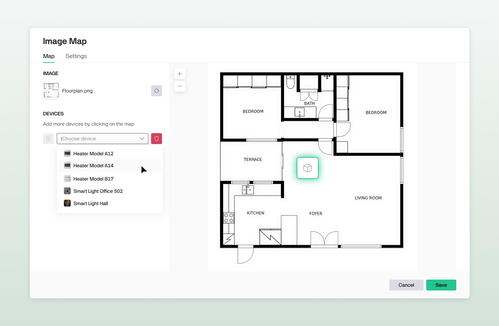<figcaption></figcaption></figure>

4. **Adjust devices**\
   Resize a device marker if needed. You can also reposition devices anytime by dragging them.  Devices stay pinned to their locations for quick reference. You can place up to **50 devices** on one map.
5. **Configure device markers**\
   Choose how the markers look and what data are shown on markers.


Device data is updated every 5 sec.


#### Device Marker Styles

You can select one of three marker styles:

* **Image** — shows the device image.
* **Value** — shows a selected datastream value.
* **Indicator** — shows the device as a circle, best for maps with many similar devices.


Marker settings apply to all devices from the same template.


<figure>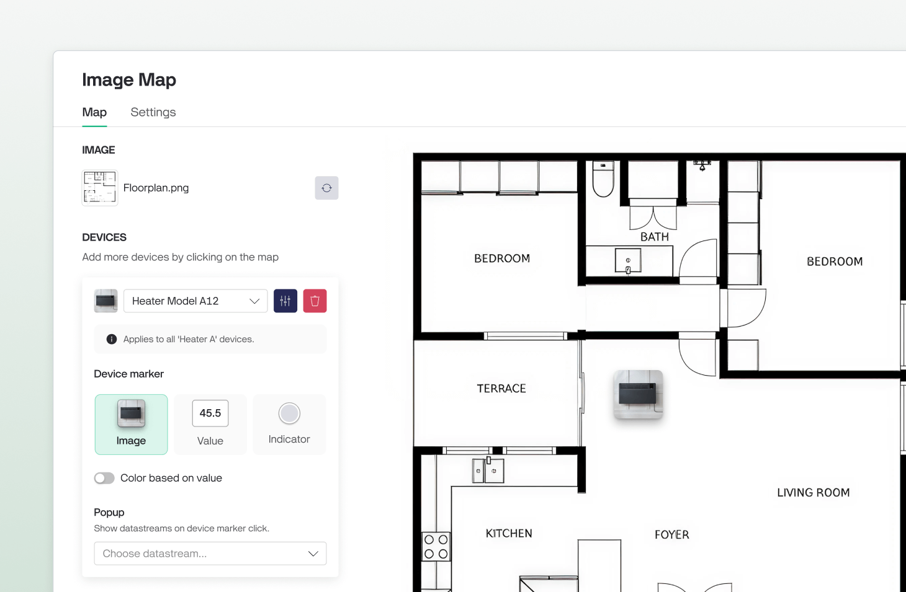<figcaption></figcaption></figure>

#### Color Based on Value

Enable **Change color based on value** to highlight devices according to their data. This feature makes it easy to spot abnormal values or changes at a glance, helping you quickly identify issues without scanning each device individually.

You can:

* Use a gradient scheme or set custom color rules based on the minimum and maximum values of a datastream.
* Color markers based on **connection status** (online/offline).

All marker styles support the **Color based on value** option.

<figure>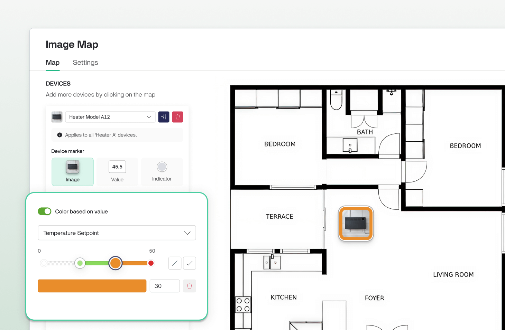<figcaption>
Color based on value
</figcaption></figure>

#### Popup

You can optionally add datastreams to display in a popup tooltip when clicking on a device. Each popup supports up to 5 datastreams, giving you quick access to extra details without crowding the map.

**💡 Tip:** Avoid overcrowding by showing only essential datastreams per device. For deeper analysis, combine the Image Map with tables or charts.

<figure>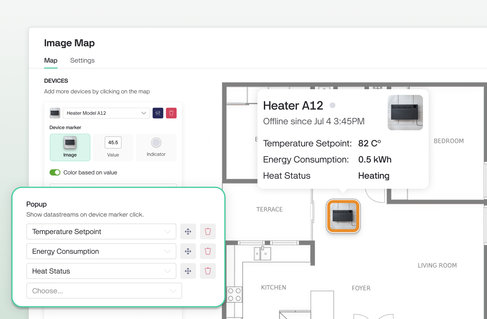<figcaption></figcaption></figure>

#### Sharing to Sub-Orgs

When a dashboard containing an Image Map widget is shared with sub-organizations, users in the sub-org will see the background image along with only the devices they have access to. Devices from higher-level organizations are automatically filtered out. This ensures that sub-org users always view a clean and relevant map without exposure to unrelated devices.

### Geomap

#### Overview

The Geomap widget allows you to display device locations on a world map. It provides a real-world view of where your devices are located and helps you monitor their status and key data at a glance.


The widget is available on **Pro and Enterprise plans**.


<figure>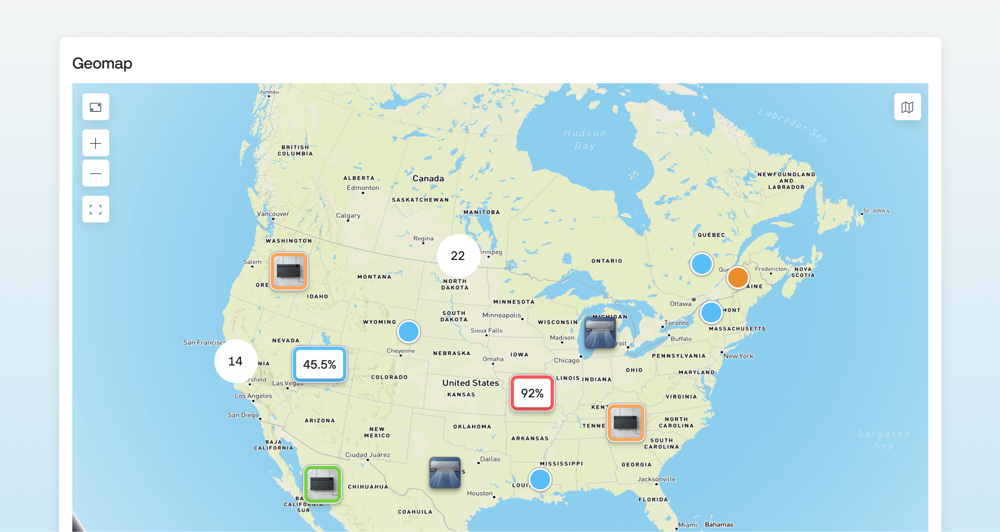<figcaption></figcaption></figure>

Device location is determined automatically in the following order:

1. **Metadata location** set in the device profile
   * **GPS coordinates:** If “Use location data from device (e.g. GPS)” is enabled in the Location Metadata, the system uses the coordinates sent by the device to the Location datastream.
   * Otherwise, the system uses either the **organization’s default location** or the **static location defined in the metafield** itself.
2. **IP-based geolocation** — used if no location metadata is available.

This logic ensures that every device can appear on the map, even if it doesn’t provide precise GPS data.


If neither Location Metadata nor IP information is available, the device will not be shown on the map.


#### How to Configure

1. **Add the widget**\
   Open your dashboard, click **Add Widget**, and select **Geomap**.

<figure>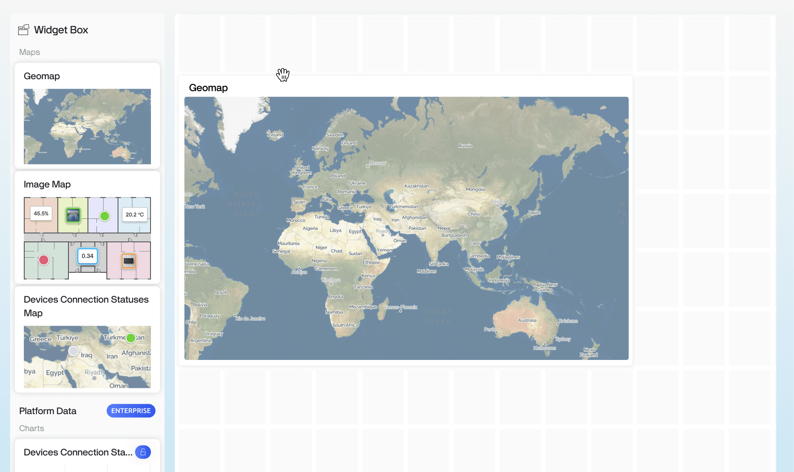<figcaption></figcaption></figure>

2. **Select devices**\
   In the **Data** tab, choose which devices you want to display on the map. By default, all devices from the dashboard’s data source are selected.

<figure><figcaption></figcaption></figure>

3. **Configure marker styles**\
   Open the **Design** tab to customize how device markers look and what information they display for each device template.


Marker settings apply to all devices from the same template.


**Device Marker Styles:**\
You can select one of three marker styles:

* **Image** — shows the device image.
* **Value** — shows a selected datastream value.
* **Indicator** — shows the device as a circle, best for maps with many similar devices.\

1. **Enable Color Based on Value (optional)**
2. Turn on Color based on value to highlight devices according to their data or status:
   * Use a gradient scale or set custom thresholds for a chosen datastream (red - danger, green-normal).
   * Color markers based on connection status (online/offline).

<figure>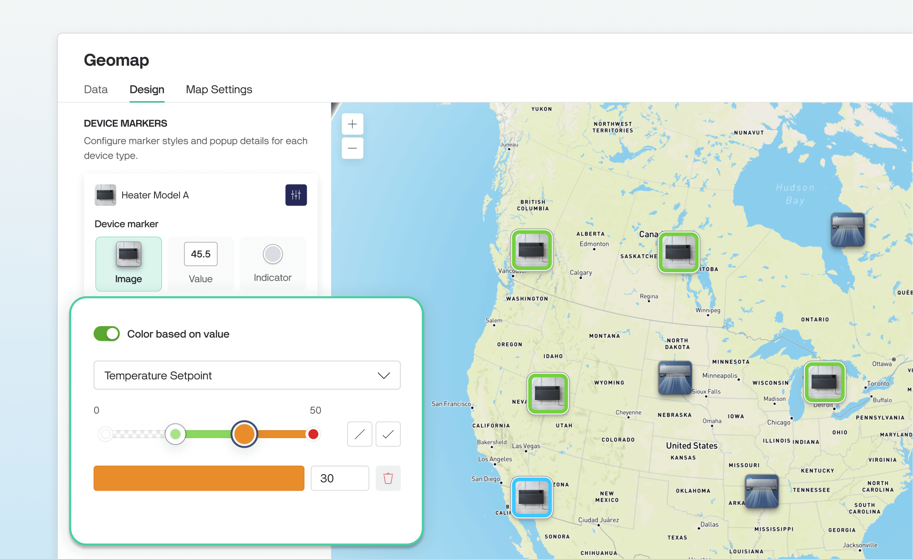<figcaption></figcaption></figure>

This helps you spot abnormal values or disconnected devices immediately.\
All marker styles support the **Color based on value** option.\

1. **Set up popup details**\
   Configure which datastreams appear in the popup tooltip when clicking a device marker. You can display up to **5 datastreams per device**, providing more detail without cluttering the map view.

<figure>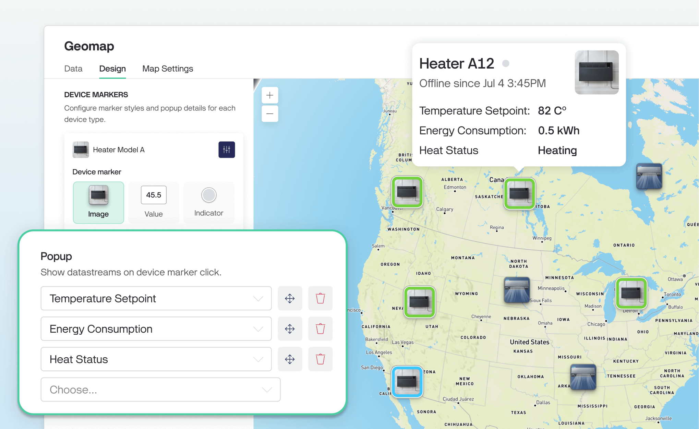<figcaption></figcaption></figure>

2. **Adjust map view**\
   In the **Settings** tab, choose your preferred map style. This style will be applied by default when the dashboard is loaded.

<figure>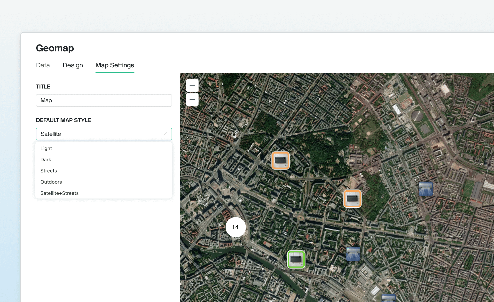<figcaption></figcaption></figure>

3. **Save your dashboard**\
   Once configured, the widget is ready to use.

#### Sharing to Sub-Orgs

If the dashboard is shared with sub-organizations, users in those sub-orgs will only see the devices they have permission to access. Devices outside their scope are automatically filtered out. This ensures that each user sees only the relevant devices in their Geomap view.
