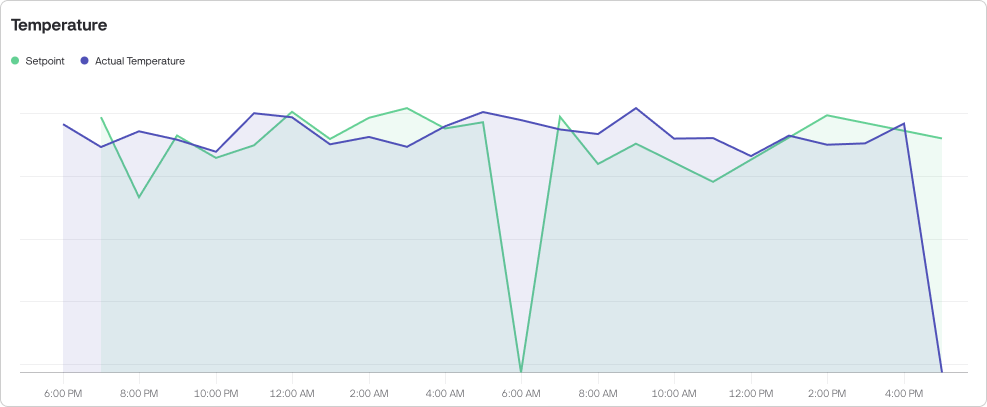
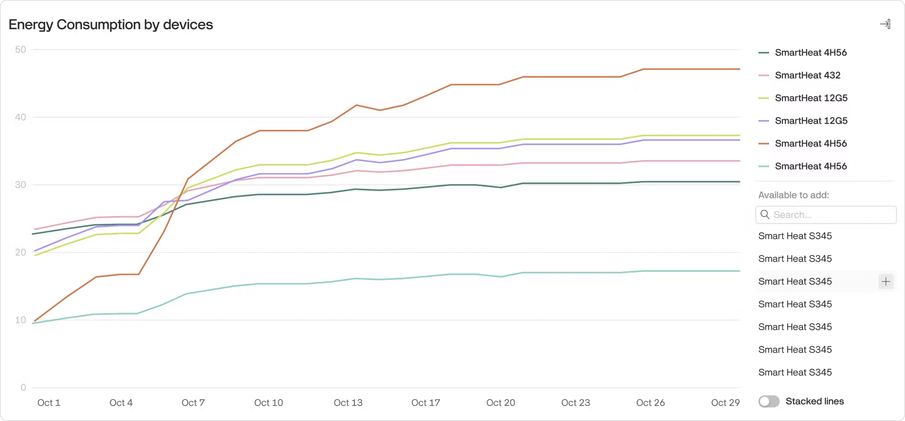

# Charts

### Chart: Metrics over time, agg.

This widget provides a visual representation of historical data, making it easier to identify trends, patterns, and anomalies over time.

<figure><figcaption>
Chart: Metrics over time, agg.
</figcaption></figure>

By supporting multiple data series, the widget allows you to compare different data types simultaneously, such as temperature and humidity, or energy consumption and production output. You can also compare energy consumption or any other metric by different aggregation types, e.g. Min Temperature vs Max Temperature.

**How to configure**:

1. Select datastreams. The chart supports up to 5 series.
2. Choose aggregation type. You can choose Average, Min, Max, or Sum for each data series.
3. Narrow down device selection (optional).
4. Design. Navigate to Design tab to select the chart view (line, area, column (bar), or stepline) set colors, axis and series names.

### Chart: Metric by device

This chart displays datastream values from multiple selected devices on a single chart, with each device represented by a distinct line. You can customize the chart by selecting specific devices.

The chart can display data from up to **eight** devices at the same time.

<figure><figcaption>
Chart: Metric by device
</figcaption></figure>

**How to configure**:

1. Select datastream.
2. Narrow down device selection (optional).
3. Design. Navigate to Design tab to set widget title.
