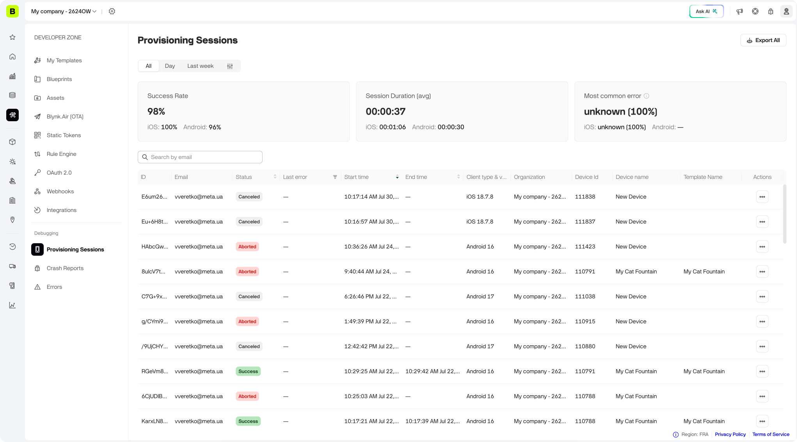
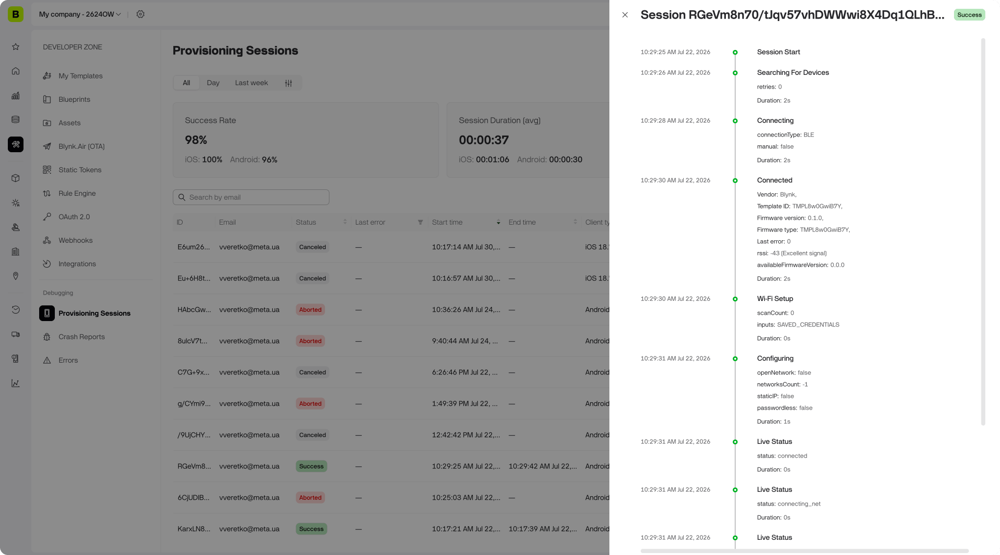

# Provisioning Sessions

## Provisioning Sessions

Every attempt to provision a device — successful, failed, or cancelled — is recorded as a **Provisioning Session**. This gives administrators visibility into how device onboarding is actually performing across their fleet, without needing to reproduce the issue on the device itself or rely on the end user's description of what happened.

<figure><figcaption></figcaption></figure>

### Why it exists

An error code alone rarely explains what actually happened on a device during setup. And if you're an administrator who didn't personally run the provisioning, you still need a way to see how onboarding is performing for your users. Provisioning Sessions solves both problems:

* **Troubleshoot a specific failure.** Developers can look up the exact session using the Session ID shown on the error screen in Developer Mode, and see exactly which step failed and why.
* **Monitor at scale.** See aggregate success rates, average session duration, and the most common failure reasons across iOS and Android, without digging through individual sessions.

### Where to find it

**Blynk.Console → Developer Zone → Debugging → Provisioning Sessions**

This is an organization-level view — like Devices, it also includes sessions from sub-organizations you have access to.

### Summary statistics

At the top of the page, three cards summarize the currently filtered result set — an overall number plus the **iOS** / **Android** breakdown:

| Metric                     | Description                                                                                                                                                                                                                                       |
| -------------------------- | ------------------------------------------------------------------------------------------------------------------------------------------------------------------------------------------------------------------------------------------------- |
| **Success Rate**           | Share of sessions that ended in `Success`, out of `Success` + `Failed` + `Aborted` sessions. `Canceled` sessions (the user closed the flow themselves) are excluded from this calculation entirely — they count neither for nor against the rate. |
| **Session Duration (avg)** | Average time from a session's first step to its last, across matching sessions.                                                                                                                                                                   |
| **Most Common Error**      | The error code that appears most frequently as the _last_ recorded error in a session. Shows `unknown` when the client didn't report a specific code.                                                                                             |

### The sessions table

Each row is one provisioning attempt. Columns:

| Column                       | Description                                                                                                                             |
| ---------------------------- | --------------------------------------------------------------------------------------------------------------------------------------- |
| **ID**                       | The session identifier. Developers can look this up directly from a Session ID reported by a user (see Reading the error screen below). |
| **Email**                    | The user who ran the provisioning attempt.                                                                                              |
| **Status**                   | One of four values — see Session status below.                                                                                          |
| **Last error**               | The error code of the final error step recorded, if any. Shown as `—` for sessions that never hit an error.                             |
| **Start time / End time**    | When the session began and ended.                                                                                                       |
| **Client type & OS Version** | e.g. `iOS 18.7.8`, `Android 16` — useful for spotting platform-specific regressions.                                                    |
| **Organization**             | The organization the session belongs to (relevant when viewing sessions across sub-organizations).                                      |
| **Device Id / Device name**  | The device involved, once one is assigned/known. New, not-yet-named devices show as "New Device".                                       |
| **Template Name**            | The device template involved, once known.                                                                                               |
| **Actions**                  | A **Delete** option to remove the session record.                                                                                       |

#### Session status

| Status       | Meaning                                                                                                           |
| ------------ | ----------------------------------------------------------------------------------------------------------------- |
| **Success**  | The device connected successfully.                                                                                |
| **Failed**   | The device itself reported an error (see the error tables below).                                                 |
| **Aborted**  | The session did not complete for a reason other than a device-reported error — an app, internet, or server issue. |
| **Canceled** | The user closed the provisioning flow themselves. Not counted in the Success Rate calculation.                    |

Click anywhere on a row (outside the email/copy icon) to open the **Provisioning Steps** drawer — a step-by-step timeline of that specific attempt. For example, a successful BLE-assisted Wi-Fi session looks like this:

| Step                    | Fields shown                                                                                                                                          | Duration |
| ----------------------- | ----------------------------------------------------------------------------------------------------------------------------------------------------- | -------- |
| Session Start           | —                                                                                                                                                     | —        |
| Searching For Devices   | retries                                                                                                                                               | 2s       |
| Connecting              | connectionType (e.g. `BLE`), manual                                                                                                                   | 2s       |
| Connected               | Vendor, Template ID, Firmware version & type, Last error, rssi (with a signal-quality label, e.g. "-43 (Excellent signal)"), availableFirmwareVersion | 2s       |
| Wi-Fi Setup             | scanCount, inputs (e.g. `SAVED_CREDENTIALS`)                                                                                                          | 0s       |
| Configuring             | openNetwork, networksCount, staticIP, passwordless                                                                                                    | 1s       |
| Live Status _(repeats)_ | status: `connecting_net` → `connecting_cloud` → `connected`                                                                                           | varies   |
| Device Online           | —                                                                                                                                                     | 3s       |
| Session Finished        | total session duration                                                                                                                                | —        |

Every step carries its own timestamp and duration, so you can see exactly where time was spent or where a session stalled — this is the detail that answers "what actually happened on the device" beyond just the last error code.

<figure><figcaption></figcaption></figure>

#### Filtering and search

* **Search by email**
* **Time range** — quick filters for **All** / **Day** / **Last week**, or a custom date range
* **Last error** (multi-select checklist, searchable — matches the same error codes reported by the mobile client, e.g. `prov_start_fail`, `scan_fail`, `hw_info_wrong_tmpl`, etc.)

Sorting is available on the Last error, Start time, and End time columns.

#### Exporting

Use **Export All** to download all sessions matching your current filters (not just the current page) as a CSV — useful for offline analysis or sharing with support/engineering. The export includes Session ID, Email, Status, Client, OS Version, Organization, Device ID, Device Name, Template Name, Start/End Time, and Last Error. Individual session step timelines are not included in the export.

#### Deleting a session

Each row's **Actions** menu has a **Delete** option, e.g. to clear out test data. This permanently removes that session's analytics record and requires the same permission as deleting a device — it does not affect the device itself.

### Reading the error screen

When a BLE-assisted device hits an error during provisioning, the app shows recovery instructions plus two fields that are visible only in **Developer Mode** — not shown to regular end users:

* **Reason** — the specific error identifier (see the tables below).
* **Session ID** — the same ID used as the primary key in this table, for looking up the full step-by-step timeline of that attempt.

### Provisioning Error IDs

Error codes are reported by the mobile client and describe exactly what went wrong at each stage of provisioning.

#### 1. Token errors

| ErrorId             | Description                                                                                                                                                          |
| ------------------- | -------------------------------------------------------------------------------------------------------------------------------------------------------------------- |
| `prov_start_fail`   | Initial provisioning token retrieval from the server failed during setup. May indicate network issues, auth failure, or server problems.                             |
| `prov_restart_fail` | New token retrieval failed when restarting provisioning after a successfully provisioned device (add-another / restart flow). Same root causes as `prov_start_fail`. |

#### 2. Provisioning state errors

| ErrorId               | Description                                                                                                                        |
| --------------------- | ---------------------------------------------------------------------------------------------------------------------------------- |
| `prov_busy`           | Provisioning state machine is currently busy with another operation; the connect/verify request was rejected. Typically transient. |
| `prov_released`       | Provisioning session was released/terminated before the operation could complete. May occur on timeout or device reboot.           |
| `prov_not_sup`        | The requested operation is not supported by the current provisioning backend or device firmware.                                   |
| `prov_not_sup_params` | The connection parameters supplied are not supported by the current device type.                                                   |

#### 3. Scanning and association errors

| ErrorId              | Description                                                                                                                                       |
| -------------------- | ------------------------------------------------------------------------------------------------------------------------------------------------- |
| `scan_fail`          | Generic scan failure — BLE/WiFi adapter unavailable, permissions denied, scan returned a non-specific error, or scan requirements list was empty. |
| `scan_assoc_start`   | Device scan-to-connect association failed at the start/initiation stage before any connection attempt.                                            |
| `scan_assoc_handle`  | Association failed while handling the system WiFi association intent/callback result.                                                             |
| `scan_assoc_extract` | Association failed while extracting the device from the intent or association result — the result was present but could not be parsed.            |

#### 4. Hardware connection errors

| ErrorId              | Description                                                                                                                                |
| -------------------- | ------------------------------------------------------------------------------------------------------------------------------------------ |
| `http_not_permitted` | Phone does not have permission to communicate with the device — restricted by firewall, network policy, or system security.                |
| `hw_con_no_network`  | No network available while attempting to connect to hardware.                                                                              |
| `hw_con_add_network` | Phone's WiFi adapter failed to add or connect to the device's network profile — a system-level constraint requiring manual network config. |
| `hw_con_fail`        | Generic hardware connection failure: exception during transport setup, inconsistent connect requirements (missing params or empty lists).  |

#### 5. Hardware validation errors

| ErrorId                  | Description                                                                                                                                                                                     |
| ------------------------ | ----------------------------------------------------------------------------------------------------------------------------------------------------------------------------------------------- |
| `hw_info_timeout`        | Timed out waiting for board info / validation response from the device. Device may be offline, rebooting, or experiencing connectivity issues.                                                  |
| `hw_info_parse_fail`     | Device responded but the board information is invalid, unrecognizable, or missing (e.g. no firmware version). May indicate corrupted firmware, unsupported hardware, or protocol mismatch.      |
| `hw_info_wrong_vendor`   | Device manufacturer/vendor does not match the expected vendor for this provisioning flow. User may be trying to provision an incompatible device.                                               |
| `hw_info_wrong_tmpl`     | Device reports a template ID that does not match the expected template for this provisioning session. May occur when the wrong device is being provisioned or after a firmware reconfiguration. |
| `hw_info_tmpl_not_found` | Device reports a template ID that is not recognized in the Blynk system. May indicate unsupported device, corrupted firmware, or server-side database issue.                                    |

#### 6. Firmware update errors

| ErrorId                | Description                                                                                                                                                        |
| ---------------------- | ------------------------------------------------------------------------------------------------------------------------------------------------------------------ |
| `fw_upd_con_fail`      | Post-OTA reconnect verification failed — device update check could not complete (device rebooted, connection or validation failed while firmware check was armed). |
| `fw_upd_fail`          | Firmware update binary delivery to device failed.                                                                                                                  |
| `fw_upd_not_supported` | Device firmware does not support OTA update.                                                                                                                       |

#### 7. Hardware configuration errors

Emitted during the active device configuration phase (credential delivery, network join, cloud auth).

**Generic**

| ErrorId                 | Description                                                                                                                                                         |
| ----------------------- | ------------------------------------------------------------------------------------------------------------------------------------------------------------------- |
| `conf_fail`             | Generic configuration failure: device rejected payload, internal device error, upload request failure without a typed config error, or resume-awaiting wrong state. |
| `conf_con_no_network`   | No network available on the device during configuration upload or post-config online check.                                                                         |
| `conf_con_timeout`      | Configuration connection timed out (socket-level timeout while sending config to device). Device may have disconnected, rebooted, or is not accepting connections.  |
| `conf_con_fail`         | Generic config connection failure with a non-timeout typed reason (e.g. connection refused, reset, unknown network error).                                          |
| `conf_con_unknown_host` | Config server hostname could not be resolved during configuration upload.                                                                                           |
| `conf_con_no_route`     | No route to host while attempting configuration upload (network is unreachable).                                                                                    |
| `disconnected`          | Device disconnected after configuration was attempted. May indicate device reboot or signal loss during config delivery.                                            |
| `timeout`               | Device failed to connect to the WiFi network within the expected timeout. Network may be unreachable, congested, or device is too far from the router.              |

**Networking** — emitted after the device has received configuration and attempts to join the WiFi network.

| ErrorId                        | Description                                                                                                                                               |
| ------------------------------ | --------------------------------------------------------------------------------------------------------------------------------------------------------- |
| `net_fail_net_unknown`         | Generic/unknown device networking failure after receiving config — device could not establish the expected network connection for an unclassified reason. |
| `net_fail_net_failed`          | Device networking failure with a known error returned but no more specific subtype available.                                                             |
| `net_fail_not_found`           | Device cannot find the WiFi network with the provided SSID. The network name is shown in the error to guide the user.                                     |
| `net_fail_invalid_credentials` | Device failed to authenticate with the WiFi network — incorrect WiFi credentials were sent.                                                               |
| `net_fail_no_ip_assigned`      | Device connected to the WiFi network but could not obtain an IP address (DHCP failure). May require static IP configuration.                              |

**Cloud** — emitted after the device has joined the WiFi network and attempts to reach the Blynk cloud.

| ErrorId                            | Description                                                                                                                                          |
| ---------------------------------- | ---------------------------------------------------------------------------------------------------------------------------------------------------- |
| `cloud_fail_dns_failed`            | Device cannot resolve the Blynk cloud server hostname. May indicate network DNS misconfiguration, DNS server problems, or firewall blocking.         |
| `cloud_fail_captive_portal`        | Network requires a login page before allowing Internet access.                                                                                       |
| `cloud_fail_invalid_certificate`   | Device cannot validate the Blynk cloud server's SSL/TLS certificate. May indicate a MITM situation, certificate expiration, or system time mismatch. |
| `cloud_fail_authentication_failed` | Device reached the cloud but token authentication failed — token may be invalid, expired, or rejected by the server.                                 |
| `cloud_fail_cloud_timeout`         | Device did not receive a cloud response within the timeout. May indicate server overload, network congestion, or firewall blocking.                  |
| `cloud_fail_cloud_failed`          | Generic cloud communication failure (not DNS, certificate, auth, or timeout).                                                                        |

#### 8. Device online / server reachability

| ErrorId              | Description                                                                                                                                                                                                                                                                                        |
| -------------------- | -------------------------------------------------------------------------------------------------------------------------------------------------------------------------------------------------------------------------------------------------------------------------------------------------- |
| `server_con_timeout` | The phone lost its internet route to the Blynk server while awaiting the device to come online. The device itself may be online; verification could not complete due to the phone's connectivity loss. Different from `device_con_timeout` — here it's the phone without internet, not the device. |
| `device_con_timeout` | Device was successfully configured but did not come online (become accessible on the Blynk server) within the expected timeout. May indicate device connectivity issues, router problems, or misconfiguration. Reported separately for Wi-Fi vs. non-Wi-Fi (Ethernet/Cellular/BLE) devices.        |
| `device_rescanned`   | Legacy — previously used when a provisioned device was re-scanned. No longer raised by current app versions.                                                                                                                                                                                       |

#### 9. Hardware request / device request errors

Raised during device communication operations outside the initial configuration phase (e.g. OTA, board-info reload).

| ErrorId           | Description                                                                                                                             |
| ----------------- | --------------------------------------------------------------------------------------------------------------------------------------- |
| `hw_req_busy`     | Device is currently processing another request and cannot accept a new one. Typically transient.                                        |
| `hw_req_released` | Device request session released or timed out — provisioning took too long or the device rebooted.                                       |
| `hw_req_not_sup`  | Device does not support the requested operation (e.g. OTA firmware update not available in firmware). Indicates a compatibility issue.  |
| `hw_req_failure`  | Generic device request failure with no specific subtype.                                                                                |
| `hw_req_no_net`   | Device has no network connection, preventing it from processing the request. May have disconnected from the network after provisioning. |

#### 10. Generic fallback

| ErrorId   | Description                                                                                                                                                    |
| --------- | -------------------------------------------------------------------------------------------------------------------------------------------------------------- |
| `generic` | Catch-all fallback for unclassified association states during scan-to-connect.                                                                                 |
| `unknown` | The client reported an error code not recognized by this server version — typically means a newer app release introduced a code before the platform caught up. |

### Related

* Add New Device — the in-app flow that generates these sessions, including where the Session ID and Reason are shown to developers.
* User Guides — configure per-template installation/activation instructions and the troubleshooting link shown on the error screen; this is what a session's "prepare your device" step and error recovery link are actually pulling from.
* Deploying Products With Dynamic AuthTokens — for managing provisioning at scale across clients.
