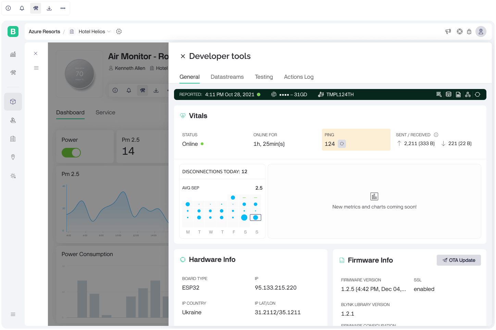

# Developer tools

<figure><figcaption>
Developer Tools
</figcaption></figure>

This overview will guide you through the key sections and functionalities available on this screen.

The Developer Tools section is organized into several tabs, each designed for specific purposes:

### General

Provides a summary and essential information about the device, including its status, hardware info, firmware info, and access to advanced features like Vitals.

**Key Features:** Device status, last seen online, heartbeat interval, and firmware configuration.

### Datastreams

Displays detailed information about the various data streams associated with the device. This tab allows you to monitor and manage data streams effectively.

**Key Features:** List of datastreams with their IDs, names, virtual pins, current values, update timestamps, property values, data types, and the actions you can perform on them.

### Testing

Allows developers to test and interact with their device’s datastreams using various API commands. This is crucial for verifying the functionality and ensuring proper communication between the device and the platform.

**Key Features:** API commands (GET value, UPDATE value, Set property, Log event), value input, update functionality, and code snippets.

### Actions Log

Provides a comprehensive history of actions performed on the datastreams associated with the device. This tab is essential for tracking activities, diagnosing issues, and auditing changes.

**Key Features:** Log entries with timestamps, user names, client types, datastreams affected, and values. Time filters for viewing logs within specific periods.
