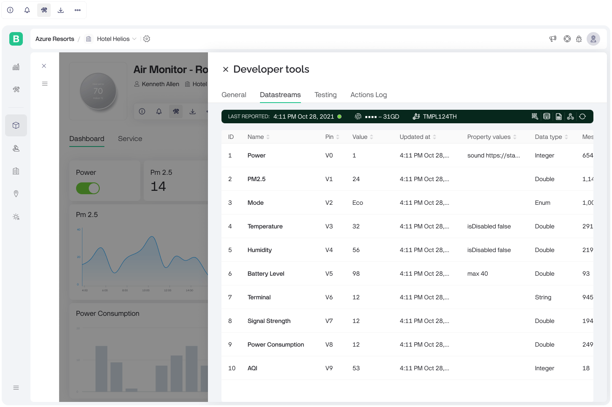

# Datastreams

<figure><figcaption>
Developer tools | Datastreams
</figcaption></figure>

The section is divided into multiple columns, each providing specific information about the data streams. Click on the value in any column to copy it.

#### Columns and Descriptions

1. **ID -** A unique identifier for each data stream.
2. **Name -** The name of the data stream.
3. **Pin -** The virtual pin associated with the data stream.
4. **Value -** The current value of the data stream.
5. **Updated At -** The timestamp of the last update for the data stream.
6. **Property Values -** Additional properties associated with the data stream.
7. **Data Type -** The type of data being recorded.
8. **Actions** - Perform

### Actions

The actions menu provides several options for interacting with and managing the data streams of your IoT device. Each action is designed to perform a specific task related to data retrieval, update, or reset.

#### GET Value URL

Provides a URL to retrieve the current value of a specific data stream via HTTPs API.

You can copy the URL or open it in a new browser tab for testing.

#### UPDATE Value URL

Provides a URL to update the value of a specific data stream via HTTPs API.

You can copy the URL or open it in a new browser tab for testing.

#### Reset Value

Resets the current value of the selected data stream to its default or initial state.

#### Reset All Properties

Resets all properties of the selected data stream to their default or initial states.
