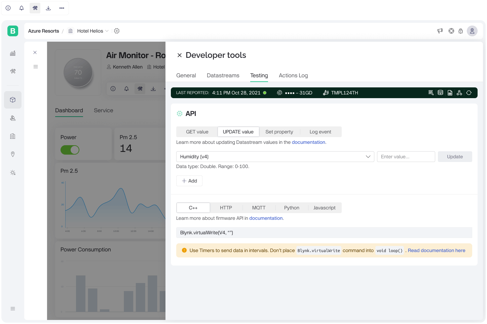

# Testing

<figure><figcaption></figcaption></figure>

This section is essential for verifying the functionality of different parameters and ensuring proper communication between the device and the platform.

### API

The API section provides options to get or update the values of datastreams, set properties, and log events.

#### **API Command Tabs**

* **GET value:** Retrieve the current value of a specific datastream.
* **UPDATE value:** Update the value of a specific datastream.
* **Set property:** Modify the properties of a datastream.
* **Log event:** Record events related to the datastream.

#### **Datastream Selection**

Allows the selection of a specific datastream to interact with from a dropdown menu (e.g., `Humidity (V4)`).

**Data Type and Range:** Displays the hint on the data type and acceptable range for the selected datastream (e.g., `Double. Range: 0-100`).

#### **Value Input and Update**

For Update value, Set property options you can enter a new value to update the datastream ().

You can also update multiple datastreams / properties usind _Add_ button.

#### Code Snippets

The section provides code snippets for [firmware API](/broken/pages/3N6UZd68hmTb9kGG8ZUT), [HTTP API](../../../../blynk.cloud/device-https-api/) and [MQTT API](../../../../blynk.cloud/device-mqtt-api/) that can be used to perform the actions that were configured in the interface above from the hardware.


Use Timers to send data in intervals. Don’t place `Blynk.virtualWrite` command directly into `void loop().` [Read documentation here](../../../../getting-started/how-to-display-any-sensor-data-in-blynk-app.md#use-timers).

