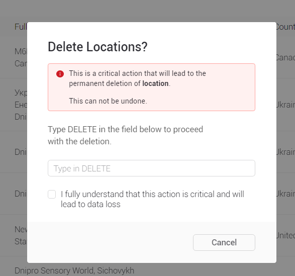
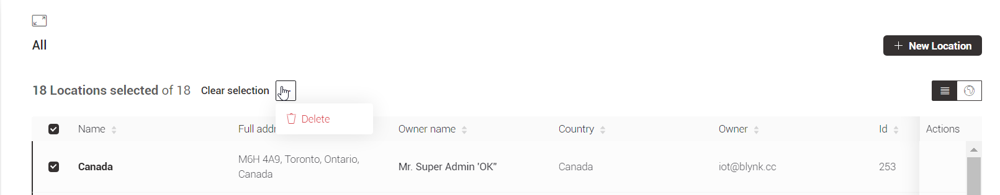
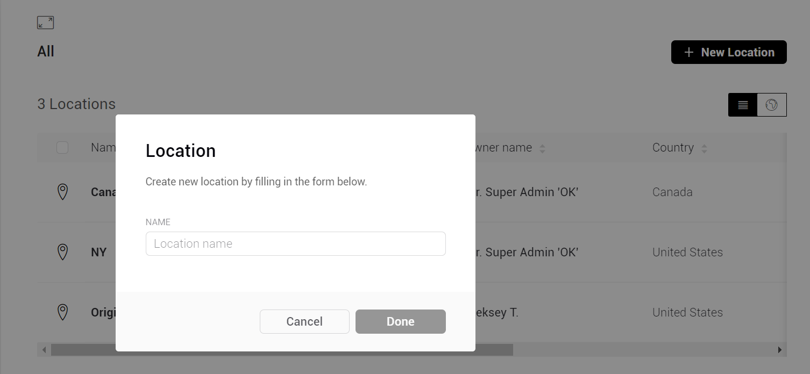
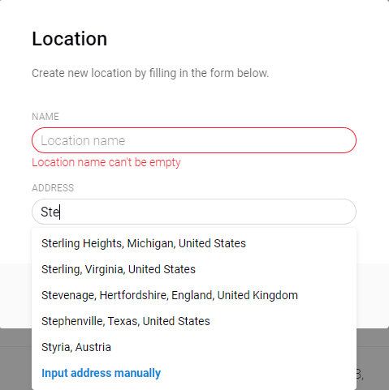
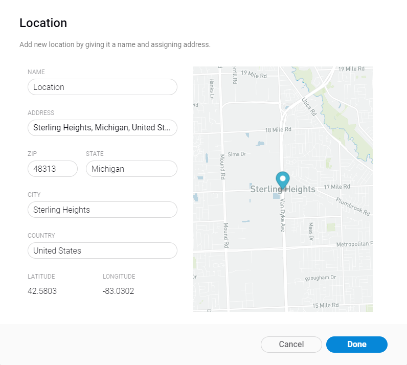
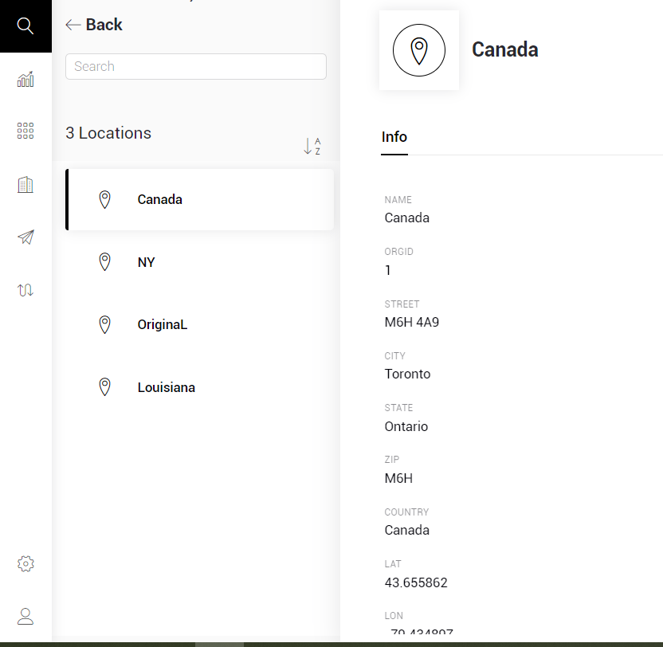

# Locations

## Create new

View locations

Any actions

Edit

Delete

## Locations View

You can see information about the available Locations in the form of a table or in the form of a map.

## Map

## List of Locations

### Table interaction

All the columns support sorting.

## Table contents

### Table contents

There are 5 specific columns:

* **Location Name **
* **Full Address **– displays full address of the Location
* **Owner Name **– displays the Name of user who assigned to this Location
* **Country **– displays the country where the Location is located
* **Owner E-mail **– displays E-mail of  user who assigned to this Location

Table view can be **sorted **in ascending/descending order by any column value.

**Single Actions** menu is triggered by hovering Actions column in Location's row. Available actions:

*   **Edit Location **– edit data of Location. Modal window will appear. 

    Confirm or cancel the action   

* **Delete Location **– modal window will appear. Type DELETE and confirm the action are required.

The only **Bulk Action** available here is to Delete the Locations. 

1. Select all Locations by marking **checkbox **in columns naming row or specify Locations selection by marking each Location's checkbox.
2. Once Locations selection is made **Delete **button appears on the top right of the screen.
3. Don't worry, there's a prompt  "Delete Selected Locations?" with **Cancel **and ** Delete** buttons.
4. Type DELETE and confirm the action are required.

### **Search**

Locations can be found by Location **Name**,** Address** or **Owner E-mail** – type at least 3 characters to get search results in the table.

### New Location

This button click opens modal window. 

* **Name **– make it meaningful and readable. 48 characters limit.
*   **Address **(field will appear after Name input) – start typing Location address up to 48 characters and there are 2 options available: 

    * select from search suggestions 
    * input manually

    Full form will be opened:

Check all the fields to be filled and correct here:

* **Name **– will be transferred from the previous form. Can be edited.
* **Address **– will be transferred from the previous form. Can be edited.
* **ZIP **– postal code
* **State**
* **City**
* **Country**
* **Latitude **and **Longitude **– automatically generated from the data given and can't be edited
* **Map view **– location preview. No set point functionality at the moment.

### Location Page

You can view information about a Location by clicking on its Name in the List of Locations

