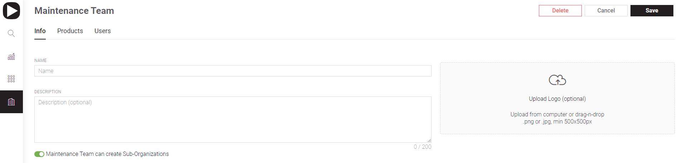
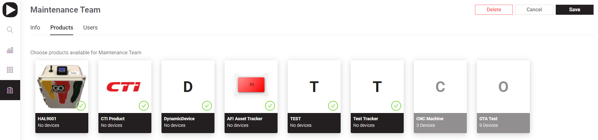
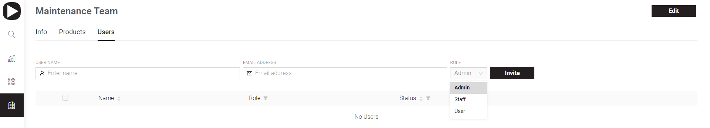
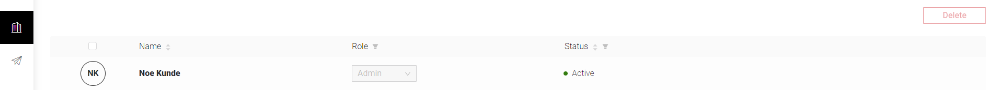

# Organizations

## Info

**Name** – must be unique. Use letters, digits, space or '.', '-', ''' characters. 80 characters limit.

**Description**  – optional field with information about the Organization. Notes about sub-organizations can be put here. 200 characters limit with counter.

**Can create Sub-Organizations** – enable this option to allow to create affiliated Organizations under this one. It's useful when there's a need to setup a Client Organization  
  
**Logo** – option to add Organization logo by uploading from computer or drag-n-drop a picture of .png or .jpg, min 500x500px format.

## Templates

This screen with tiles view contains all the Templates available to Organization.  
Click **Edit** to add/remove Templates by _**clicking the tiles**_. Active Templates are marked with green tick, disabled have tiles with reduced colors. Once the changes are made click **Save**.

## Users

This screen has 2 sections: Invite User and User List

**User name** – fill in this field with First and Last names of the user you want to invite.

**Email Address** – be sure to input correct Email. The invitation letter with links to apps will be sent to it.  

**Role** – select user's role in this Organization. _Admin, Staff_ and _User_ roles are available from the dropdown menu. 

Click **Invite** once all is done here.   
The invitation letter will be sent to user's Email and user account will appear in **Users Invitations List.**

Here you can see all Organizations invited users with their names, roles and invitation statuses. Also you can change view order by toggling sorting arrows near the columns names and limit viewed users list by applying Status filter \(multiple selections are supported\).

## More Organization management options

If you need to apply more specific edits switch to Organization and proceed to [Organization Settings](settings/organization-settings/)

Also there's [Transfer Organization](organizations/transfer-organization.md) feature available.

