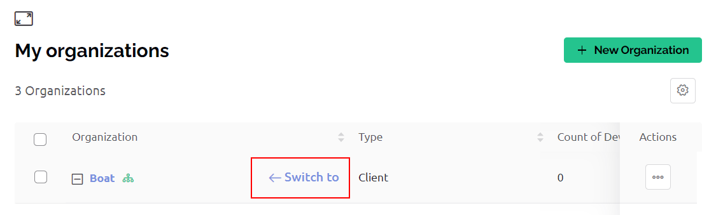

# Browse & Edit a Sub-Organization

Login to Blynk as a user with a role and permissions that will allow you to perform your intended actions.  The ‘Admin’ role with default permissions is sufficient.

Click on the sidebar ‘Organizations’ and a list of your organizations will appear.  Click on a particular organization and then the details are displayed in the tabs ‘Info’, ‘Templates’, ‘Users’, ‘Locations’.   Note that only the first level of organizations are displayed.  Navigate to ‘Search -> ‘ORGANIZATIONS’ to switch to a sub-organization, enabling you to then see any third level or deeper sub-organizations.

### Add Templates to a Sub-Organization

Under the ‘Templates’ tab, you will only see the templates that have been enabled for your organization.  In order to see what other templates are available to be enabled, click the ‘Edit’ button at the upper right of the Blynk.Console.  After a template has been enabled for your sub-organization, the related devices may be [transferred](https://docs.blynk.io/en/blynk.console/devices/actions-with-devices#move-device-to-another-organization-within-your-hierarchy) to another user.  Enabling a template for a sub-organization doesn’t perform any automatic device transfers, but it does allow devices to be transferred.&#x20;

### Invite Users to a Sub-Organization

From the ‘Users’ tab, you may invite new users to add them to the organization, and you can delete users.

You can dynamically invite users to an organization that don’t currently have a Blynk account and assign them the [roles](https://docs.blynk.io/en/blynk.console/settings/access#roles-and-permissions) of ‘Admin’, ‘Staff’, or ‘User’.  Existing Blynk members will need to be [transferred](browse-and-edit-a-sub-organization.md#how-to-transfer-a-user-to-another-organization).

To add a user to an organization that is not a Blynk member, navigate to Search -> Organizations and select an existing organization.  Click on the ‘Users’ tab to see the existing users.  Click the ‘...’ link at the top right of the page and choose the option ‘Manage Users’.  From this page you can click the ‘+ Invite’ button at the top of right of the screen to add a user that doesn’t exist to the organization. The user will receive an invitation by email and must click on the link in the email to set a password within 30 days. The user’s status will appear as ‘Pending’ until they click on that email link and set a password.

The ‘Locations’ tab doesn’t currently display any assigned organizations.  Navigate to ‘Settings -> ORGANIZATION SETTINGS -> Locations’, or ‘Search -> LOCATIONS’ to see them, add new locations, assign users, and delete locations. &#x20;

You may also browse organizations from ‘Search -> [ORGANIZATIONS’](https://docs.blynk.io/en/blynk.console/search-data).  It provides a useful way to see device and user assignment to organizations.

### How to Transfer a User to Another Organization

Existing Blynk members can be transferred from one organization to another via [Search -> Users -> All](https://docs.blynk.io/en/blynk.console/users/users-list#users-table) -> Actions -> Transfer User, or [Search -> Organizations](https://docs.blynk.io/en/blynk.console/settings/organization-settings/users#hover-options), [Settings -> ORGANIZATION SETTINGS -> Users](https://docs.blynk.io/en/blynk.console/settings/organization-settings/users#hover-options).

To transfer a user that is currently a Blynk member, navigate to  [Search -> Users -> All](https://docs.blynk.io/en/blynk.console/users/users-list#users-table) -> Actions, and choose the ‘Transfer User’ option.  Enter the email address of the administrator for the destination organization.  You may change the role for the user, and optionally transfer all owned devices.  The user transferred, and the admin for the destination organization will automatically receive an email notification of the user transfer. &#x20;

   


WARNING:  If you transfer the only ‘Admin’ user in a sub-organization to another organization, then you will need to assign another user with the ‘Admin’ role that is not a Blynk member.


### Switch to a Sub-Organization

You can make a particular sub-organization active from Search -> ORGANIZATIONS and then under the list, hover your mouse over the organization name and click on the ‘Switch to’ link. On doing that you will view the sub-organization exactly like the users of this sub-organization would, which will make troubleshooting far easier.

<figure><figcaption></figcaption></figure>

Once you switch to a sub-organization, you will see the templates, devices, and users assigned to the sub-organization.  The scope of devices each sub-organization user will see depends on their [device permissions](https://docs.blynk.io/en/blynk.console/settings/access#devices).

You can navigate back to your root organization by clicking the Blynk logo at the top of the sidebar menu (top left corner).


You can navigate back to your root organization by clicking the Blynk logo at the top of the sidebar menu (top left corner).


