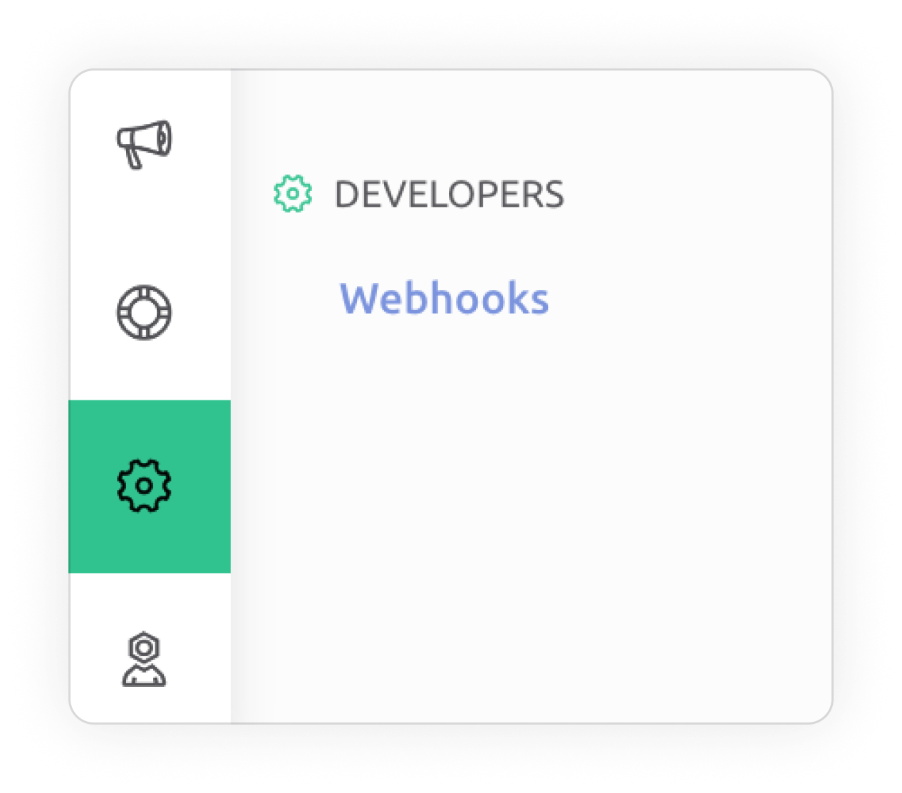
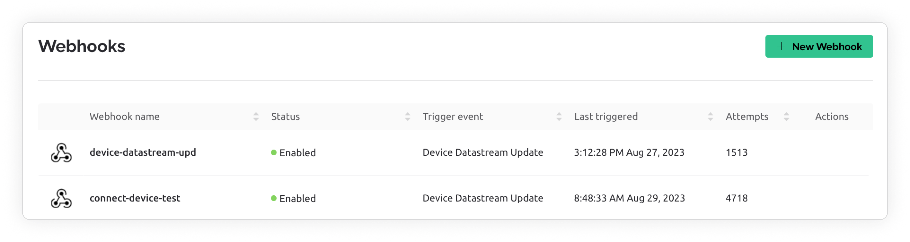
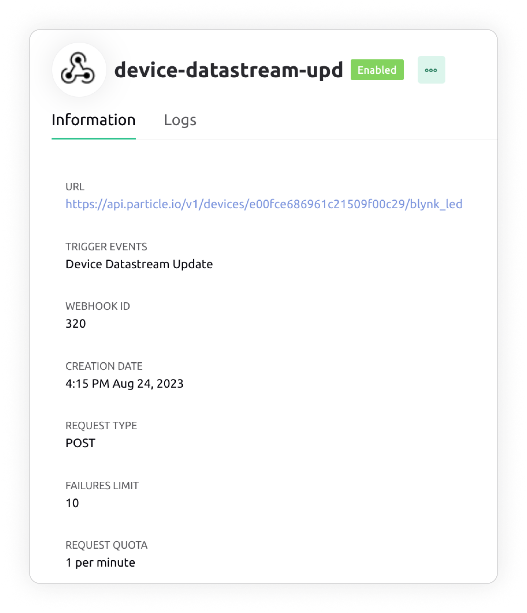
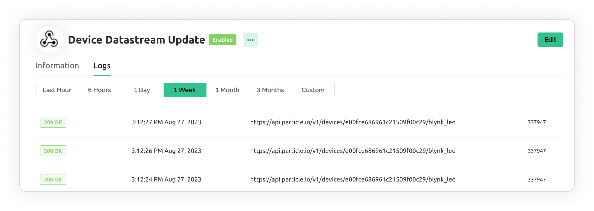

# Webhooks

Webhooks could be found in the **Developers** section of the **Settings** menu:

If you don't see this section, this means you don't have permission to access the webhooks. Please contact your administrator for access rights.

In the view above you can find 5 specific columns:

* **Webhook name**
* **Status** – webhooks can be enabled or disabled for execution
* **Trigger event** – displays the action that causes the webhook to run
* **Last triggered** – displays last execution time in hh:mm:ss M D, Y format (the current year is hidden)
* **Attempts** – counter of all (_successful, failed, test, real action_) attempts to execute the webhook

### Actions

* **Click on row area** – opens Webhook view screen
* **Actions Menu**
  * **Edit** – (also available from Webhook view screen)
  * **Test** – triggers test execution with success/error return from the server on the top of the screen (this execution is not saved to Webhook Log)
  * **Disable** – turns off the execution of the webhook without deleting it
  * **Delete** – opens delete modal window. Follow the steps described there&#x20;

### [Create New Webhook](create-new-webhook.md)

## Webhook view

Once the Webhook is created you can view it's info by clicking it's row or name in Webhooks table.

### Information tab

* **URL** – webhook request destination&#x20;
* **Trigger events** – displays the action that causes the webhook to run
* **Webhook ID** – used in Blynk.Console only&#x20;
* **Creation date** – hh:mm M D, Y format
* **Version**

### Logs tab

This table stores and displays all trigger results that were caused by real actions (not test webhook runs)\
It can be sorted by switching Timeline tabs and each column value.

* **Status** – `OK`_,_ `Waiting`_,_ `Failed` are possible with [`server response code`](https://developer.mozilla.org/en-US/docs/Web/HTTP/Status)
* **Date** – webhook trigger time in hh:mm:ss M D, Y format&#x20;
* **Request to** – webhook request destination URL
* **Trigger ID** – hover on so the hint appears, click Copy pictogram to put it to your clipboard

### [Limits apply](../../limits.md#webhooks-limits)
