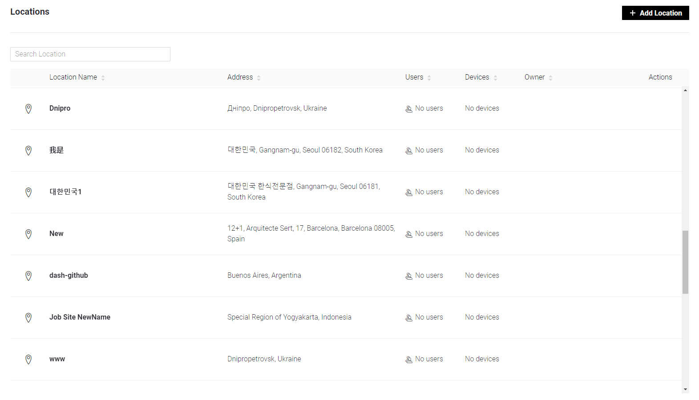

# Locations (Job Site or Facilities)

_**Note:**_ this entity has [3 variations](../../../commercial-use/business-plan-white-label-assets/application-settings/general.md)

## Table contents

There are 5 specific columns:

* **Location Name**&#x20;
* **Address** – displays full address of the Location
* **Users** – displays assigned users quantity
* **Devices** – displays assigned devices quantity
* **Owner** – displays E-mail of the user who created the Location

&#x20;Table view can be **sorted** in ascending/descending order by any column value.&#x20;

## **Search**&#x20;

Locations can be found by Location Name, Address or Owner E-mail – type at least 3 characters to get search results in the table.

## Add Location

This button click opens modal window.&#x20;

* **Name** – make it meaningful and readable. 48 characters limit.
*   **Address** (field will appear after Name input) – start typing Location address up to 48 characters and there are 2 options available:&#x20;

    * select from search suggestions&#x20;
    * input manually

    Full form will be opened:

Check all the fields to be filled and correct here:

* **Name** – will be transferred from the previous form. Can be edited.
* **Address** – will be transferred from the previous form. Can be edited.
* **ZIP** – postal code
* **State**
* **City**
* **Country**
* **Latitude** and **Longtitude** – automatically generated from the data given and can't be edited
* **Map view** – location preview. No set point functionality at the moment.

## Actions

* Actions menu:
  * **Edit** (also can be accessed by click on **Location Name)** – opens Location create/edit full form
  * **Manage Users** (also can be accessed by click on **Users** **counter**) – assign or unassign Organization Users by selecting and moving them between All users and Users assigned columns. Search by User name, single and bulk selections are supported here.

*
  * **Delete** – standard Delete confirmation modal window opens after click. Only single Location delete option is supported.
