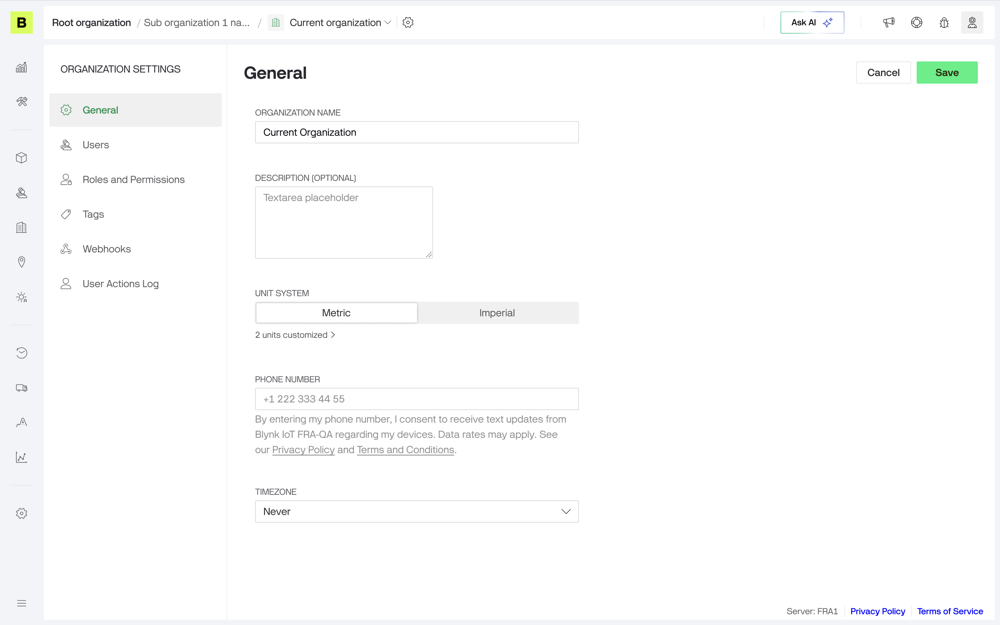

# Unit System

Org admins set the organization-wide default in **Organization Settings**. Pick a base preset — Metric or Imperial — to set every measurement group at once, then optionally override individual groups if needed (for example, Imperial everywhere but °C for temperature).\
By default all org users will see data in this units.

<figure><figcaption></figcaption></figure>
