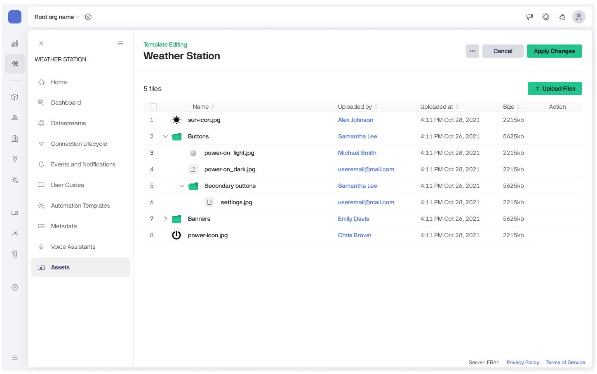
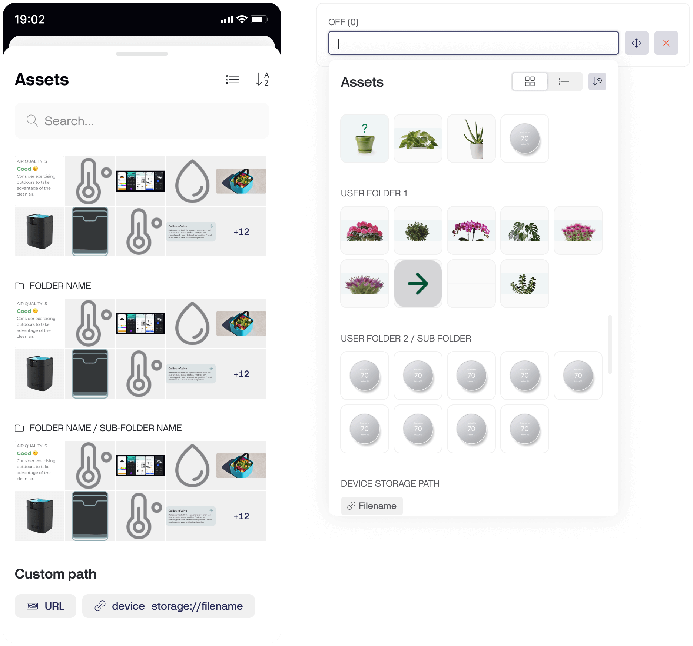

# Assets

The Assets feature allows you to upload and manage **media files like .png, .jpg, .jpeg, and .ico** directly within Blynk. This eliminates the need for external file hosting, as assets can now be stored in the template and accessed through the UI Builder.

Use these files to build mobile and web dashboards, adding custom visuals like logos, icons, or equipment images to your UI.&#x20;


**Note:** This feature is currently available only for Enterprise customers.


<figure><figcaption>
Assets tab in your Device Template
</figcaption></figure>

### Uploading Files

1. Navigate to the **Assets** tab in your Template.
2. Click the **Upload Files** button.
3. Drag and drop files or click on the file upload area to browse and select files.
4. Adjust file names if needed.
5. Click **Save** to upload the files.


**Pro Tip:** Use `_light`/`_dark` postfixes in your file names, and the app will automatically detect the appropriate image for opposite themes.



During upload, we automatically compress the images to improve load speed on the UI.



**Note:** Uploading a file with the same name replaces the existing one.


***

### Creating Folders

You can create folders to organize your assets:

* Add a slash (`/`) to the file name to create subfolders.\
  Example: `buttons/play.png` creates a folder named `buttons` containing the file `play.png`.


**Tip:** You can pre-name your files with slashes before uploading to speed up the folder creation process.


***

### Managing Files

The actions menu is available in Edit mode.

#### Actions Available

* **Copy Link:** Get a direct link to the file for use anywhere in the app.
* **Rename:** Rename the file (folders cannot be created during renaming).


Renaming a file does not change its link or ID.


* **Replace:** Replace the file while keeping the same ID.


It is ideal during prototyping to swap images without breaking the UI.\
When replacing an asset, the URL changes but the ID remains the same.


* **Delete:** Permanently delete the selected file(s).

***

### File and storage limits

| Feature                    | Details                         |
| -------------------------- | ------------------------------- |
| **Supported formats**      | `.png`, `.jpg`, `.jpeg`, `.ico` |
| **Max files per upload**   | 50 files                        |
| **Max file size**          | 5 MB per file                   |
| **Storage per template**   | 200 MB                          |
| **Max files per template** | 1,000 files                     |
| **Max file name length**   | 1,000 characters                |

***

### Using Assets

#### 1. Add an Asset Using the Asset Picker (Recommended).&#x20;

Available in both the App and web Console for convenient asset selection:

1. While editing the Dashboard open the widget you want to configure.
2. Click **Add Image** (in the App) or the image URL input (on the web) to open the Asset Picker.
3. Search for an asset by name, or switch to "list view" for easier navigation.
4. Use sorting and grouping options to find assets quickly.
5. Click and save to apply.


**Pro Tip:** Use the **Add All** button to add all images from a folder at once.\
This feature is supported in the Image Gallery and Header Image widgets, with images sorted by their IDs.


<figure><figcaption>
Asset pickers in Apps and Console
</figcaption></figure>

#### 2. Add an Asset Using the URL

You can also manually copy an asset URL and paste it into the URL field where needed.


**Important:** Replacing a file updates its link. To avoid broken links, use the Asset Picker or the file ID (`template_asset://ID`).


#### 3. Add Images Using Device Storage Placeholders

Replace placeholders with images uploaded from the device:

Replace placeholders with actual images uploaded from the device:

* **Supported Placeholder:** `device_storage://filename`

For more details on uploading files from your device, see the [Device HTTPS API Documentation](https://docs.blynk.io/en/blynk.cloud/device-https-api/upload-a-file).

***
