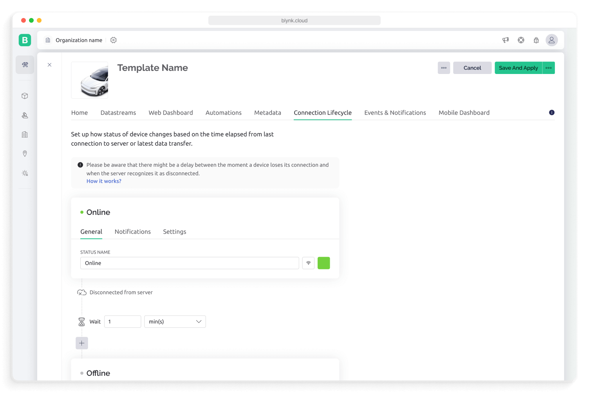
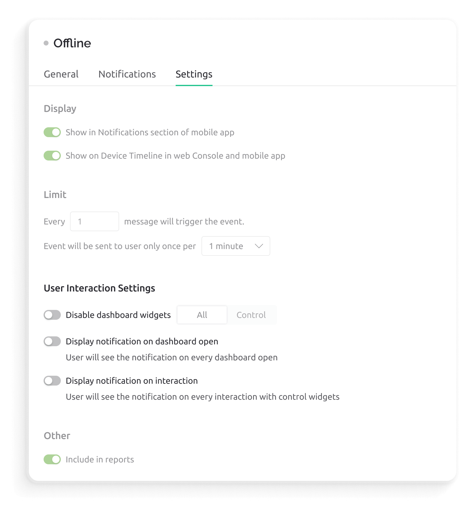
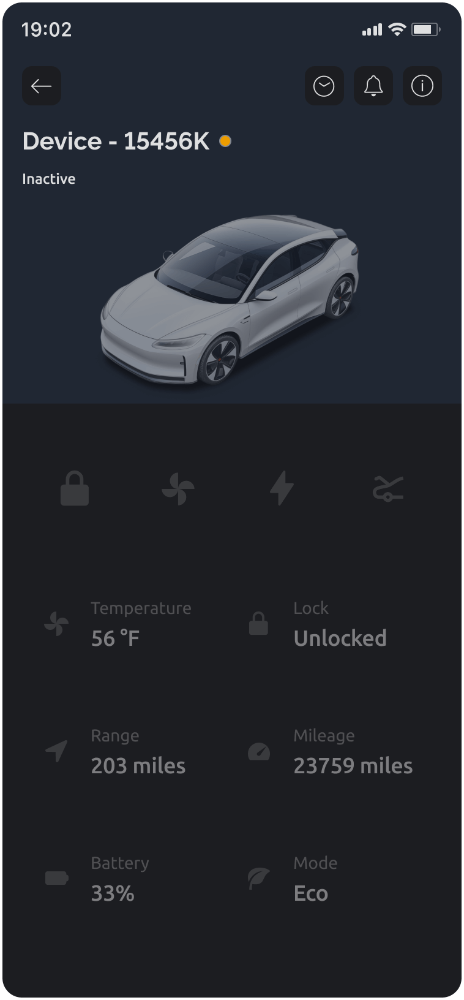
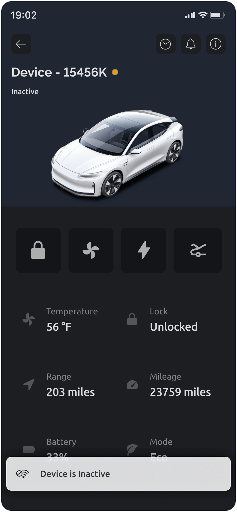

# Connection Lifecycle

Connection Lifecycle helps you customize the default Online/Offline device statuses and/or add more specific statuses to accurately reflect what's happening with the device's Internet connection at the moment and adjust the dashboards' behavior accordingly.

For context, refer to the [Device Connection Lifecycle](../../concepts/connection-lifecycle-management/), which covers key use cases and the underlying processes.

<figure><figcaption>
Template "Connection Lifecycle" section
</figcaption></figure>

## Status Types&#x20;

### Default Statuses

There are two default connection statuses: `Online` and `Offline` with a timeout between them. These events can be customized, but can't be deleted.&#x20;

When device connects to Blynk.Cloud (or transmits data), server immediately captures this and sets the device status to `Online`.&#x20;

When device disconnects from the server, timer starts. When timeout is reached, server sets device to `Offline`status.


Default timeout is set to 1 minute, however, in real life the time when a device is marked 'offline' depends on **how** **exactly** device had disconnected. You can read more about various [disconnection scenarios](../../concepts/connection-lifecycle-management/disconnections-and-heartbeat.md) here.


### Custom Statuses

You can add 2 more custom statuses and timeouts between them. Statuses will be applied automatically one after another based on the timeouts.

One custom status, `Inactive`, is pre-configured for you by default and can be altered or deleted if not needed. This uses one of the slots for custom statuses.

Let's imagine a device, that sleeps most of the time, but is expected to report data at least once during 24 hours. If the device doesn't report for 3 months, it is considered to be "No longer active".

1. **Online** status is applied when the device connects to server and successfully reports data.&#x20;
2. After stage one is over the server captures disconnection and starts the timer. In 5 minutes the server automatically sets the device to **Standby** status. Your customers will understand that the device is not online, but is operating as expected and won't be concerned about it being Offline or not working. \
   &#xNAN;_&#x53;et up a wait between `Online` and `Standby` to 5 minutes._
3. The server is waiting for 24 hours for the device to connect and report data (become **Online**). If that doesn't happen, the server applies **No Data Reported** status. This is an indication for you and your customers that something is not working correctly. \
   &#xNAN;_&#x53;et up a wait between `Standby` and `No Data Reported` to 24 hours._
4. If there is no signal from the device for 3 months, the server applies **No Longer Active** status.\
   &#xNAN;_&#x53;et up a wait between `No Data Reported` and `No Longer Active` to 3 months._

## Settings

### General

You can change name of any status and color-code it.


Choose names that are easy to understand. Set the colorcoding and the icon to reflect the nature of the status following known patterns. Online - green, Offline - grey. Be careful with red and orange colors as they can be interpreted as errors.


#### Log when device reports any data

This setting is designed for devices that periodically send data but are not continuously connected to Blynk Cloud. It is particularly useful for devices that use HTTP(s), cloud-to-cloud integrations, or other methods that do not rely on the Blynk library.

**How It Works:**

• When **enabled**, the device will be marked as **Online** once data is received.

• The device will **remain in the Online status** for the duration of the configured **Wait Period**, even if no new data is received.

• If no additional data is received within the Wait Period, the device status will transition to **Offline**.

This feature ensures that devices with intermittent connectivity still appear online while actively transmitting data, improving visibility and event logging within Blynk.

### Notifications

When connection status changes, users can receive emails, SMS, or push notifications. Keep in mind, that notifications can be blocked by the users in smartphone settings.

### Settings

#### Display

* **Show event in Notifications** - add selected events to the general Notifications & Alerts section in Blynk apps. Access this page from the top menu on the home screen of the app.

<figure><figcaption>
Connection Lifecycle events in the notifications section in a mobile app
</figcaption></figure>

* **Show on Device Timeline** - add selected events to the device Timeline of the selected device in apps and Blynk.Console. Access this page from the top menu on the device dashboard in the app or using the Timeline tab of the device dashboard on the web.

<figure><figcaption>
Connection Lifecycle events in the device timeline 
</figcaption></figure>

#### Notification Limits

To control how often users get notified about specific events you can apply Notification limits.

**Limit Period**- limits the number of notifications to just one notification for a specified time period. Timer starts when first Event happened and notification sent.

❇️ _Example: if you set 1 hour as a limit, end-users will only get one notification within 1 hour after the first event was recorded. No matter how many events are generated by hardware (or API calls) during one hour after that, no notifications will be sent._

**Event Counter** - notification will be sent only after a number of events was recorded. The counter starts when the first event happened. After the counter value was met, the counter resets to zero.&#x20;

❇️ _Example: if the counter is set to 50 and device sends 100 events, the user would only get 1 notification (every 51st event will trigger the notification)._


You can also use Limit period and Event counter together.


❇️ _Example: set Limit Period to 1 hour and Event Counter to 5._

* _When first event is recorded, the Limit Period timer starts and Event Counter starts_
* _Device sends 100 events_
* _When 6th event is logged, a notification is sent because counter value is met_
* _No more notifications are sent because 1h limit is active_

Please note that these notifications contribute to the overall event notification quota.&#x20;


The current daily limit is 100 events per device. For Enterprise clients, this limit may be adjusted to meet their specific needs.


#### Custom Event Description

#### Interactions

Statuses set up in the Connection Lifecycle tab can modify the behavior of the device dashboard UI (except for `online` event) to provide feedback and avoid unwanted user actions. The following options are available:

<figure><figcaption></figcaption></figure>

* **Disable all dashboard widgets** - all widgets on device dashboard will be disabled when the status is applied.

<figure><figcaption>
App with all widgets disabled
</figcaption></figure>

* **Disable control widgets** - widgets that can accept user input (button, switch, text input, etc.) will be disabled.&#x20;


Use this option when you don't want users to interact with the device. For example, when the device is offline. &#x20;


<figure><figcaption>
App with control widgets disabled
</figcaption></figure>

* **Display notification on dashboard open** - when users open the device dashboard, a pop up will show up for 3 seconds indicating the state, both on the web and mobile.

<figure><figcaption></figcaption></figure>

* **Display notification on interaction** - when users try to interact with widgets, a banner will pop up, indicating that the device is in the certain status. You can still interact with widgets and change their state, however, on every interaction you'll get a banner with a warning. This option is the default for all newly created templates.

<figure><figcaption></figcaption></figure>


If the device is Offline, but [_syncing to the latest server state_](../../blynk.edgent-firmware-api/state-syncing.md) is implemented, the users will be able to change the parameters, but the changes will be applied when the device goes online.&#x20;


####
