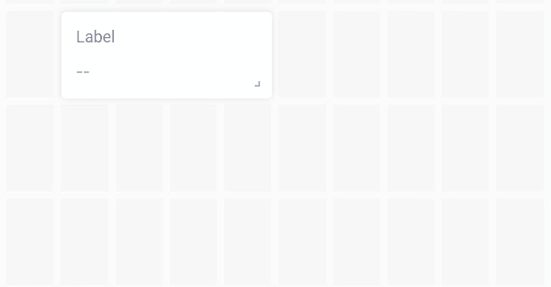

# Web Dashboard

The Web Dashboard allows you to visualize data from a device or control the device using [Widgets](../../widgets-console/) (GUI elements). The widgets may be organized in the dashboard by one or more tabs.

## Create/Edit a Web Dashboard

Web Dashboard editor is a part of a [Device Template](../../../concepts/device-template.md) (Templates -> (select a template) -> Web Dashboard). There you define the look and functionality of the web interface for all devices assigned to the Template.

In order to see a live view of the widgets with the actual data from the device, you must navigate to Search -> My Devices -> Device.

Creating/editing a Web Dashboard is only possible with [Developer Mode](../../../getting-started/developer-mode.md) on. You can switch the Developer Mode on/off in the User Profile section of the main menu.

To add widgets, click on the ‘Edit’ button at the top right of the Web Dashboard tab to enter the edit mode, and then drag and drop widgets from the ‘Widget Box’ to the Dashboard Preview window.

<figure><figcaption></figcaption></figure>

After the widgets are added, you may:

* **Arrange** - drag the widgets into the position you want on each dashboard tab.
* **Resize** - hover your mouse over the lower right corner until the cursor changes to a resize pictogram, then hold the left mouse button and drag to change the widget size.&#x20;
* **Delete** - Hover the mouse pointer over the widget and then click on the trash bin pictogram. No undo option exists.
* **Clone** - creates a copy of the selected widget. Hover your mouse over the widget and click on the copy pictogram.
* **Configure** - hover your mouse over the widget and select the gear pictogram. This option will allow you to access all of the widget settings, including assignment of a datastream.


The Widgets in the Web Dashboard and Blynk.App both use and may share Datastreams. However, you must independently configure Widgets for the Web Dashboard in Blynk.Console, and Widgets for mobile apps in Blynk.App.



IMPORTANT: In order to see live data applied to your dashboard, you need to create and save your dashboard template, apply it to your devices, and then visit the Blynk.Console section: Search -> My Devices -> Device -> Dashboard.



[widgets-console](../../widgets-console/)

