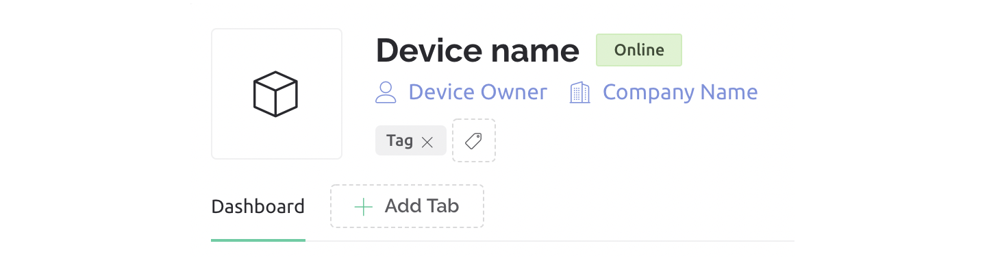
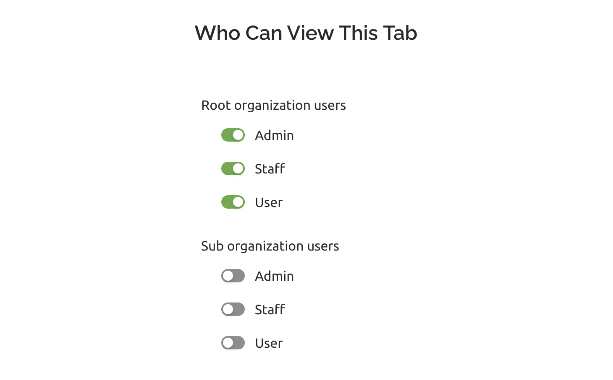

# Multiple Dashboards

Each device can have multiple dashboards in Blynk.Console. This feature allows to group widgets based on use cases and set up access permissions to view certain tabs. For example, you can set up a general device tab for all users and a separate one with restricted access for staff use.

To create new tabs in your web dashboard in Blynk.Console:

* Go to Device Template -> Web Dashboard
* Click on “Add Tab”
* Name the tab
* Add widgets as usual

You can define who will have access to the new tabs you are creating. Main Dashboard tab doesn't have access controls and can't be deleted.

