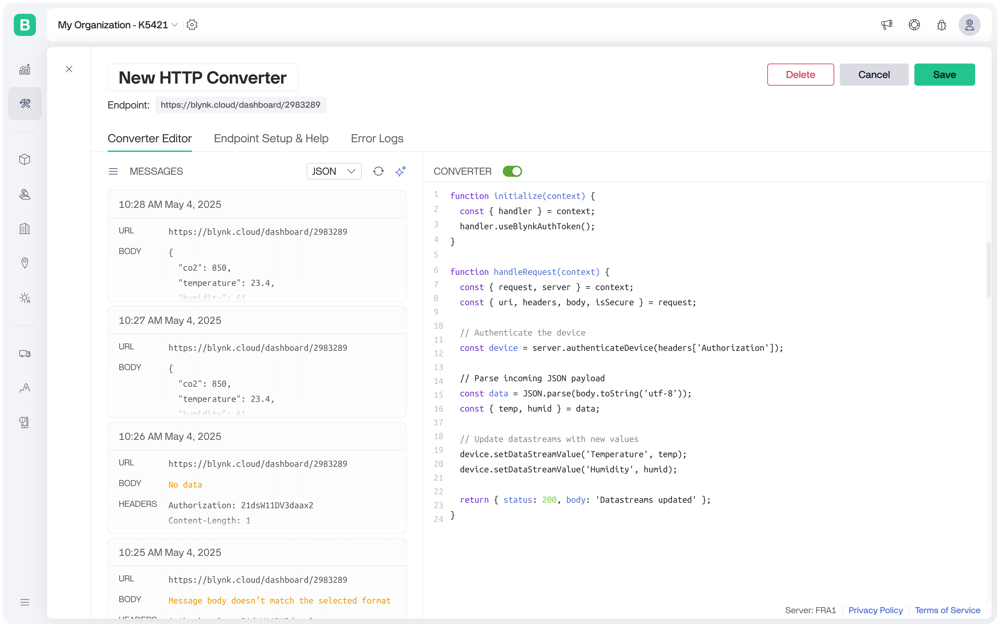

# HTTP Data Converter

HTTP Data Converter provides an endpoint that devices can use to send HTTP requests with any method, headers, and body. A user-defined script determines the authentication method (using either the device’s Blynk Auth Token or a [metadata value](../metadata/)). It can then update its datastreams, log events, and access existing datastream values. The script may also return a custom HTTP response that is passed back to the device.

<figure><figcaption></figcaption></figure>

Each HTTP Data Converter receives its own unique endpoint, identified by a token in the URL path. An example endpoint would look like:

```url
https://blynk.cloud/converter/ic1B-u8eoux39BLoKfIap1LTj62uqZQv
```

This token is used to identify which converter should handle the request. Devices can send requests to this endpoint using any HTTP method, include arbitrary query parameters or URL fragments, and may use either HTTPS or plain HTTP. The converter script will receive the request and can parse all parts of the URL, headers, and body as needed.

## Examples

**Using Blynk Auth Token Authentication**

```javascript
// Initialization function
function initialize(context) {
  const { handler } = context;

  // Configure authentication to use Blynk Auth Token
  handler.useBlynkAuthToken();
}

// Handle incoming HTTP requests
function handleRequest(context) {
  const { request, server } = context;
  const { headers } = request;

  // Authenticate device using Blynk Auth Token
  let device;
  try {
    device = server.authenticateDevice(headers['Authorization']);
  } catch {
    return { status: 403, body: 'Invalid authentication token.' };
  }

  // Return a simple success response
  return { status: 200, body: 'Authenticated' };
}
```

**Using Metadata Authentication**

```javascript
function initialize(context) {
  const { handler } = context;

  // Authenticate device using a metadata field called "Serial Number"
  handler.useAuthMetaField("Serial Number");
}

function handleRequest(context) {
  const { request, server } = context;
  const { headers } = request;

  let device;
  try {
    // Authenticate device using the metadata field
    device = server.authenticateDevice(headers['Serial-Number']);
  } catch {
    return { status: 403, body: 'Invalid authentication token.' };
  }

  return { status: 200, body: 'Authenticated via metadata' };
}
```

**Parsing JSON body and updating DataStream values**

```javascript
function initialize(context) {
  const { handler } = context;
  handler.useBlynkAuthToken();
}

function handleRequest(context) {
  const { request, server } = context;
  const { headers, body } = request;

  // Authenticate the device
  const device = server.authenticateDevice(headers['Authorization']);

  // Parse incoming JSON payload
  const data = JSON.parse(new TextDecoder().decode(body));
  const { temp, humid } = data;

  // Update datastreams with new values
  device.setDataStreamValue('Temperature', temp);
  device.setDataStreamValue('Humidity', humid);

  return { status: 200, body: 'Datastreams updated' };
}
```

**Logging an Event**

```javascript
function initialize(context) {
  const { handler } = context;
  handler.useBlynkAuthToken();
}

function handleRequest(context) {
  const { request, server } = context;
  const { headers, body } = request;

  const device = server.authenticateDevice(headers['Authorization']);

  // Parse payload
  const { humid } = JSON.parse(new TextDecoder().decode(body));

  // Log an event if humidity exceeds threshold
  if (humid > 80 && device.getDataStreamValue('Humidity') <= 80) {
    device.logEvent('high_humidity', `Humidity reached ${humid}%`);
  }

  device.setDataStreamValue('Humidity', humid);

  return { status: 200, body: 'Success' };
}
```

**Handling Authentication and Incorrect Method Errors**

```javascript
function initialize(context) {
  const { handler } = context;
  handler.useBlynkAuthToken();
}

function handleRequest(context) {
  const { request, server } = context;
  const { method, headers } = request;

  // Ensure only POST requests are allowed
  if (method !== 'POST') {
    return { status: 405, body: 'Method Not Allowed' };
  }

  // Attempt device authentication
  let device;
  try {
    device = server.authenticateDevice(headers['Authorization']);
  } catch {
    return { status: 403, body: 'Invalid authentication token.' };
  }

  // If authentication succeeds, return success
  return { status: 200, body: 'Authenticated successfully' };
}
```

**Return a binary body**

```javascript
function initialize(context) {
  const { handler } = context;
  handler.useBlynkAuthToken();
}

function handleRequest(context) {
  // Create a custom binary payload
  const buffer = new ArrayBuffer(4);
  const dataView = new DataView(buffer);
  dataView.setInt8(0, 1);
  dataView.setInt8(1, 2);
  dataView.setInt8(2, 3);
  dataView.setInt8(3, 4);

  // Return response with headers and raw bytes
  return {
    status: 200,
    headers: {
      'Content-Type': 'application/octet-stream',
      'X-Custom-Header': 'SensorData'
    },
    body: buffer
  };
}
```

## TypeScript declaration

<pre class="language-typescript"><code class="lang-typescript"><strong>/**
</strong> * Provides helper methods for initialization (authentication setup, etc.)
 */
interface Handler {
  /**
   * Use a device metadata field for authentication.
   * @param metaFieldName Name of the metadata field
   * @throws Error if the metafield name is not provided, not a string or contains more than 1000 symbols
   */
  useAuthMetaField(metaFieldName: string): void;

  /**
   * Use Blynk Auth Token for authentication.
   */
  useBlynkAuthToken(): void;
}

interface InitializeContext {
  handler: Handler;
}

/**
 * Initialize function: configure authentication or other setup logic.
 * @param context Script context
 */
declare function initialize(context: InitializeContext): void;

/**
 * Represents the incoming HTTP request.
 */
interface Request {
  method: string; // HTTP method ('GET', 'POST', etc.)
  uri: string;    // Request URI (e.g. '/converter/token?someRequestParam=abc')
  headers: Record&#x3C;string, string>;
  body: DataView;
  isSecure: boolean; // true if HTTPS
}

/**
 * Represents the allowed value types for a datastream.
 * - number: for integer, double and enum datastreams
 * - string: for string datastreams
 * - { lon: number, lat: number }: for location datastreams
 */
type DataStreamValue = number | string | { lon: number; lat: number };

/**
 * DataStream property names.
 */
type DataStreamPropertyName = 'label' | 'color' | 'onBackColor' | 'offBackColor' |
  'onColor' | 'offColor' | 'onLabel' | 'offLabel' | 'labels' |
  'min' | 'max' | 'isOnPlay' | 'url' | 'urls' | 'step' | 'valueFormatting' |
  'suffix' | 'maximumFractionDigits' | 'opacity' | 'scale' | 'rotation' |
  'sortType' | 'isDisabled' | 'isHidden' | 'icons' | 'onImageUrl' | 'offImageUrl' |
  'page' | 'sound' | 'isMuted' | 'loop' | 'autoplay' | 'contentDesign' | 'backColor';

/**
 * DataStream property names that accept boolean values.
 */
type DataStreamBooleanPropertyName = 'isOnPlay' | 'isDisabled' | 'isHidden' | 'isMuted' | 'loop' | 'autoplay';

/**
 * Represents a Blynk device.
 */
interface Device {
  /**
   * Gets the current value of a datastream.
   * @param dataStreamName Datastream name (required)
   * @returns the datastream value or `null`, if the datastream is missing or the value was not configured
   * @throws Error if datastream name is not provided or contains more than 1000 symbols
   */
  getDataStreamValue(dataStreamName: string): DataStreamValue | null;

  /**
   * Updates the value of a device datastream.
   * Note: For string values, the maximum length is 1024 characters.
   *
   * @param dataStreamName Datastream name
   * @param value New value for the datastream
   * @throws Error if the datastream name is not provided, empty, or contains more than 1000 symbols
   * @throws Error if datastream value is invalid
   * @throws Error if 256 datastreams were already updated
   */
  setDataStreamValue(dataStreamName: string, value: DataStreamValue): void;

  /**
   * Updates the datastream property value.
   * Note: You can provide up to 100 values. Each value should be up to 1000 characters in length.
   *
   * @param dataStreamName Datastream name
   * @param propertyName Property name to update
   * @param values New property values
   * @throws Error if the datastream name is not provided, empty, or contains more than 1000 symbols
   * @throws Error if the datastream property name is not provided, empty, contains more than 1000 symbols or unknown
   * @throws Error if property value is invalid or too long
   */
  setProperty(dataStreamName: string, propertyName: DataStreamPropertyName, ...values: string[]): void;

  /**
   * Updates the datastream property value.
   *
   * @param dataStreamName Datastream name
   * @param propertyName Property name to update
   * @param value New property value
   * @throws Error if the datastream name is not provided, empty, or contains more than 1000 symbols
   * @throws Error if the datastream property name is not provided, empty, contains more than 1000 symbols or unknown
   */
  setProperty(dataStreamName: string, propertyName: DataStreamPropertyName, value: boolean): void;
  
   /**
   * Updates the datastream property value.
   *
   * @param dataStreamName Datastream name
   * @param propertyName Property name to update
   * @param value New property value
   * @throws Error if the datastream name is not provided, empty, or contains more than 1000 symbols
   * @throws Error if the datastream property name is not provided, empty, contains more than 1000 symbols or unknown
   */
  setProperty(dataStreamName: string, propertyName: DataStreamBooleanPropertyName, value: boolean): void;

  /**
   * Logs an event for the device.
   * @param code Event code (required)
   * @param description Event description (optional, up to 300 characters)
   * @throws Error if code is not provided, empty, or contains more than 1000 symbols
   * @throws Error if the description contains more than 300 symbols
   * @throws Error if 3 events were already logged during the script execution
   */
  logEvent(code: string, description?: string): void;
  
  /**
   * Device's assigned Blynk Auth Token.
   */
  blynkAuthToken: string;
}

/**
 * Represents the server context provided to the script.
 */
interface Server {
  /**
   * Authenticates a device using a token or a metadata field.
   * Can be invoked only once per HTTP request.
   * @param token Auth token or metadata value
   * @returns the authenticated device
   * @throws AuthenticationError if token contains more than 1000 symbols
   * @throws AuthenticationError if authentication fails
   */
  authenticateDevice(token: string): Device;
}

interface RequestContext {
  request: Request;
  server: Server;
}

/**
 * Represents the HTTP response returned by handleRequest.
 */
interface Response {
  status?: number;
  headers?: Record&#x3C;string, string>;
  body?: string | DataView;
}

/**
 * HandleRequest function: process incoming request, update datastreams, log events, and return response.
 *
 * Note: The response body returned by this function must not exceed 1 MB.
 *
 * @param context Script context
 * @returns HTTP response object
 */
declare function handleRequest(context: RequestContext): Response;

</code></pre>
