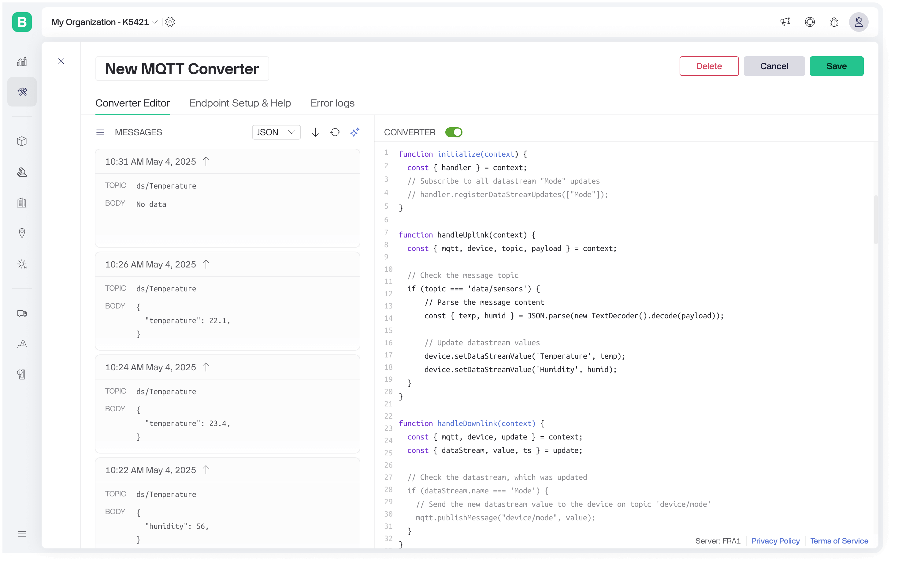

# MQTT Data Converter

MQTT Data Converter lets you handle messages on any topic with a custom payload. Devices must connect using `"device"` as the username and their Blynk Auth Token as the password. A user-defined script can parse incoming messages, update datastreams, log events, access existing values, or publish messages back to the device. For downlink, the script subscribes to specific datastream updates, and whenever a value changes, Blynk executes the converter to send the new value to the device.

<figure><figcaption></figcaption></figure>

## Examples

**Handle uplink MQTT message and update datastream value**

```javascript
function handleUplink(context) {
  const { mqtt, device, topic, payload } = context;

  // Check the message topic
  if (topic === 'data/sensors') {
      // Parse the message content
      const { temp, humid } = JSON.parse(new TextDecoder().decode(payload));

      // Update datastream values      
      device.setDataStreamValue('Temperature', temp);
      device.setDataStreamValue('Humidity', humid);
  }
}
```

**Handle datastream update and send MQTT message to the device**

```javascript
function initialize(context) {
  const { handler } = context;
  // Subscribe to all datastream "Mode" updates
  handler.registerDataStreamUpdates(["Mode"]);
}

function handleDownlink(context) {
  const { mqtt, device, update } = context;
  const { dataStream, value, ts } = update;

  // Check the datastream, which was updated
  if (dataStream.name === 'Mode') {
    // Send the new datastream value to the device on topic 'device/mode'
    mqtt.publishMessage("device/mode", String(value));
  }
}
```

## TypeScript declaration

```typescript
/**
 * Represents the allowed value types for a datastream.
 * - number: for integer, double and enum datastreams
 * - string: for string datastreams
 * - { lon: number, lat: number }: for location datastreams
 */
type DataStreamValue = number | string | { lon: number; lat: number };

/**
 * Represents a Blynk device.
 */
interface Device {
  /**
   * Gets the current value of a datastream.
   * @param dataStreamName Datastream name (required)
   * @returns the datastream value or `null`, if the datastream is missing or the value was not configured
   * @throws Error if datastream name is not provided or contains more than 1000 symbolstoo long
   */
  getDataStreamValue(dataStreamName: string): DataStreamValue | null;

  /**
   * Updates the value of a device datastream.
   * Note: For string values, the maximum length is 1024 characters.
   *
   * @param dataStreamName Datastream name
   * @param value New value for the datastream
   * @throws Error if the datastream name is not provided, empty, or contains more than 1000 symbols
   * @throws Error if datastream value is invalid
   * @throws Error if 256 datastreams were already updated
   */
  setDataStreamValue(dataStreamName: string, value: DataStreamValue): void;

  /**
   * Logs an event for the device.
   * @param code Event code (required)
   * @param description Event description (optional, up to 300 characters)
   * @throws Error if code is not provided, empty, or contains more than 1000 symbols
   * @throws Error if the description contains more than 300 symbols
   * @throws Error if 3 events were already logged during the script execution
   */
  logEvent(code: string, description?: string): void;
}

/**
 * Provides methods to interact with MQTT.
 */
interface MQTT {
  /**
   * Publishes a message to a topic.
   *
   * Note: The target device must be subscribed to the topic to receive the message.
   * Wildcard subscriptions using `+` are not supported.
   *
   * @param topic MQTT topic (must be up to 1000 characters)
   * @param payload Message payload (must be up to 1 MB)
   * @throws Error if topic is empty or contains more than 1000 symbols
   * @throws Error if payload is too long
   * @throws Error if 5 messages were already published
   */
  publishMessage(topic: string, payload?: string | DataView): void;
}

/**
 * Represents a Blynk datastream.
 */
interface DataStream {
  id: number;
  name: string;
  pin: string;
}

/**
 * Represents a datastream update for downlink.
 */
interface DataStreamUpdate {
  dataStream: DataStream;
  value: DataStreamValue;
  ts: number; // Unix epoch timestamp in milliseconds
}

/**
 * Handler object for initialization.
 */
interface Handler {
  /**
   * Registers datastreams for downlink updates.
   * @param dataStreamNames List of datastream names to subscribe
   * @throws Error if datastream names are not provided, empty, contain more than 1000 symbols, invalid type, or contain more than 255 values
   */
  registerDataStreamUpdates(dataStreamNames: string[]): void;
}

/**
 * Context object for initialization.
 */
interface InitializeContext {
  handler: Handler;
}

/**
 * Called once when the script is initialized.
 * Note: Implementing this function is optional.
 * @param context Initialization context
 */
declare function initialize(context: InitializeContext): void;

/**
 * Context object for uplink handling.
 */
interface UplinkContext {
  mqtt: MQTT;
  device: Device;
  topic: string;
  payload: DataView;
}

/**
 * Handles incoming uplink messages from devices.
 * Note: Implementing this function is optional.
 * @param context Uplink context
 */
declare function handleUplink(context: UplinkContext): void;

/**
 * Context object for downlink handling.
 */
interface DownlinkContext {
  mqtt: MQTT;
  device: Device;
  update: DataStreamUpdate;
}

/**
 * Handles downlink messages triggered by datastream updates.
 * Note: Implementing this function is optional.
 * @param context Downlink context
 */
declare function handleDownlink(context: DownlinkContext): void;

```
