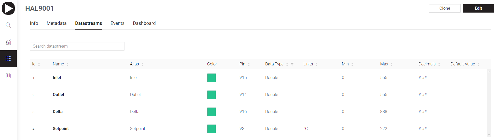

# Datastreams

A datastream is a way to structure data that flows between your device and the Blynk platform. Think of it as a container for a specific value — like sensor readings, telemetry, or actuator states.

Each device manages its own value for every datastream.

Values can be:

* Updated by the device and shown in widgets.
* Updated by certain widgets, which then send the new value back to the device.

This enables seamless two-way communication between your device and the Blynk interface.

