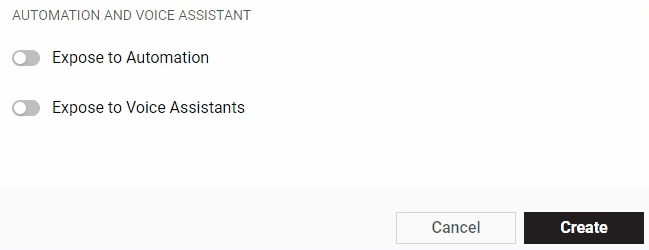

# Expose to Automation

### 1. Turn on the switch to expose this Datastream for Automation

1. **Edit** your Template
2. Switch to _Datastream tab_
3. _Select and click _the Datastream you want to be used in Automations. Modal window will appear
4. Click **+ Advanced Settings**
5. Enable **Expose to Automation **at the bottom of the modal window
6. Enable **Available in Conditions **below

### 2. Choose the Type of Automation

Type defines what kind of Action or Trigger is it and how it will be presented for the user when using Automation

| Type                  | Description                                                                                                                                                                                                 |      GUI     | Condition | Action | Settings |
| --------------------- | ----------------------------------------------------------------------------------------------------------------------------------------------------------------------------------------------------------- | :----------: | :-------: | :----: | :------: |
| **Main Power Switch** | Control that turn device ON/OFF. You can have **only one** Main Power Switch per Product                                                                                                                    |    Switch    |     •     |    •   |     –    |
| **Switch**            | Controls property that has on/off state. **Don't use this property for Main Power Switch**                                                                                                                  |    Switch    |     •     |    •   |     –    |
| **Range Control**     | Controls a property within a set range. Min/Max values are taken from Datastream settings. This parameter also requires a `step` value. Step defines increments between min and max value of the datastream |    Slider    |     •     |    •   |   Step   |
| **Color**             | Controls properties where color can be set. Include Brightness if needed.                                                                                                                                   | Color picker |     •     |    •   |     –    |
| **Sensor**            | Read-only property to use sensor data as a Condition                                                                                                                                                        |     Value    |     •     |        |     –    |

### 3. Configure if this Datastream is as a trigger, an action, or both.

**Condition:** makes this Datastream available as a Condition.

**Action:** makes this Datastream available as an Action. Some of the Automation Types can be only a condition.

