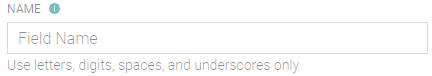

# Name

Alias for your data stream. You'll use this name as reference during the product setup. Please, pick the name carefully as it's extensively used across the platform.\
\
&#xNAN;_**Note:** duplicate names are not allowed_
