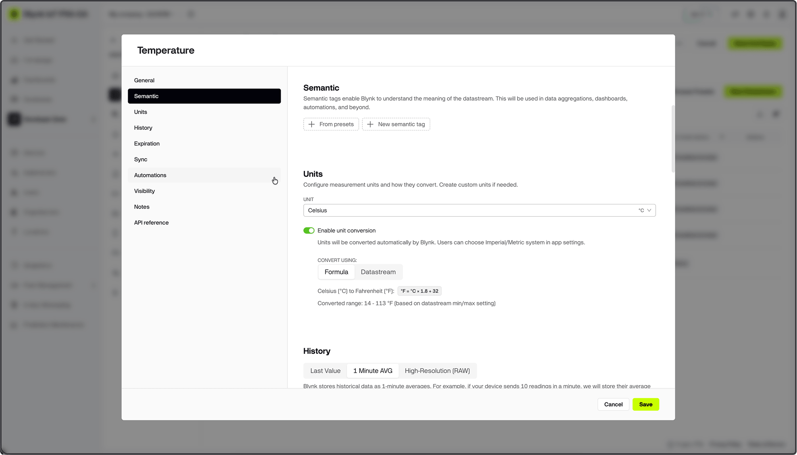
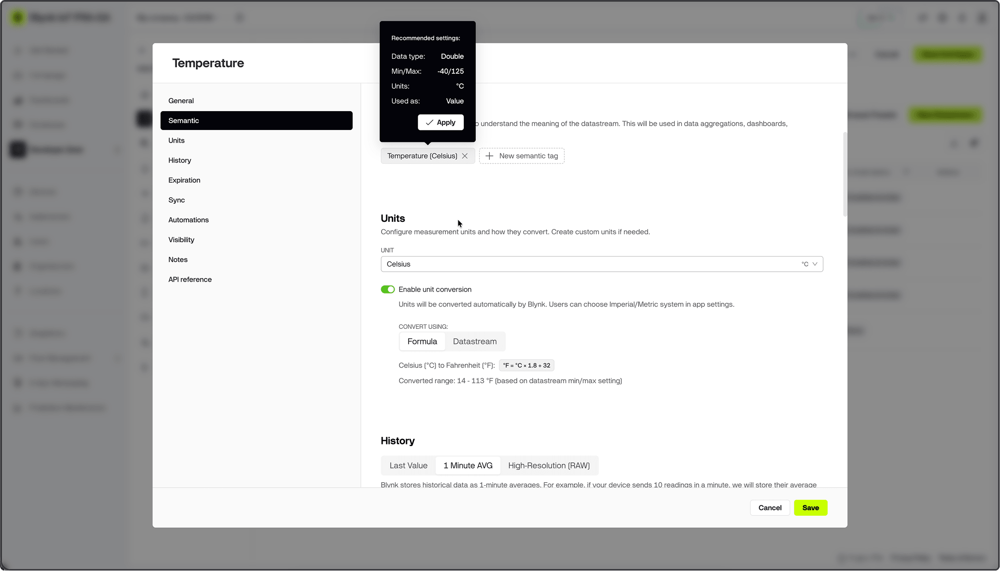

# Semantic Tags

Semantic Tags let you label the meaning of a datastream's data — for example,
temperature, battery level, or RSSI — so Blynk can power smarter dashboards,
column management, automations, and device analytics automatically.

<figure><figcaption>
Sementic Tags in Datastream Settings
</figcaption></figure>

---

### Tag types

There are two types of Semantic Tags:

**System Tags** are a built-in set of predefined tags (see the reference tables
below). They connect datastreams to system-wide logic — auto-aggregated views,
Developer Tools panels, column management, and data visualizations. Only
**one System Tag** can be assigned per datastream. Some System Tags are also
restricted to **one per template**, meaning no two datastreams in the same
template can hold the same System Tag.

**Custom Tags** are tags you create yourself. They are primarily used for
grouping device properties across different products (templates), making it
possible to build cross-product automations, dashboards, and device list views.
Up to **four Custom Tags** can be assigned per datastream.

---

### How to assign Semantic Tags

1. Open a Template in Blynk.Console.
2. Navigate to **Datastreams** and open or create a datastream.
3. In the **Semantic** section, locate the **Semantic Tags (Optional)** field.
4. Click **+ Add** to open the tag picker.
5. Add up to 5 tags (1 system tag and up to 4 custom tags).
6. Click **Save**.


**Note:** Semantic Tags are optional. Datastreams without tags work normally,
but assigning tags enables automatic dashboard column management, Automation
grouping, Developer Tools panels, and device metric detection.


---

### System Tag settings suggestions

When you select a System Tag, Blynk suggests recommended settings for the
datastream — Data Type, Units, and Min/Max values — based on the expected
signal characteristics. You can **apply** the suggestions or **skip** them.

Applied settings can still be overridden manually. However, if a System Tag
specifies a set of supported Data Types, you cannot select a Data Type outside
that supported set.

<figure><figcaption>
Suggested Datastream Settings by Semantic Tags
</figcaption></figure>


**Pro Tip:** Use System Tags for well-known signals (such as RSSI or Battery
Level) to get suggested datastream settings and automatically populated
Developer Tools panels.


---

### Creating a custom Semantic Tag

To create a new Custom Tag:

1. In the **Semantic** section of a datastream, click **Add a custom tag**.
2. Type the name of the new tag.
3. Select **Create** at the top of the list to create and apply it.

Custom Tags are available across all templates in your organization. Once
created, a Custom Tag can be assigned to datastreams in any template — making
it easy to group equivalent properties across different products.

---

### Handling complex use cases

When a template has multiple datastreams representing the same measurement type
in different contexts, assign **multiple tags** to each datastream to
differentiate them.

**Examples:**
- A device reporting three temperature readings — Current, Setpoint, Target —
  assign the Temperature system tag combined with a custom qualifier tag to
  each datastream.
- A device with sensors across multiple zones — combine a measurement system
  tag with a custom zone qualifier tag per datastream.

---

### Conflicts

#### Duplicate tag combinations

The same individual tag can be assigned to multiple datastreams in a template,
unless the tag is marked as **single per template** in the reference table
below. What must remain unique is the **combination of tags** on each
datastream — no two datastreams in the same template can have an identical
set of Semantic Tags.

A conflict can occur when you **remove a tag** from a datastream, causing its
remaining tag combination to match another datastream's combination in the same
template. When this happens, an inline error is shown and you cannot save the
datastream until the conflict is resolved.

#### Deleting a tag that is in use

The behavior when deleting a Semantic Tag depends on how it is currently used:

- **Not used, or used in only one datastream** — the tag can be deleted freely.
- **Used in a datastream in the same template** — the warning appears.
- **Used in datastreams across multiple templates** — the warning appears.

---

### Where Semantic Tags are used

Once assigned, Semantic Tags affect several areas of the product. See the
dedicated sub-page for full details:

- [Using Semantic Tags](https://docs.blynk.io/en/blynk.console/templates/datastreams/semantic-tags/where-semantic-tags-are-used)

**Quick overview:**

| Area | How Semantics are used |
|---|---|
| **Automations** | Allows selecting datastreams by semantic group instead of by name/pin when configuring Control Segment actions |
| **Dashboard Widgets** | Datastream picker offers a "Property Group (Semantics)" view in addition to the standard pin picker |
| **Column Management** | Device list columns can be bound to a Semantic Group rather than a specific datastream name |
| **Developer Tools** | Uptime, Free Memory, Mode Display, Battery Level, and MAC Address panels are driven by their respective System Tags |
| **Dashboard Widgets** | Devices can be filtered by datastream value via a semantic-aware cascader picker |

---

### Semantic Tag reference

The tables below list all available System Tags grouped by category.

**Single per template** (✅) means the tag can be assigned to **at most one
datastream per template**. All other System Tags can be used across multiple
datastreams, but the **combination** of tags on each datastream must be unique
within the template.

#### State

| Display Name | Value Type | Unit | Supported Value Types | Single per Template |
|---|---|---|---|:---:|
| Automation Scenario JSON | STRING | — | STRING | ✅ |
| Automation Status | INT | — | STRING, INT, BOOL, ENUM | ✅ |
| Error Code | STRING | — | INT, STRING, ENUM | |
| Free Memory | DOUBLE | Kilobytes | INT, DOUBLE | ✅ |
| Last Seen Timestamp | STRING | — | STRING | ✅ |
| Mode Display | ENUM | — | STRING, ENUM, INT | |
| Operating State | STRING | — | STRING, ENUM, INT | |
| Sensor Status | STRING | — | STRING, ENUM, INT | |
| Status | STRING | — | STRING, ENUM | |
| Uptime | INT | Seconds | INT | ✅ |

#### Sensor

| Display Name | Value Type | Unit | Supported Value Types | Single per Template |
|---|---|---|---|:---:|
| Air Pollution | DOUBLE | AQI | DOUBLE, INT | |
| Air Pressure | DOUBLE | Hectopascal | DOUBLE, INT | |
| Altitude | DOUBLE | Meters | DOUBLE, INT | |
| Ambient Light | DOUBLE | Lux | DOUBLE, INT | |
| Battery Capacity | DOUBLE | Milliampere | DOUBLE, INT | |
| Battery Level | INT | Percent | DOUBLE, INT | |
| CO₂ | DOUBLE | Particles per million | DOUBLE, INT | |
| CPU Temperature | DOUBLE | Celsius | DOUBLE, INT | |
| CPU Temperature | DOUBLE | Fahrenheit | DOUBLE, INT | |
| Current | DOUBLE | Ampere | DOUBLE, INT | |
| Distance / Proximity | DOUBLE | Centimeter | DOUBLE, INT | |
| Energy Consumption | DOUBLE | Kilowatt Hour | DOUBLE, INT | |
| Fill Level | INT | Percent | DOUBLE, INT | |
| Flow Rate | DOUBLE | Liter per second | DOUBLE, INT | |
| GPS Coordinates | GPS | — | GPS | |
| Humidity | INT | Percent | DOUBLE, INT | |
| Noise Level | DOUBLE | Decibel | DOUBLE, INT | |
| PH | DOUBLE | pH | DOUBLE, INT | |
| Power | DOUBLE | Watt | DOUBLE, INT | |
| Pressure (generic) | DOUBLE | Pascal | DOUBLE, INT | |
| Pulse Counter | INT | — | DOUBLE, INT | |
| Soil Moisture | INT | Percent | DOUBLE, INT | |
| Speed | DOUBLE | Kilometer per hour | DOUBLE, INT | |
| Temperature | DOUBLE | Celsius | DOUBLE, INT | |
| Temperature | DOUBLE | Fahrenheit | DOUBLE, INT | |
| Total Consumption / Counter | DOUBLE | — | DOUBLE, INT | |
| Vibration | DOUBLE | Meter per second | DOUBLE, INT | |
| Voltage | DOUBLE | Volt | DOUBLE, INT | |
| Volume | DOUBLE | Liter | DOUBLE, INT | |
| Water Leak / Water Presence | INT | — | DOUBLE, INT | |

#### Network

| Display Name | Value Type | Unit | Supported Value Types | Single per Template |
|---|---|---|---|:---:|
| Cellular Network Name (Operator) | STRING | — | STRING, ENUM | ✅ |
| Cellular Signal Quality | INT | Percent | DOUBLE, INT | ✅ |
| Cellular Signal Strength | DOUBLE | Signal Strength | DOUBLE, INT | ✅ |
| Connection Status | STRING | — | STRING, ENUM | ✅ |
| IP Address | STRING | — | STRING | ✅ |
| LTE Metrics (RSRP, RSRQ, SINR) | STRING | — | INT, DOUBLE, STRING | |
| MAC Address | STRING | — | STRING | ✅ |
| WiFi Network Name (SSID) | STRING | — | STRING | ✅ |
| WiFi Signal Quality | INT | Percent | DOUBLE, INT | ✅ |
| WiFi Signal Strength (RSSI) | DOUBLE | Signal Strength | DOUBLE, INT | ✅ |

#### Control

| Display Name | Value Type | Unit | Supported Value Types | Single per Template |
|---|---|---|---|:---:|
| Automation Control (on/off) | INT | — | BOOL, INT | ✅ |
| Brightness | INT | Percent | DOUBLE, INT | |
| Color | STRING | — | STRING | |
| Fan Speed | INT | Percent | DOUBLE, INT | |
| LED | INT | — | DOUBLE, INT | |
| Mode Selector | ENUM | — | STRING, ENUM, INT | |
| Output Level (0–100%) | INT | Percent | DOUBLE, INT | |
| Power Switch | INT | — | INT, BOOL | |
| Range (0–X) | INT | Percent | DOUBLE, INT | |
| Reboot | INT | — | INT, BOOL | |
| Servo / Motor Position | INT | Degree | DOUBLE, INT | |
| Switch | INT | — | INT, BOOL | |
| Target Humidity | INT | Percent | DOUBLE, INT | |
| Target Temperature | DOUBLE | Celsius | DOUBLE, INT | |
| Target Temperature | DOUBLE | Fahrenheit | DOUBLE, INT | |
| Valve Position | INT | Percent | DOUBLE, INT | |

#### Other

| Display Name | Value Type | Unit | Supported Value Types | Single per Template |
|---|---|---|---|:---:|
| Debug Commands | STRING | — | STRING | ✅ |
| Device Type | STRING | — | STRING, ENUM | ✅ |
| Firmware Version | STRING | — | INT, DOUBLE, STRING | |
| Label | STRING | — | STRING, ENUM | |
| Measurement System | ENUM | — | STRING, ENUM | ✅ |
| Timezone | STRING | — | STRING, ENUM | ✅ |

---

### Limits and constraints

| Constraint | Details |
|---|---|
| System Tags per datastream | 1 |
| Custom Tags per datastream | Up to 4 |
| Total tags per datastream | Up to 5 (1 system + 4 custom) |
| Tag combination uniqueness | Each datastream's tag combination must be unique within the template |
| Single-per-template System Tags | Some System Tags (marked ✅ above) can only be assigned to one datastream per template |

---

### Related

- [Where Semantic Tags are used](https://docs.blynk.io/en/blynk.console/templates/datastreams/semantic-tags/where-semantic-tags-are-used)
- [Datastreams](https://docs.blynk.io/en/blynk.console/templates/datastreams)
