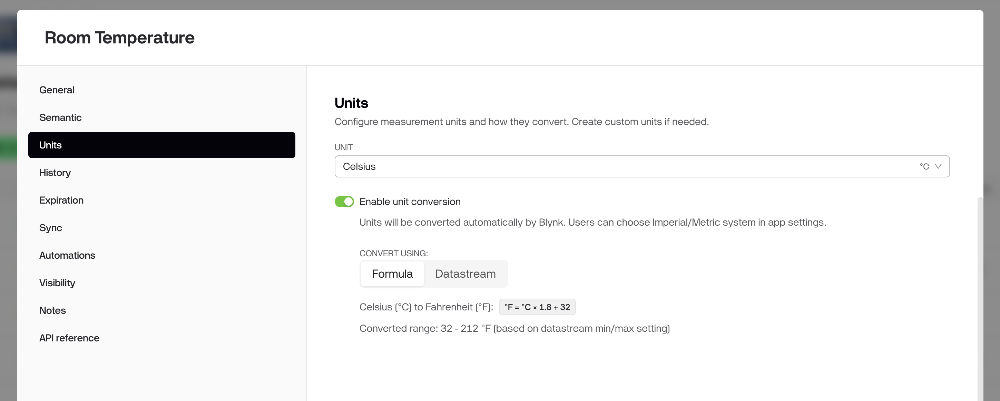
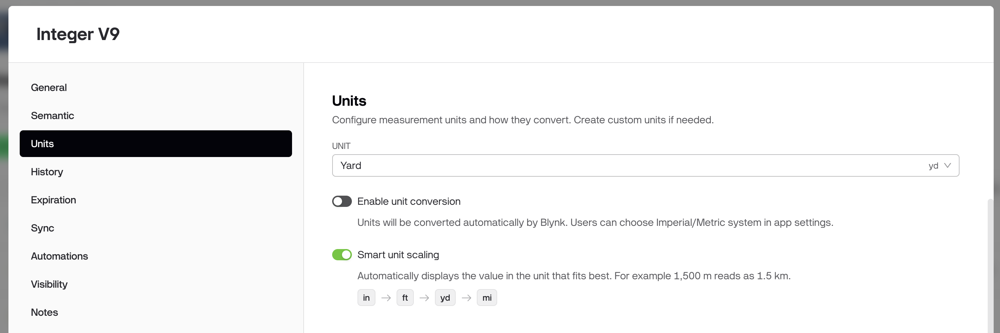
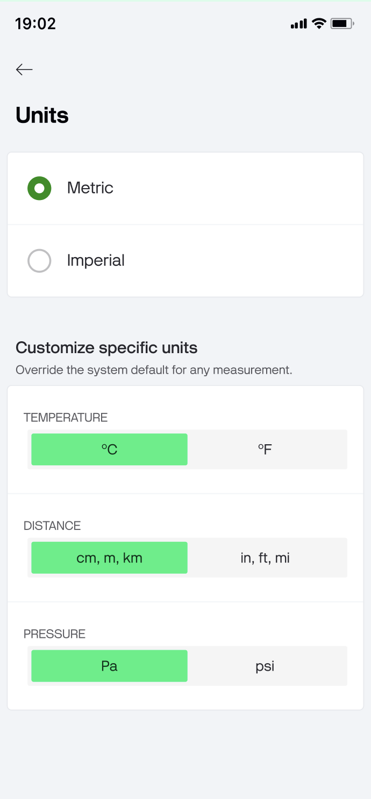
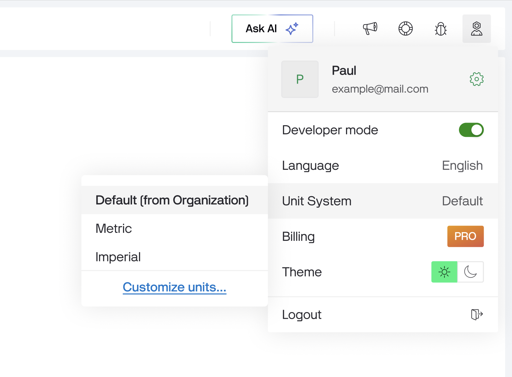
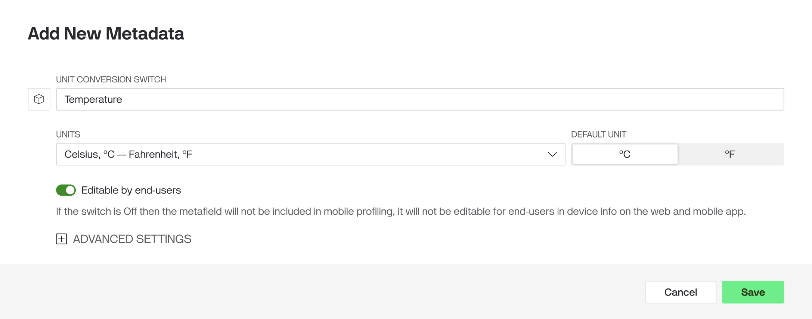
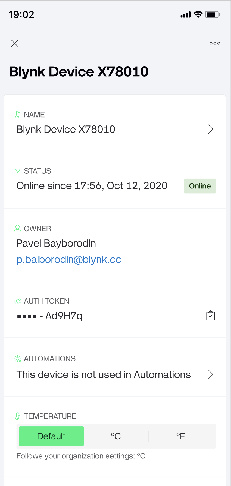
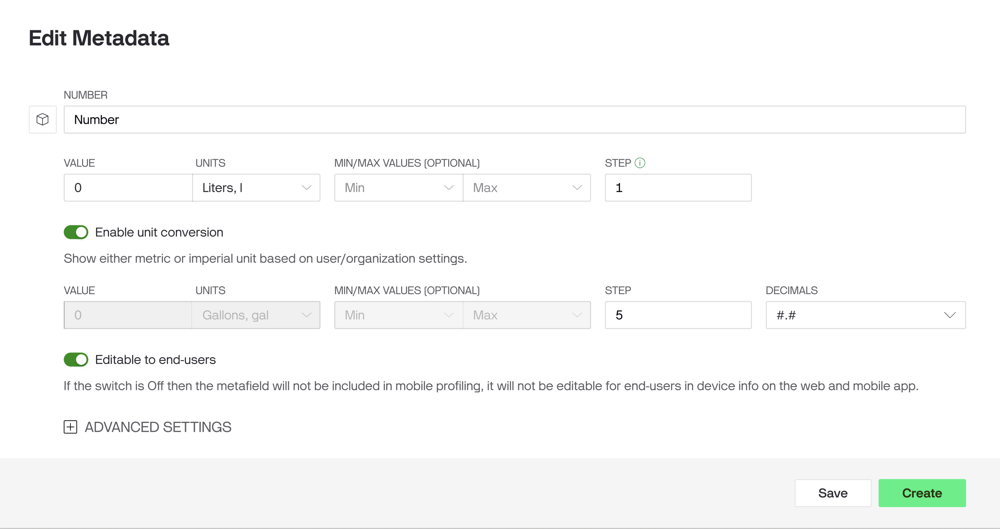

# Unit Conversion

Unit conversion lets Blynk automatically display sensor values in a different unit than what your device reports — without changing the data your device sends or how it's stored.

For example, a device that reports temperature in _°C_ can show values to users in _°F._ A flow sensor reporting in _l/min_ can display readings in _CFM_. No firmware changes needed.

***

### How it works

Each datastream has a **base unit** — the unit your device sends. When conversion is enabled, Blynk shows that value in the user's preferred unit using one of two methods:

* **Formula** — Blynk applies a conversion formula to the value (for example, °C → °F). This is the default.
* **Paired datastream** — if the device already streams the same measurement in two units on separate pins (for example, V1 = °C, V2 = °F), Blynk reads the matching datastream directly instead of calculating.


Note: Conversion changes only how values are displayed. The raw value stored on server is always the value your device sent, so historical data, the API, and exported reports remain in the device's original (base) unit.


### Enabling conversion per datastream

Conversion can be turned off for an individual datastream in the Units tab of Datastream Settings. The toggle appears only when the selected unit is convertible, and is on by default. When off, that datastream always displays in its base unit regardless of the user's unit system.

<figure><figcaption></figcaption></figure>

### Unit conversion levels

Unit preferences can be set at multiple levels: per user, per device, per organization, or per template — with more specific settings taking priority.

| Priority                                             | Level                                    | Set by       | Purpose                                                      |
| ---------------------------------------------------- | ---------------------------------------- | ------------ | ------------------------------------------------------------ |
| 1 (highest, if added will override all other levels) | Unit Conversion Switch (device metadata) | Manufacturer | Keep the app in sync with a unit toggle on the device itself |
| 2                                                    | User preference                          | End user     | "I prefer Imperial"                                          |
| 3                                                    | Organization                             | Org admin    | Company-wide default                                         |
| 4 (lowest)                                           | Template default                         | Manufacturer | The unit a product ships with                                |

### Smart Unit Scaling

Beyond converting between systems, Blynk can automatically scale a value to the most readable unit within the same system — showing `2.5 kg` instead of `2500 g`, or `45 kW` instead of `45000 W`. Some quantities scale as a single decimal value; others that read more naturally in two parts (time, imperial length and mass) display as a composite, like `2 days 19 hr` or `5 ft 8 in`.

Smart scaling is a display-only convenience and never changes the stored value. It can be toggled on the Units tab of Datastream Settings. The toggle appears only when the selected unit supports smart scaling, and is **enabled** by default.

<figure><figcaption></figcaption></figure>

***

#### Organization level

Org admins set the organization-wide default in [**Organization Settings**](../../settings/organization-settings/) (on mobile – [Organization Management](../../../blynk.apps/profile-management/organization-management.md)). Pick a base preset — Metric or Imperial — to set every measurement group at once, then optionally override individual groups if needed (for example, Imperial everywhere but °C for temperature).\
By default all org users will see data in this units.

<figure><figcaption></figcaption></figure>

<figure><figcaption></figcaption></figure>

***

#### User level

Each user can override the org default in their [**User Profile**](https://docs.blynk.io/en/blynk.console/users/user-view) in web console, and in [**Settings**](https://docs.blynk.io/en/blynk.apps/profile-management/settings) on mobile app. Users get the same **Metric** and **Imperial** presets, plus a **Default** option that follows whatever the organization is set to.&#x20;

Default is pre-selected for new users and shows what it currently resolves to, so users always know what they're inheriting. If the org admin later changes the org units, users on Default update automatically; users who picked their own preset stay put.

<figure><figcaption></figcaption></figure>

<figure><figcaption></figcaption></figure>

#### Device level

A manufacturer can tie unit preference to a control on the device itself using the **Unit Conversion Switch** metadata ([see Metadata](../metadata/#common-metadata-settings-for-all-types)). When present, it takes priority over user and org preferences — useful when a device has a physical unit toggle (e.g. °C/°F on a thermostat) and the app should stay in sync. 

<figure><figcaption></figcaption></figure>

<figure><figcaption></figcaption></figure>

### Number metadata

The **Number** metadata field holds a numeric value and, optionally, a unit. When a unit is assigned and that unit is convertible, the field can be converted just like a datastream.


The previous separate Number and Unit metadata types have been merged into a single Number type. Existing fields keep their settings; there is now one type to choose from instead of two.


When you add a Number field, you can set a default value, a unit, optional min/max limits, and a step.

If the selected unit supports conversion, an **Enable Unit Conversion** switch appears with its conversion settings — the same way it works on a datastream. If the unit is not convertible, no switch is shown.

In **Device Info**, a Number field with a unit always displays the value together with its unit (for example, `22 °C`, not just `22`), shown in whatever unit the viewer's preference resolves to.

<figure><figcaption></figcaption></figure>

### Unit Conversion Switch metadata

The **Unit Conversion Switch** metadata type lets a device declare which unit the app should display, overriding the organization and user preferences. Use it when a device has its own way of choosing units — for example, a thermostat with a physical °C/°F button — and the app should stay in sync with it. It also works in reverse: a user changing the unit in the app can be reflected back on the device.

<figure><figcaption></figcaption></figure>

When you add this metadata type, you select the **unit pair** it controls (for example, °C ↔ °F). You also decide whether end users can change it:

* **Editable** — end users can switch the unit from Device Info.
* **Non-editable** — the value is controlled by the device only.


Each unit pair can be controlled by only one Unit Conversion Switch in a template. Once a pair is used, it is disabled in the selector when adding another switch, so the same pair can't be assigned twice.

