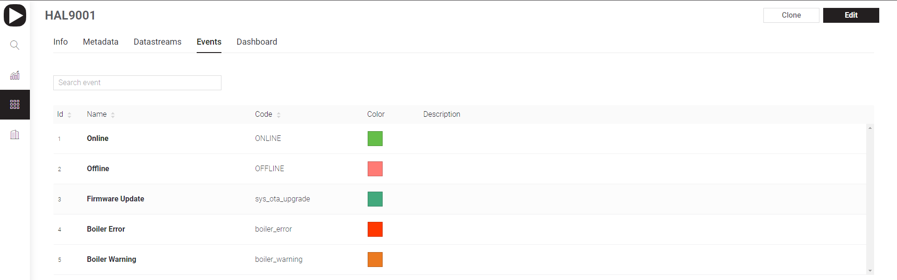

# Events

[Blynk.Console](../../console-overview.md) -> [Device Template](../) -> Events

Event is generic concept that allows to track, log, and work with important events that happen on the device.&#x20;

Additionally to the historical event tracking, events can also be used for notifications which can be sent over email, delivered as push notifications to user's smartphone, or sent as an SMS.

Events are pre-configured in Blynk.Console and can be triggered with a [Events Firmware API](broken-reference) from device or using [Events HTTP API](../../../blynk.cloud/trigger-events-api.md).

_Examples of an Event:_

* Log a moment when a temperature reached a certain threshold and send a notification to selected users
* Track total working hours of the device. If it approaches or goes beyond a max value, you would need to notify technical support so that they can replace the device or provide warranty service

## Types of Events

There are three types of Events in Blynk:&#x20;

* **System Events:** Default Blynk platform events.&#x20;
* **Custom Events:** Events you can create and configure for your needs
* **Content Events:** Informative events that are shown separately in the app

### System Events

You can't delete the system events, but you can configure them.

#### Online/Offline status

This event is used to track when devices goes online and offline.

In some cases you would need to ignore offline state for a certain period of time. For example, if your device is mostly offline (or in deep sleep) and only wakes up every hour to send the data.

#### Firmware Over-The-Air Update status

This is a system event to track firmware update. It can't be configured

### Custom Events

These are Events you can configure based on what your device do. Read these articles to start logging events and sending notifications:&#x20;

* [**Event Settings**](custom-events/events-general-setting.md)****
* ****[**How to send custom events fom hardware using Firmware API and HTTPS API**](custom-events/events--how-to-log-events.md) ****&#x20;
* ****[**Content Events**](custom-events/events-content-events.md)****

## Daily Limits

* You can send only 1 event per second of specific type
* You are limited with 100 events per day per device

In Business Plan limits can be increased
