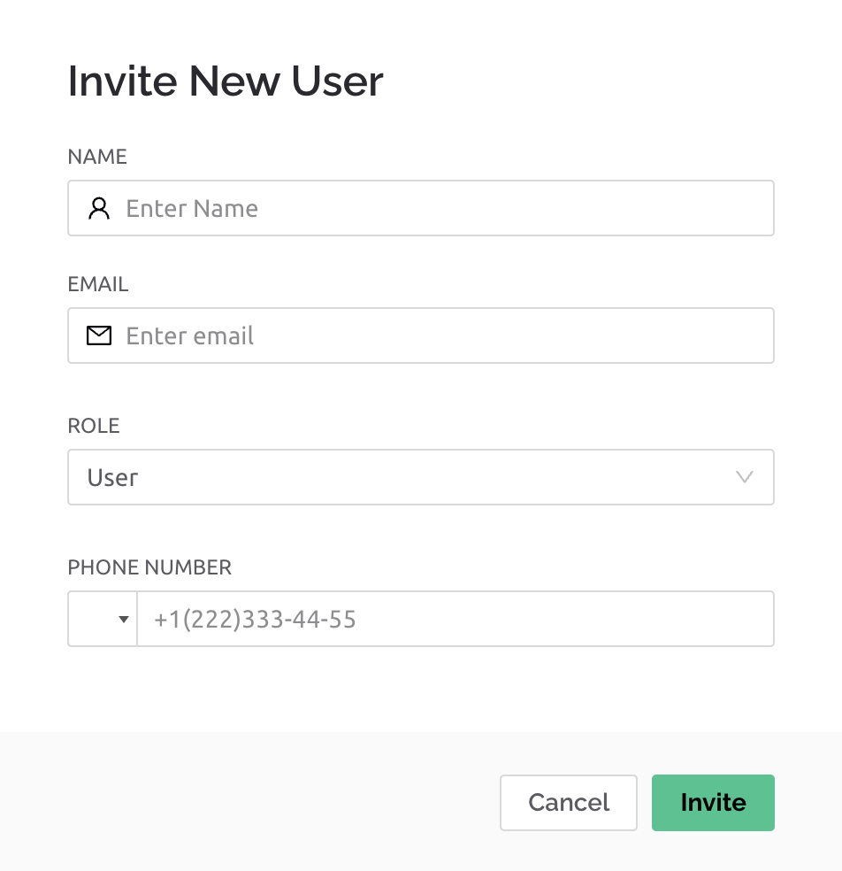

# Custom Sounds and Critical Notifications

It is possible to customize sounds for notifications coming from Blynk. There are three main push notification channels:

* In-app push notifications from a device triggered by [events](../custom-events/events-general-setting.md) configured in the Blynk.Console.&#x20;
* Notifications triggered by Automations&#x20;
* Other such as [content events](../custom-events/events-content-events.md).&#x20;

Each channel can be configured to turn on/off all notifications or use custom sounds, and device event notifications can be configured as critical alerts in some cases.&#x20;

### Device Event Notifications

For a notification to be considered an alert and become eligible for sound customization, a corresponding setting must be turned on in the Notifications tab of the event settings on the [Blynk.Console](https://blynk.cloud/).  Go to Templates -> Template -> Edit -> Events Tab, select an event and then the ‘Notifications’ tab. Enable the option ‘Deliver push notification as alerts’ and then configure the sound settings in Blynk apps.

<figure><figcaption></figcaption></figure>

On the ‘General’ tab, enable the option ‘Send event to Notifications tab’ if you want the event to be visible in the app notifications tab.

<figure><figcaption></figcaption></figure>

#### For iOS:

Go to Main menu -> Settings -> Notifications and sounds -> Devices. From this menu you can enable/disable notifications from device events or select a custom sound for it.

#### For Android:

Access notifications by choosing Profile -> Settings -> Notifications and sounds -> CRITICAL NOTIFICATIONS.  From here you may turn on/off Critical Notifications, and when enabled, choose the notification sound. &#x20;

### Critical notifications

#### iOS

Clients using [BUSINESS plan](https://blynk.io/pricing/business-plan) can cause critical alerts to be recognized by iOS, resulting in delivery with maximum sound, ignoring the phone’s mute and Do Not Disturb settings.


App approval to use this feature is required by Apple.


#### Android

On Android Critical notifications were created to bypass the iOS / Android app Do Not Disturb setting and to enable custom sounds for different triggers. (By default when Do Not Disturb is enabled for Android, notifications and sounds are suppressed).&#x20;

    

To turn on/off the ‘Ignore Background Restrictions’ option, causing Blynk to run in the background in an attempt to push notifications despite the phone’s do not disturb settings.


For some devices Android ‘Do Not Disturb’ may still prevent receipt of notifications.&#x20;


### Notifications customization by device

On Android notification settings may also be configured for each Blynk device. Select a device, and then tap on the More info icon, tap on the More info icon again, then within the ‘Actions’ page, select ‘Notification Settings’.  From here you have extensive control over the notification settings for the device, including the notification sound.

An additional setting ‘Override Do Not Disturb’ can be found by expanding the ‘Advanced’ menu. After enabling this setting, a window will appear asking for permission to always run the app in the background.

### Customize Notifications from Automations

The detailed notification setting options for each automation are accessible from the Blynk.App and vary depending on the platform.&#x20;

#### For iOS:

Go to Main menu -> Settings -> Notifications and sounds -> Automations. From this menu you can enable/disable notifications from Automations or select a custom sound for it.

#### For Android:

Go to Automations tab, select an automation, and then choose ‘Notification Settings’.

|  |  |
| -------------------------------------------------------------------------------------------------------------------------------------------------------------------------------------------------------------------------------------- | ------------------------------------------------------------------------------------------------------------------------------------------------------------------------------------------------------------------------------------------ |
