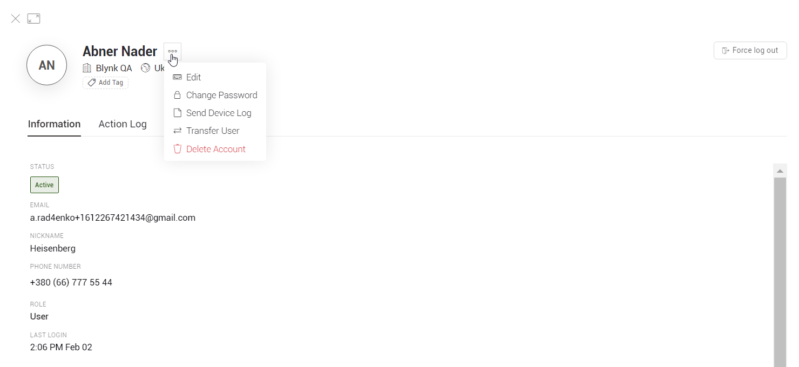

# Device Owner View

Here you can view detailed information about Device Owner.

The User profile contains information about the user **Name**, user **Organization**, user **Country**, information about the user **Status, Role, Email, Last login, Tags** and there may also be other custom information.‌

**Single Actions** menu is triggered by hovering Actions column in user's row. Available actions:‌

* **Edit** – edit data that was provided during invitation. Same modal window as for Invite User. Email can't be changed.
* **Change Password** – modal window opens. "Are you sure want to change user password?" prompt NEW PASSWORD input field.

​‌

* **Send Device Log** – sends selected user's devices logs to Administrator's Email
* **Force Logout** – logs user out immediately. No confirmations required.
* **Transfer User** – you can transfer this user to another organization. You would need to input an email address of administrator in a Destination Organization Administrator Email field.

​‌

* **Delete Account** – modal window will appear. Type DELETE and confirm the action are required.

​

​‌

## Information Tab 

The Information tab contains information about:‌

* **Status** – 3 registration statuses are possible:

  * **pending** – the user is invited, but the email is not confirmed \(user haven't logged in\)
  * **active** – the user confirmed the email, logged at least one time
  * **inactive** – the user hasn't logged for 1 month

  ​

* **Email**
* **Nickname**
* **Phone Number** \(optional\) – 15 digit international phone format for any country.
* **Role** – 3 roles available: **Admin, Staff, User** with different [access and permissions](https://app.gitbook.com/@blynk-iot/s/en/blynk.console/settings/access).
* **Client Custom fields-** may contain additional information about the user required for work.
* **Timezone-** user location timezone.

‌

## Actions Log Tab 

​‌

On the Action logs tab, the user can select a time interval to view the actions for this period:

​‌

The table contains information about:‌

* **Time** – Date and time of the Action
* **Organization Name**
* **Client** – \_\*\*\_Android, iOS, Web, HTTPS API, Automation, Alexa, Google Home, Other
* **Action Name**
* **Action Code**

​‌

## Devices Tab 

​‌

The Devices tab contains information about all user devices‌

* **Name** – Name of Device
* **Status –** Online or Offline
* **Model-** Model of Device
* **Last Updated-**Date and time of the last update

