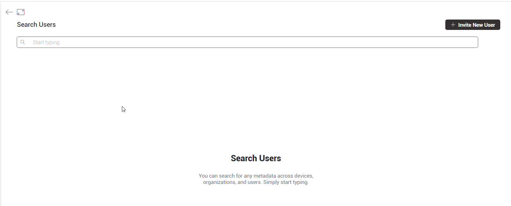
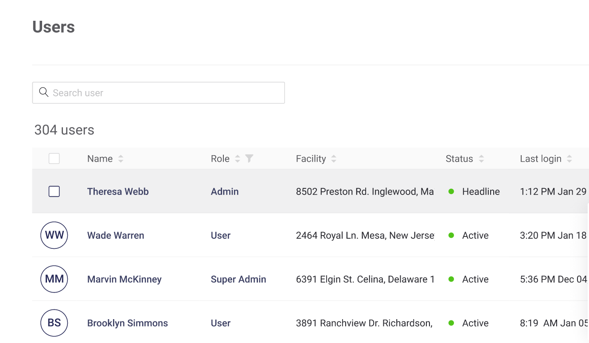
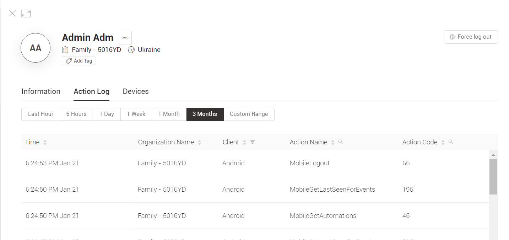

# User Profile

You can see information about **Users** in the **Section of Users**

## Search

You can search for a specific user by typing the part or the whole Name, Email,  Role or Location.\
The result (multiple results are possible) will be given in the Users table.&#x20;

## Users table

This table shows the Organization's users information:

* **Name** – user's name and last name (optional) that was assigned to User during invitation or sign up
* **Role** – displays one of  3 roles available: **Admin, Staff, User** with different [access and permissions](../settings/access.md).
* **Location** – displays location user was assigned to during invitation or sign up
* **Status** – 3 registration statuses are possible:
  * **pending** – the user is invited, but the email is not confirmed (user haven't logged in)&#x20;
  * **active** – the user confirmed the email, logged at least one time&#x20;
  * **inactive** – the user hasn't logged for 1 month
* **Last login** – last time user logged in. hh:mm M D, Y format (year is hidden if it's current)

### Table interaction

All the columns support sorting.

Role and Status columns support additional filtering option.\
Select desired option(s) from the menu appears on clicking filter icon and press OK in order to change the table view. Click reset in the same menu if you want to return to default table view.

#### Hover options:

* **Initials** – allows selecting users for Bulk Actions
* **Name** – opens Email containing hint. Click on it to copy user's Email address
* **User role** – click opens [Role Permissions list](../settings/access.md) on the right part of the screen \

The only **Bulk Action** available here:&#x20;

* **Apply Tag**
* **Export Users (CSV)**
* **Delete**

Select all users by marking **checkbox** in columns naming row or specify users selection by marking each user's checkbox.

‌ Select the desired menu item

&#x20;Confirm or cancel the action

\

By clicking on the **Name** of a User in the **List of Users,** you can see information about a specific user

## User Profile

The User profile contains information about the user **Name**, user **Organization**, user **Country**, information about the user **Status, Role, Email, Last login, Tags** and there may also be other custom information.

**Single Actions** menu is triggered by hovering Actions column in user's row. Available actions:

* **Edit** – edit data that was provided during invitation. Same modal window as for Invite User. Email can't be changed.
* **Change Password** – modal window opens.  "Are you sure want to change user password?" prompt NEW PASSWORD input field.

* **Send Device Log** – sends selected user's devices logs to Administrator's Email
* **Force Logout** – logs user out immediately. No confirmations required.
* **Transfer User** – you can transfer this user to another organization. You would need to input an email address of administrator in a Destination Organization Administrator Email field.

* **Delete Account** – modal window will appear. Type DELETE and confirm the action are required.

### Information Tab

The Information tab contains information about:&#x20;

*   **Status** – 3 registration statuses are possible:

    * **pending** – the user is invited, but the email is not confirmed (user haven't logged in)&#x20;
    * **active** – the user confirmed the email, logged at least one time&#x20;
    * **inactive** – the user hasn't logged for 1 month

* **Email**&#x20;
* **Nickname**
* **Phone Number** (optional) – 15 digit international phone format for any country.&#x20;
* **Role** – 3 roles available: **Admin, Staff, User** with different [access and permissions](../settings/access.md).
* **Client Custom fields-** may contain additional information about the user required for work.
* **Timezone-** user location timezone.

### Actions Log Tab

On the Action logs tab, the user can select a time interval to view the actions for this period:

The table contains information about:

* **Time -** Date and time of the Action
* **Organization Name**
* **Client -** Android, iOS, Web, HTTPS API, Automation, Alexa, Google Home, Other
* **Action Name**
* **Action Code**

### Devices Tab

The Devices tab contains information about all user devices

* **Name -** Name of Device
* **Status -** Online or Offline
* **Model-** Model of Device
* **Last Updated-**Date and time of the last update

****
