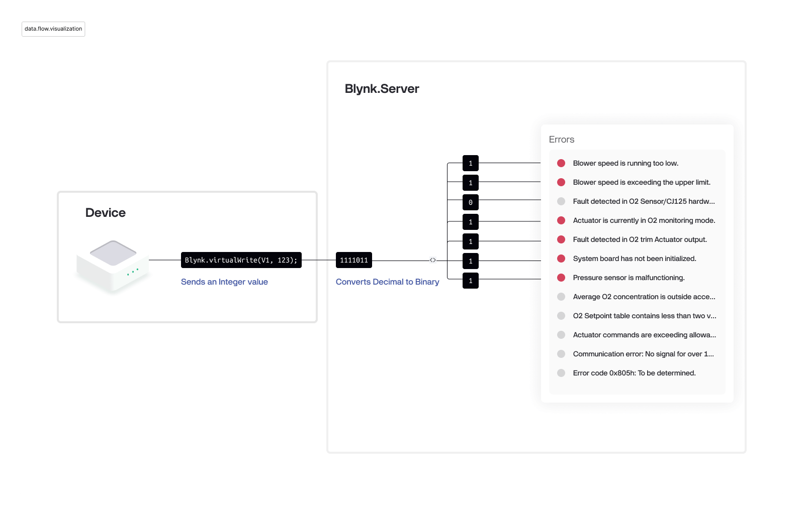
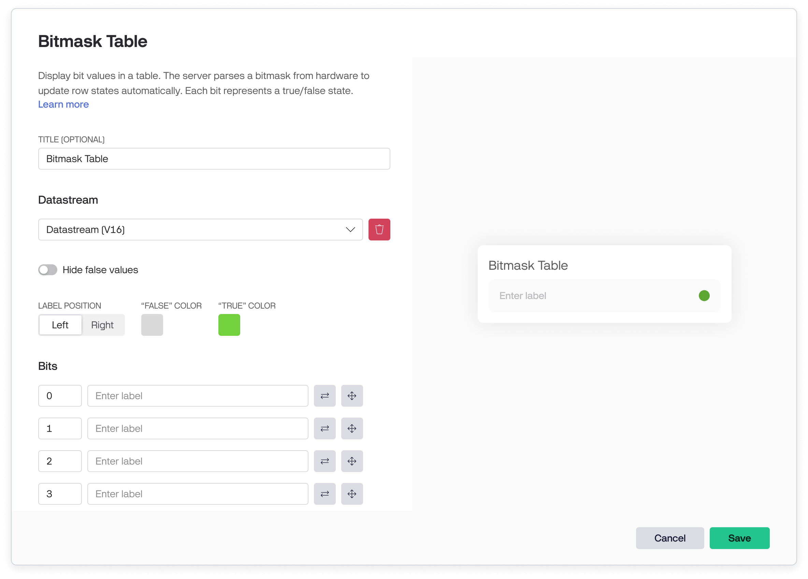

# Bitmask Table

### Overview

This widget helps display a table of values as LED indicators. The hardware sends a bitmask value, which the server parses to update LED states automatically. Each bit represents the ON/OFF status of an LED on the corresponding row.

***

### What is a Bitmask?

A bitmask stores multiple true/false (binary) values in a single integer. Each bit represents a separate state (e.g., an error, alarm, or status).

* 1 = ON (True)
* 0 = OFF (False)

***

### How the Server Parses the Data

When the hardware sends a bitmask as an integer, the server extracts individual bit states to update the table.

#### Example

A device has 11 error states, each represented by a bit in a bitmask value. If an error occurs, the corresponding bit is set to 1, turning ON the LED in the respective row.

* Received Integer: 123
* Binary Representation: 1111011
* Mapped States:
  * Bit 0 → True
  * Bit 1 → True
  * Bit 2 → False
  * Bit 3 → True
  * Bit 4 → True
  * Bit 5 → True
  * Bit 6 → True
  * _(Other bits remain False)_

<figure><figcaption><p>Bitmask Table Data Flow Visualization</p></figcaption></figure>

***

### Settings

* Title – Optional widget title
*   Datastream – Select the datastream receiving the bitmask

    _Only integer datastreams are supported_
* Label position – Labels on the left or right
* Hide false values – Hide rows with a false (0) value
* False color – LED color for false state
* True color – LED color for true state
* Bits mapping – Map bit indexes to specific rows
* Inverse values – Reverse 1 and 0 logic (ON becomes OFF)


Note: If your hardware sends bits that aren’t mapped in the widget settings, they will be ignored in the UI.


<figure><figcaption><p>Bitmask Table Settings</p></figcaption></figure>

***

### Limits

* Only integer datastreams are supported
* Maximum of 50 rows
* Maximum label length: 100 characters

***

### Change Bitmask Table Properties from Hardware

Use this command in firmware to update widget properties:

```
Blynk.setProperty(vPin, "widgetProperty", "propertyValue");
```

* vPin: Virtual pin assigned to the widget
* widgetProperty: The property to change
* propertyValue: New value to assign\



Warning: Avoid placing Blynk.setProperty() in the loop() function — this may flood the server and disconnect your device. Use timers or event-based updates instead.


#### Changeable Properties

You can dynamically update these widget properties:

* label
* isHidden
* isDisabled


**Example (Firmware)**

```
Blynk.setProperty(V1, "isHidden", "true");
```

**Example (HTTP API)**

```
https://{server_address}/external/api/update/property?token={your_32_char_token}&pin=V1&isHidden=true
```

