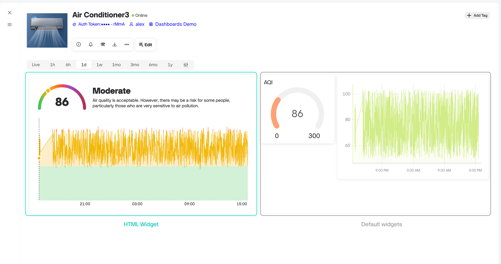
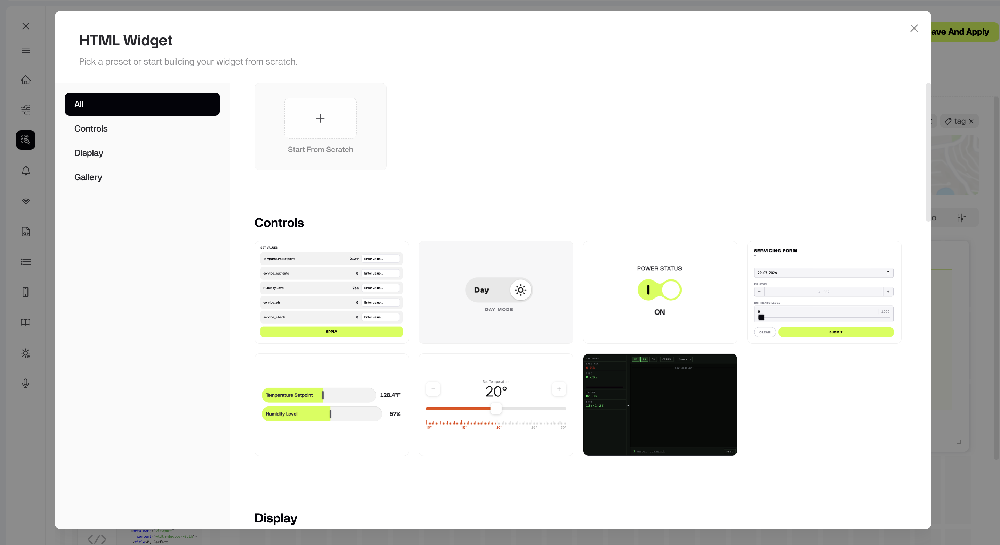
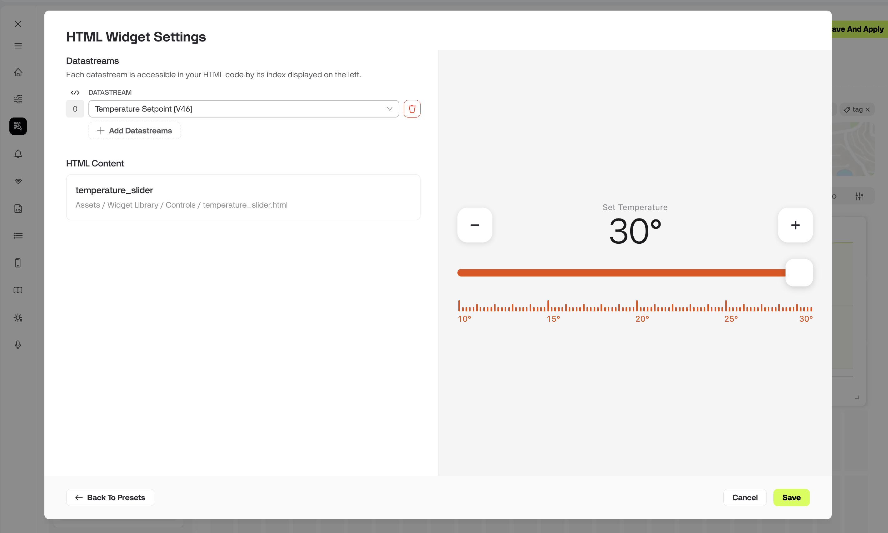
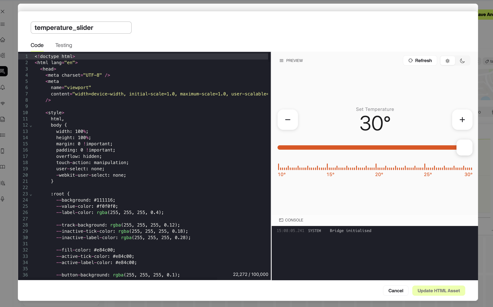
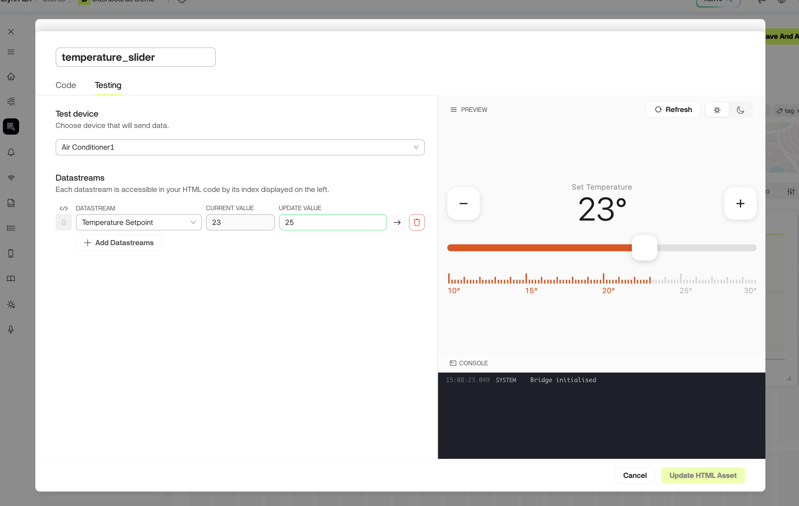

# HTML Widget

The HTML Widget is the most flexible dashboard widget allows you to use your own custom HTML, CSS, and JavaScript and connect it to your datastreams. Use it when the standard Widgets don’t cover your use case — a custom gauge design, a combined status panel, a branded control surface, or any layout you want to build yourself.

The Widget renders your HTML in a sandboxed frame and injects a JavaScript object called `BlynkBridge`. Through it, your page can read Datastream values, write values back to the Device, receive real-time updates, fetch historical data, and pick up the current app theme.

<figure><figcaption></figcaption></figure>

***

#### Adding an HTML Widget

1. Open your Template and navigate to the **Web Dashboard** tab.
2. Drag the **HTML Widget** onto the canvas.
3. Open the Widget settings.
4. Pick a starting point, then assign the Datastreams your widget needs.
5. Click **Save**.

***

#### Choosing a starting point

HTML Widget offers three ways to begin:

* **Start from scratch** – opens a code editor filled with minimal HTML strucuture required for widget where you can write or paste your own HTML.
* **Blynk presets (Display, Control)** – ready-made widgets built and maintained by Blynk. When you pick one, a copy is cloned into your **Assets** so you can modify it as much as you want.
* **Your uploaded files** – any `.html` file you’ve already uploaded to the **Widget Library** folder in [Assets](https://docs.blynk.io/en/blynk.console/templates/assets).

<figure><figcaption></figcaption></figure>

***

#### Widget settings

* **Datastreams** – select one or more Datastreams the Widget can read from and write to. The order you add them here defines their index, starting at `0`. Your code refers to Datastreams by that index, not by name.
* **HTML code** – the full HTML document that will be rendered, including its `<style>` and `<script>` blocks.

<figure><figcaption></figcaption></figure>

***

#### Where widget files are stored

Every `.html` file used by an HTML Widget lives in **Developer Zone → Assets**. There are two ways to get a file there:

* Upload the `.html` file directly to **Assets**
* Use **Start from scratch** in the widget settings — the code you paste is saved to Assets for you.


**Note:** The Preset gallery only lists `.html` files stored in the system **Widget Library** folder or its sub-folders. Files kept elsewhere in Assets won’t appear as a starting point.



**Tip:** Sub-folders inside **Widget Library** appear as separate categories in the widget settings. Create sub-folders to group your Widgets — by project, by device type, or however your team works — and the gallery structure follows.


***

#### Code Editor

Whichever starting point you choose, the code opens in the same editor — new files, files uploaded to Assets, and cloned Blynk presets are all edited the same way. The code editor has two tabs.

#### Code tab

The tab where you're working on your code. It consists of:

* **Editor pane:** write and edit your HTML here.
* **Preview:** shows the rendered widget. Click Refresh after making changes to see the update. Use the theme toggle to check how it looks in light and dark mode.
* **Console:** shows log messages and JavaScript errors from your code, so you can debug without leaving the editor.

<figure><figcaption></figcaption></figure>

#### Testing tab

Check how the widget behaves with a real device before you put it on a dashboard:

1. Select a device you own for testing.
2. Add the datastreams your widget uses.
3. Update their values to see how the widget reacts.

<figure><figcaption></figcaption></figure>


**Note:** Testing runs against a real Device, not a simulation. The Widget displays live data from that device, and any value your widget sends is delivered to it. These messages count toward your regular message limit.


***

#### What HTML Widget can do

| Capability                    | Method                                                                               |
| ----------------------------- | ------------------------------------------------------------------------------------ |
| **Read one Datastream**       | `getValue(index)` — resolves with the current value and its metadata                 |
| **Read multiple Datastreams** | `getValues()` — resolves with an array, one entry per assigned Datastream            |
| **Write a value**             | `sendValue(index, value)`                                                            |
| **React to live updates**     | `setCallbacks({ onValueUpdated })` — fires whenever the server pushes new data       |
| **Fetch historical data**     | `getHistoricalData(options)` — raw points or aggregated buckets over a chosen period |
| **Match the app theme**       | `getTheme()` — returns colors and fonts already resolved for light or dark mode      |
| **Show Device details**       | `getDeviceInfo()` — Device name, status, and last reported time                      |
| **Surface an error**          | `sendError(message)` — displays an error toast in the Dashboard                      |

Full method signatures, parameters, return shapes, and annotated examples are in the [HTML Widget Developer Guide](html-widget-developer-guide.md).&#x20;

***

#### Light and dark theme

Call `getTheme()` and write the returned values into CSS custom properties. The colors come back already matched to the Dashboard’s current mode, so you don’t need `prefers-color-scheme` logic inside the Widget.

Always keep fallback values in `:root` so the Widget still looks correct before `getTheme()` resolves.

```
:root {  
--bg: #f7f7f8;  
--text: #111114;  
--accent: #22c55e;
}
```


**Note:** `getTheme()` returns the theme once, at the moment it is called. It does not notify your page when the user switches between light and dark mode. If you want to update it on theme change add `onThemeUpdated: applyTheme;`to the `bridge.setCallbacks`


***

#### Generating Widgets with AI

Blynk publishes `blynk-anywidget`, an [Agent Skill](https://agentskills.io) that teaches an AI coding agent how to build HTML widgets. It carries the BlynkBridge API reference, the platform constraints, and Blynk's visual style, so the agent produces a widget that works instead of guessing at the bridge.

1. Download the skill below.
2. Add it to your AI tool. The way to add depends on the exact tool.
3. Describe what you need in plain language: _"a gauge showing the temperature datastream with a 24-hour chart underneath"_ and optionally send a screenshot reference if you have to get more precise result.
4. Copy the generated HTML into the editor's **Code** tab, then verify it on the **Testing** tab against a real device.




**Note:** Always review generated code before adding the widget to a production dashboard. A generated widget can send values to your device, and the Testing tab uses a real device and real messages.


***

#### Limits

The HTML widget is available on all plans. The number of widgets you can add differs by subscription.

| Limit                         | Details                                                              |
| ----------------------------- | -------------------------------------------------------------------- |
| **HTML code size**            | 100,000 characters per widget                                        |
| **HTML Widgets per Template** | `1,3,10,20` per plan — see [Blynk pricing](https://blynk.io/pricing) |
| **Historical data range**     | Maximum 365 days per request                                         |
| **Historical data timeout**   | 60 seconds per request                                               |
